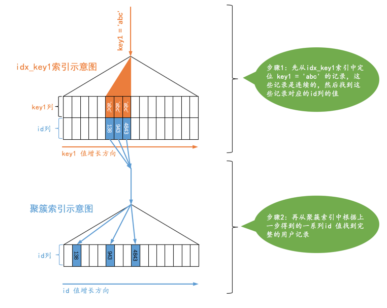

# 数据库

---

# MySQL

## 索引能干啥？

大大提高系统性能

### 优点

1. 通过创建 unique 唯一索引能 **保证** 数据库表中的每一行数据的唯一性
2. 大大加快数据的 **检索** 速度，这也是创建索引的最主要原因
3. 在实现数据的参考完整性方面可以 **加速表与表之间的连接** 
4. 在使用分组和排序子句进行数据查询时也可以显著减少查询中分组和排序的时间

### 缺点

1. **索引的创建和维护 **的时间随着数量增加而增加
2. 索引会 **占据数据空间**，还要占一定的物理空间


## 事务

### 什么是事务

事务是指是程序中一系列严密的逻辑操作，而且所有操作必须全部成功完成，否则在每个操作中所作的所有更改都会被撤消。可以通俗理解为：就是把多件事情当做一件事情来处理，好比大家同在一条船上，要活一起活，要完一起完 。

#### 事务的四个特性（ACID）

- 原子性 [atomicity]
-  一致性 [consistency]
-  隔离性 [isolation]
-  持久性 [durability]

### 概念解释

| 名称       | 解释                                                         |
| :--------- | :----------------------------------------------------------- |
| 原子性     | 是操作这些指令时，要么全部执行成功，要么全部不执行。只要其中一个指令执行失败，所有的指令都执行失败，数据进行回滚，回到执行指令前的数据状态。 |
| 一致性     | 事物的执行使数据从一个状态转换为另一个状态，但是对于整个数据的完整性保持稳定。 |
| 隔离性     | 隔离性是多个用户并发访问数据库时，比如操作同一张表时，数据库为每个用户开启的事务，不能被其他事务的操作所干扰，多个并发事物之间要相互隔离。对于任意两个并发的事务 t1 和 t2，在事物 t1 看来，t2 要么在 t1 开始之前就已经结束，要么在 t1  结束之后才开始，这样每个事物都感觉不到其他事务在并发地执行。 |
| 持久性     | 当事务正确完成后，他对于数据的改变时持久的。                 |
| 读未提交   | 最低级别，任何情况都无法保证。读未提交，顾名思义，就是一个事务可以读取另一个未提交事务的数据。 |
| 读已提交   | 可避免脏读的发生。读提交，顾名思义，就是一个事务要等另一个事务提交后才能读取数据。 |
| 可重复读   | 可避免脏读、不可重复读的发生。重复读，就是开始读取数据时 [事务开启]，不在允许修改操作。 |
| 串行化     | 可避免脏读、不可重复读、幻读的发生。是最高的事务隔离级别，在该级别下，事务串行化顺序执行，可避免脏读、不可重复读、幻读。但是这样事务隔离级别效率低下，比较耗数据库性能，一般不使用。 |
| 脏读       | 一个事务处理过程中读取了另一个未提交的事物中的数据。         |
| 幻读、虚读 | 一个事务执行两次查询，第二次结果集包含第一次中没有或某些行已经被删除的数据，造成两次结果不一致，只是另一个事务在这两次查询中间插入或删除了数据造成的。 |
| 不可重复读 | 一个事务两次读取同一行的数据，结果得到不同状态的结果，中间正好另一个事务更新了该数据，两次结果相异，不可被信任。 |

### 数据事务的隔离级别

事务的隔离级别有 4 种，由低到高分别为 

- Read uncommitted	最低级别，任何情况都无法保证
- Read committed        可避免脏读的发生
- Repeatable read        可避免脏读、不可重复读的发生
- Serializable                可避免脏读、不可重复读、幻读的发生


而且，在事务的并发操作中可能出现脏读、不可重复读、幻读。

Mysql 的 **默认隔离级别是 Repeatable read** 

#### 不可重复读和脏读的区别

不可重复读和脏读的区别：脏读是某一事务读取了另一个事务未提交的脏数据，而不可重复读则是读取了前一事务提交的数据。　

不可重复读与脏读逻辑类似。主要在于事务2在事务1第二次读取时，提交了数据。导致事务1前后两次读取的数据不一致。

#### 幻读和不可重复读都区别

幻读和不可重复读都是读取了另一条已经提交的事务（这点就脏读不同），所不同的是不可重复读查询的都是同一个数据项，而幻读针对的是一批数据整体（比如数据的个数）。

### 隔离级别的实现原理

> 使用MySQL的默认隔离级别（可重复读）来进行说明。
>
> 每条记录在更新的时候都会同时记录一条回滚操作（回滚操作日志undo log）。同一条记录在系统中可以存在多个版本，这就是数据库的多版本并发控制（MVCC）。即通过回滚（rollback操作），可以回到前一个状态的值。
>
> 假设一个值从 1 被按顺序改成了 2、3、4，在回滚日志里面就会有类似下面的记录。


> 当前值是 4，但是在查询这条记录的时候，不同时刻启动的事务会有不同的 read-view。如图中看到的，在视图 A、B、C  里面，这一个记录的值分别是 1、2、4，同一条记录在系统中可以存在多个版本，就是数据库的多版本并发控制（MVCC）。对于 read-view  A，要得到 1，就必须将当前值依次执行图中所有的回滚操作得到。
>
> 同时你会发现，即使现在有另外一个事务正在将 4 改成 5，这个事务跟 read-view A、B、C 对应的事务是不会冲突的。
>
> 提问：回滚操作日志（undo log）什么时候删除？
>
> MySQL会判断当没有事务需要用到这些回滚日志的时候，回滚日志会被删除。
>
> 提问：什么时候不需要了？
>
> 当系统里没有比这个回滚日志更早的 read-view 的时候。

### ReadView

其实就像是在生成`ReadView`的那个时刻做了一次时间静止（就像用相机拍了一个快照），查询语句只能读到在生成`ReadView`之前已提交事务所做的更改，在生成`ReadView`之前未提交的事务或者之后才开启的事务所做的更改是看不到的。

### MVCC（Multi-Version Concurrency Control）

指的就是在使用`READ COMMITTD`、`REPEATABLE READ`这两种隔离级别的事务在执行普通的`SELECT`操作时访问记录的版本链的过程，这样子可以使不同事务的`读-写`、`写-读`操作并发执行，从而提升系统性能。`READ COMMITTD`、`REPEATABLE READ`这两个隔离级别的一个很大不同就是：生成ReadView的时机不同，**READ COMMITTD**在每一次进行普通SELECT操作前都会生成一个ReadView，而**REPEATABLE  READ**只在第一次进行普通SELECT操作前生成一个ReadView，之后的查询操作都重复使用这个ReadView就好了。


### 资料

https://www.cnblogs.com/Kevin-ZhangCG/p/9038371.html

https://learnku.com/articles/51110

https://developer.aliyun.com/article/743691


## 存储引擎

### InnoDB

`InnoDB`是一个将表中的数据存储到磁盘上的存储引擎

`InnoDB`采取的方式是：将数据划分为若干个页，以页作为磁盘和内存之间交互的基本单位，InnoDB中页的大小一般为 ***16*** KB。

`MySQL`中磁盘和内存交互的基本单位是`页`，也就是说`MySQL`是以`页`为基本单位来管理存储空间的，我们的记录都会被分配到某个`页`中存储。而一个页的大小一般是`16KB`，也就是`16384`字节.

#### InnoDB 行格式

我们可以在创建或修改表的语句中指定`行格式`：

```SQL
CREATE TABLE 表名 (列的信息) ROW_FORMAT=行格式名称
    
ALTER TABLE 表名 ROW_FORMAT=行格式名称
```

我们平时是以记录为单位来向表中插入数据的，这些记录在磁盘上的存放方式也被称为`行格式`或者`记录格式`。

##### Compact


###### 记录的额外信息

这部分信息是服务器为了描述这条记录而不得不额外添加的一些信息，这些额外信息分为3类

- 变长字段长度列表
- NULL值列表
- 记录头信息

*变长字段长度列表*

`MySQL` 支持一些变长的数据类型，比如`VARCHAR(M)`、`VARBINARY(M)`、各种`TEXT`类型，各种`BLOB`类型，这些数据类型的列称为`变长字段`，变长字段中存储多少字节的数据是不固定的，所以在存储真实数据的时候需要顺便把这些数据占用的字节数也存起来，这样才不至于把`MySQL`服务器搞懵，所以这些变长字段占用的存储空间分为两部分：

1. 真正的数据内容
2. 占用的字节数

在`Compact`行格式中，把所有变长字段的真实数据占用的字节长度都存放在记录的开头部位，从而形成一个变长字段长度列表，各变长字段数据占用的字节数按照列的顺序逆序存放，我们再次强调一遍，是逆序存放！

*NULL 值列表*

`Compact`行格式把这些值为`NULL`的列统一管理起来，存储到`NULL`值列表中

*记录头信息*

它是由固定的`5`个字节组成。`5`个字节也就是`40`个二进制位，不同的位代表不同的意思，如图：


###### 记录的真实数据

`MySQL`会为每个记录默认的添加一些列（也称为`隐藏列`），具体的列如下：

|       列名       | 是否必须 | 占用空间 |          描述          |
| :--------------: | :------: | :------: | :--------------------: |
|     `row_id`     |    否    | `6`字节  | 行ID，唯一标识一条记录 |
| `transaction_id` |    是    | `6`字节  |         事务ID         |
|  `roll_pointer`  |    是    | `7`字节  |        回滚指针        |

`row_id`并不是必要的，我们创建的表中有主键或者非NULL的UNIQUE键时都不会包含`row_id`列

`trx_id`列其实还蛮好理解的，就是某个对这个聚簇索引记录做改动的语句所在的事务对应的`事务id`


在航格式中有一个占用 7 个字节的隐藏列 `roll_pointer` ，其本质是一个指向记录对应的 `undo 日志` 的指针


```
小贴士： 实际上这几个列的真正名称其实是：DB_ROW_ID、DB_TRX_ID、DB_ROLL_PTR，我们为了美观才写成了row_id、transaction_id 和 roll_pointer。
```

`InnoDB`表对主键的生成策略：优先使用用户自定义主键作为主键，如果用户没有定义主键，则选取一个`Unique`键作为主键，如果表中连`Unique`键都没有定义的话，则`InnoDB`会为表默认添加一个名为`row_id`的隐藏列作为主键。所以我们从上表中可以看出：InnoDB存储引擎会为每条记录都添加 ***transaction_id*** 和 ***roll_pointer*** 这两个列，但是 ***row_id*** 是可选的（在没有自定义主键以及Unique键的情况下才会添加该列）。这些隐藏列的值不用我们操心，`InnoDB`存储引擎会自己帮我们生成的。

变长字符集的`CHAR(M)`类型的列要求至少占用`M`个字节，而`VARCHAR(M)`却没有这个要求。比方说对于使用`utf8`字符集的`CHAR(10)`的列来说，该列存储的数据字节长度的范围是10～30个字节。即使我们向该列中存储一个空字符串也会占用`10`个字节，这是怕将来更新该列的值的字节长度大于原有值的字节长度而小于10个字节时，可以在该记录处直接更新，而不是在存储空间中重新分配一个新的记录空间，导致原有的记录空间成为所谓的碎片。（这里你感受到设计`Compact`行格式的大叔既想节省存储空间，又不想更新`CHAR(M)`类型的列产生碎片时的纠结心情了吧。）

##### Redundant

是`MySQL5.0`之前用的一种行格式


`字段长度偏移列表`实质上是存储每个列中的值占用的空间在`记录的真实数据`处结束的位置.

`MySQL`中磁盘和内存交互的基本单位是`页`，也就是说`MySQL`是以`页`为基本单位来管理存储空间的，我们的记录都会被分配到某个`页`中存储。而一个页的大小一般是`16KB`，也就是`16384`字节

##### Dynamic

MySQL 5.7 默认行格式

和`Compact`行格式挺像，只不过在处理`行溢出`数据时有点儿分歧，它们不会在记录的真实数据处存储字段真实数据的前`768`个字节，而是把所有的字节都存储到其他页面中，只在记录的真实数据处存储其他页面的地址，就像这样：


##### Compressed

`Compressed`行格式和`Dynamic`不同的一点是，`Compressed`行格式会采用压缩算法对页面进行压缩，以节省空间。

#### 行溢出的临界点

那发生`行溢出`的临界点是什么呢？也就是说在列存储多少字节的数据时就会发生`行溢出`？

`MySQL`中规定一个页中至少存放两行记录,

`MySQL`中规定一个页中至少存放两行记录，至于为什么这么规定我们之后再说，现在看一下这个规定造成的影响。以上边的`varchar_size_demo`表为例，它只有一个列`c`，我们往这个表中插入两条记录，每条记录最少插入多少字节的数据才会`行溢出`的现象呢？这得分析一下页中的空间都是如何利用的。

- 每个页除了存放我们的记录以外，也需要存储一些额外的信息，乱七八糟的额外信息加起来需要`132`个字节的空间（现在只要知道这个数字就好了），其他的空间都可以被用来存储记录。

- 每个记录需要的额外信息是`27`字节。

  这27个字节包括下边这些部分：

  - 2个字节用于存储真实数据的长度
  - 1个字节用于存储列是否是NULL值
  - 5个字节大小的头信息
  - 6个字节的`row_id`列
  - 6个字节的`transaction_id`列
  - 7个字节的`roll_pointer`列

假设一个列中存储的数据字节数为n，设计`MySQL`的大叔规定如果该列不发生溢出的现象，就需要满足下边这个式子：

```
132 + 2×(27 + n) < 16384
```

求解这个式子得出的解是：`n < 8099`。也就是说如果一个列中存储的数据小于`8099`个字节，那么该列就不会成为`溢出列`，否则该列就需要成为`溢出列`。不过这个`8099`个字节的结论只是针对只有一个列的`varchar_size_demo`表来说的，如果表中有多个列，那上边的式子和结论都需要改一改了，所以重点就是：你不用关注这个临界点是什么，只要知道如果我们一条记录的某个列中存储的数据占用的字节数非常多时，该列就可能成为`溢出列`。

#### InnoDB数据页结构

前边我们简单提了一下`页`的概念，它是`InnoDB`管理存储空间的基本单位，一个页的大小一般是`16KB`。`InnoDB`为了不同的目的而设计了许多种不同类型的`页`，比如存放表空间头部信息的页，存放`Insert Buffer`信息的页，存放`INODE`信息的页，存放`undo`日志信息的页等等等等。


| 名称                 | 中文名             | 占用空间大小 | 简单描述                 |
| -------------------- | ------------------ | ------------ | ------------------------ |
| `File Header`        | 文件头部           | `38`字节     | 页的一些通用信息         |
| `Page Header`        | 页面头部           | `56`字节     | 数据页专有的一些信息     |
| `Infimum + Supremum` | 最小记录和最大记录 | `26`字节     | 两个虚拟的行记录         |
| `User Records`       | 用户记录           | 不确定       | 实际存储的行记录内容     |
| `Free Space`         | 空闲空间           | 不确定       | 页中尚未使用的空间       |
| `Page Directory`     | 页面目录           | 不确定       | 页中的某些记录的相对位置 |
| `File Trailer`       | 文件尾部           | `8`字节      | 校验页是否完整           |


### 再谈索引

索引目录本体实质为一个基础单位——页

#### 聚簇索引

聚簇索引不是人为创建的，默认就有。

根据数据记录所在的页而不断提炼的 B+ 树，叶子节点是数据记录所在的页的

#### 二级索引

本质也是一颗 B+ 树，更具所选数据栏排序出来的另一颗树，只是叶子节点上不是记录数据其实实体，而是记录着索引栏和主键的页记录，最后在有一个回表操作——聚簇索引目录根据主键首选记录实体。

#### 联合索引

我们也可以同时以多个列的大小作为排序规则，也就是同时为多个列建立索引，比方说我们想让`B+`树按照`c2`和`c3`列的大小进行排序，这个包含两层含义：

- 先把各个记录和页按照`c2`列进行排序。
- 在记录的`c2`列相同的情况下，采用`c3`列进行排序

千万要注意一点，以c2和c3列的大小为排序规则建立的B+树称为联合索引，本质上也是一个二级索引。

#### MyISAM中的索引方案简单介绍

我们知道`InnoDB`中索引即数据，也就是聚簇索引的那棵`B+`树的叶子节点中已经把所有完整的用户记录都包含了，而`MyISAM`的索引方案虽然也使用树形结构，但是却将索引和数据分开存储：

- 将表中的记录按照记录的插入顺序单独存储在一个文件中，称之为`数据文件`。这个文件并不划分为若干个数据页，有多少记录就往这个文件中塞多少记录就成了。我们可以通过行号而快速访问到一条记录。

由于在插入数据的时候并没有刻意按照主键大小排序，所以我们并不能在这些数据上使用二分法进行查找。

使用`MyISAM`存储引擎的表会把索引信息另外存储到一个称为`索引文件`的另一个文件中。`MyISAM`会单独为表的主键创建一个索引，只不过在索引的叶子节点中存储的不是完整的用户记录，而是`主键值 + 行号`的组合。也就是先通过索引找到对应的行号，再通过行号去找对应的记录！

这一点和`InnoDB`是完全不相同的，在`InnoDB`存储引擎中，我们只需要根据主键值对`聚簇索引`进行一次查找就能找到对应的记录，而在`MyISAM`中却需要进行一次`回表`操作，意味着`MyISAM`中建立的索引相当于全部都是`二级索引`！

#### 索引的代价

- 空间上的代价

  这个是显而易见的，每建立一个索引都要为它建立一棵`B+`树，每一棵`B+`树的每一个节点都是一个数据页，一个页默认会占用`16KB`的存储空间，一棵很大的`B+`树由许多数据页组成，那可是很大的一片存储空间呢。

- 时间上的代价

  每次对表中的数据进行增、删、改操作时，都需要去修改各个`B+`树索引。而且我们讲过，`B+`树每层节点都是按照索引列的值从小到大的顺序排序而组成了双向链表。不论是叶子节点中的记录，还是内节点中的记录（也就是不论是用户记录还是目录项记录）都是按照索引列的值从小到大的顺序而形成了一个单向链表。而增、删、改操作可能会对节点和记录的排序造成破坏，所以存储引擎需要额外的时间进行一些记录移位，页面分裂、页面回收啥的操作来维护好节点和记录的排序。如果我们建了许多索引，每个索引对应的`B+`树都要进行相关的维护操作，这还能不给性能拖后腿么？

#### 总结

- 每个索引都对应一棵`B+`树，`B+`树分为好多层，最下边一层是叶子节点，其余的是内节点。所有`用户记录`都存储在`B+`树的叶子节点，所有`目录项记录`都存储在内节点。
- `InnoDB`存储引擎会自动为主键（如果没有它会自动帮我们添加）建立`聚簇索引`，聚簇索引的叶子节点包含完整的用户记录。
- 我们可以为自己感兴趣的列建立`二级索引`，`二级索引`的叶子节点包含的用户记录由`索引列 + 主键`组成，所以如果想通过`二级索引`来查找完整的用户记录的话，需要通过`回表`操作，也就是在通过`二级索引`找到主键值之后再到`聚簇索引`中查找完整的用户记录。
- `B+`树中每层节点都是按照索引列值从小到大的顺序排序而组成了双向链表，而且每个页内的记录（不论是用户记录还是目录项记录）都是按照索引列的值从小到大的顺序而形成了一个单链表。如果是`联合索引`的话，则页面和记录先按照`联合索引`前边的列排序，如果该列值相同，再按照`联合索引`后边的列排序。
- 通过索引查找记录是从`B+`树的根节点开始，一层一层向下搜索。由于每个页面都按照索引列的值建立了`Page Directory`（页目录），所以在这些页面中的查找非常快。


### 数据目录

像`InnoDB`、`MyISAM`这样的存储引擎都是把表存储在磁盘上的，而操作系统用来管理磁盘的那个东东又被称为`文件系统`，所以用专业一点的话来表述就是：像 ***InnoDB*** 、 ***MyISAM*** 这样的存储引擎都是把表存储在文件系统上的。

#### 区别数据目录与安装目录

`MySQL`的安装目录（在安装`MySQL`的时候我们可以自己指定），我们重点强调过这个`安装目录`下非常重要的`bin`目录，它里边存储了许多关于控制客户端程序和服务器程序的命令（许多可执行文件，比如`mysql`，`mysqld`，`mysqld_safe`等等等等好几十个）。而`数据目录`是用来存储`MySQL`在运行过程中产生的数据。

`数据目录`对应着一个系统变量`datadir`，我们在使用客户端与服务器建立连接之后查看这个系统变量的值就可以了：

```sql
mysql> SHOW VARIABLES LIKE 'datadir';
+---------------+-----------------------+
| Variable_name | Value                 |
+---------------+-----------------------+
| datadir       | /usr/local/var/mysql/ |
+---------------+-----------------------+
1 row in set (0.00 sec)
```


#### 数据目录的结构

使用`CREATE DATABASE 数据库名`语句创建一个数据库的时候，每个数据库都对应数据目录下的一个子目录，或者说对应一个文件夹。MySQL 具体做了如下事情：

1. 在 `数据目录` 下创建一个和数据库名同名的子目录
2. 在子目录下创建一个名为 `db.opt` 的文件，这个文件中包含了该数据库的各种属性，比方说数据库的字符集和比较规则

#### 表在文件系统中的表示

我们的数据其实都是以记录的形式插入到表中的，每个表的信息其实可以分为两种：

1. 表结构的定义
2. 表中的数据

`表结构` 就是该表的名称是啥，表里边有多少列，每列的数据类型是啥，有啥约束条件和索引，用的是啥字符集和比较规则等等信息，这些信息都体现在了我们的建表语句中。为了保存这些信息，`InnoDB`和`MyISAM`这两种存储引擎都在`数据目录`下对应的数据库子目录下创建了一个专门用于描述表结构的文件，文件名是这样：

```
表名.frm
```

#### InnoDB 是如何存储表数据的

- `InnoDB`其实是使用`页`为基本单位来管理存储空间的，默认的`页`大小为`16KB`。
- 对于`InnoDB`存储引擎来说，每个索引都对应着一棵`B+`树，该`B+`树的每个节点都是一个数据页，数据页之间不必要是物理连续的，因为数据页之间有`双向链表`来维护着这些页的顺序。
- `InnoDB`的聚簇索引的叶子节点存储了完整的用户记录，也就是所谓的索引即数据，数据即索引。

为了更好的管理这些页，设计`InnoDB`的大叔们提出了一个`表空间`或者`文件空间`（英文名：`table space`或者`file space`）的概念，这个表空间是一个抽象的概念，它可以对应文件系统上一个或多个真实文件（不同表空间对应的文件数量可能不同）。每一个`表空间`可以被划分为很多很多很多个`页`，我们的表数据就存放在某个`表空间`下的某些页里。设计`InnoDB`的大叔将表空间划分为几种不同的类型，我们一个一个看一下。

##### 系统表空间（system tablespace）

这个所谓的`系统表空间`可以对应文件系统上一个或多个实际的文件，默认情况下，`InnoDB`会在`数据目录`下创建一个名为`ibdata1`（在你的数据目录下找找看有木有）、大小为`12M`的文件，这个文件就是对应的`系统表空间`在文件系统上的表示。怎么才`12M`？这么点儿还没插多少数据就用完了，哈哈，那是因为这个文件是所谓的`自扩展文件`，也就是当不够用的时候它会自己增加文件大小～

当然，如果你想让系统表空间对应文件系统上多个实际文件，或者仅仅觉得原来的`ibdata1`这个文件名难听，那可以在`MySQL`启动时配置对应的文件路径以及它们的大小，比如我们这样修改一下配置文件：

```
[server]
innodb_data_file_path=data1:512M;data2:512M:autoextend
```

这样在`MySQL`启动之后就会创建这两个512M大小的文件作为`系统表空间`，其中的`autoextend`表明这两个文件如果不够用会自动扩展`data2`文件的大小。

我们也可以把`系统表空间`对应的文件路径不配置到`数据目录`下，甚至可以配置到单独的磁盘分区上，涉及到的启动参数就是`innodb_data_file_path`和`innodb_data_home_dir`，具体的配置逻辑挺绕的，我们这就不多唠叨了，知道改哪个参数可以修改`系统表空间`对应的文件，有需要的时候到官方文档里一查就好了。

需要注意的一点是，在一个MySQL服务器中，系统表空间只有一份。从MySQL5.5.7到MySQL5.6.6之间的各个版本中，我们表中的数据都会被默认存储到这个 ***系统表空间***。

##### 独立表空间(file-per-table tablespace)

在MySQL5.6.6以及之后的版本中，`InnoDB`并不会默认的把各个表的数据存储到系统表空间中，而是为每一个表建立一个独立表空间，也就是说我们创建了多少个表，就有多少个独立表空间。使用`独立表空间`来存储表数据的话，会在该表所属数据库对应的子目录下创建一个表示该`独立表空间`的文件，文件名和表名相同，只不过添加了一个`.ibd`的扩展名而已，所以完整的文件名称长这样：

```
表名.ibd
```

比方说假如我们使用了`独立表空间`去存储`xiaohaizi`数据库下的`test`表的话，那么在该表所在数据库对应的`xiaohaizi`目录下会为`test`表创建这两个文件：

```
test.frm
test.ibd
```

其中`test.ibd`文件就用来存储`test`表中的数据和索引。当然我们也可以自己指定使用`系统表空间`还是`独立表空间`来存储数据，这个功能由启动参数`innodb_file_per_table`控制，比如说我们想刻意将表数据都存储到`系统表空间`时，可以在启动`MySQL`服务器的时候这样配置：

```
[server]
innodb_file_per_table=0
```

当`innodb_file_per_table`的值为`0`时，代表使用系统表空间；当`innodb_file_per_table`的值为`1`时，代表使用独立表空间。不过`innodb_file_per_table`参数只对新建的表起作用，对于已经分配了表空间的表并不起作用。如果我们想把已经存在系统表空间中的表转移到独立表空间，可以使用下边的语法：

```
ALTER TABLE 表名 TABLESPACE [=] innodb_file_per_table;
```

或者把已经存在独立表空间的表转移到系统表空间，可以使用下边的语法：

```
ALTER TABLE 表名 TABLESPACE [=] innodb_system;
```

其中中括号扩起来的`=`可有可无，比方说我们想把`test`表从独立表空间移动到系统表空间，可以这么写：

```
ALTER TABLE test TABLESPACE innodb_system;
```

##### 其他类型的表空间

随着MySQL的发展，除了上述两种老牌表空间之外，现在还新提出了一些不同类型的表空间，比如通用表空间（general  tablespace）、undo表空间（undo tablespace）、临时表空间（temporary  tablespace）吧啦吧啦的，具体情况我们就不细唠叨了，等用到的时候再提。


#### MyISAM 是如何存储表数据的

在`MyISAM`中的索引全部都是`二级索引`，该存储引擎的数据和索引是分开存放的。所以在文件系统中也是使用不同的文件来存储数据文件和索引文件。而且和`InnoDB`不同的是，`MyISAM`并没有什么所谓的`表空间`一说，表数据都存放到对应的数据库子目录下。假如`test`表使用`MyISAM`存储引擎的话，那么在它所在数据库对应的`xiaohaizi`目录下会为`test`表创建这三个文件：

```
test.frm
test.MYD  // 数据文件
test.MYI  // 索引文件 
```

其中`test.MYD`代表表的数据文件，也就是我们插入的用户记录；`test.MYI`代表表的索引文件，我们为该表创建的索引都会放到这个文件中。

#### 视图在文件系统中的表示

我们知道`MySQL`中的视图其实是虚拟的表，也就是某个查询语句的一个别名而已，所以在存储`视图`的时候是不需要存储真实的数据的，只需要把它的结构存储起来就行了。和`表`一样，描述视图结构的文件也会被存储到所属数据库对应的子目录下边，只会存储一个`视图名.frm`的文件。

#### 其他的文件

除了我们上边说的这些用户自己存储的数据以外，`数据目录`下还包括为了更好运行程序的一些额外文件，主要包括这几种类型的文件：

- 服务器进程文件。

  我们知道每运行一个`MySQL`服务器程序，都意味着启动一个进程。`MySQL`服务器会把自己的进程ID写入到一个文件中。

- 服务器日志文件。

  在服务器运行过程中，会产生各种各样的日志，比如常规的查询日志、错误日志、二进制日志、redo日志吧啦吧啦各种日志，这些日志各有各的用途，我们之后会重点唠叨各种日志的用途，现在先了解一下就可以了。

- 默认/自动生成的SSL和RSA证书和密钥文件。


#### 文件系统对数据库的影响

因为`MySQL`的数据都是存在文件系统中的，就不得不受到文件系统的一些制约，这在数据库和表的命名、表的大小和性能方面体现的比较明显，比如下边这些方面：

- 数据库名称和表名称不得超过文件系统所允许的最大长度。

  每个数据库都对应`数据目录`的一个子目录，数据库名称就是这个子目录的名称；每个表都会在数据库子目录下产生一个和表名同名的`.frm`文件，如果是`InnoDB`的独立表空间或者使用`MyISAM`引擎还会有别的文件的名称与表名一致。这些目录或文件名的长度都受限于文件系统所允许的长度～

- 特殊字符的问题

  为了避免因为数据库名和表名出现某些特殊字符而造成文件系统不支持的情况，`MySQL`会把数据库名和表名中所有除数字和拉丁字母以外的所有字符在文件名里都映射成 `@+编码值`的形式作为文件名。比方说我们创建的表的名称为`'test?'`，由于`?`不属于数字或者拉丁字母，所以会被映射成编码值，所以这个表对应的`.frm`文件的名称就变成了`test@003f.frm`。

- 文件长度受文件系统最大长度限制

  对于`InnoDB`的独立表空间来说，每个表的数据都会被存储到一个与表名同名的`.ibd`文件中；对于`MyISAM`存储引擎来说，数据和索引会分别存放到与表同名的`.MYD`和`.MYI`文件中。这些文件会随着表中记录的增加而增大，它们的大小受限于文件系统支持的最大文件大小。

## 

#### MySQL 系统数据库简介

```
mysql
```

这个数据库贼核心，它存储了MySQL的用户账户和权限信息，一些存储过程、事件的定义信息，一些运行过程中产生的日志信息，一些帮助信息以及时区信息等。

```
information_schema
```

这个数据库保存着MySQL服务器维护的所有其他数据库的信息，比如有哪些表、哪些视图、哪些触发器、哪些列、哪些索引吧啦吧啦。这些信息并不是真实的用户数据，而是一些描述性信息，有时候也称之为元数据。

```
performance_schema
```

这个数据库里主要保存MySQL服务器运行过程中的一些状态信息，算是对MySQL服务器的一个性能监控。包括统计最近执行了哪些语句，在执行过程的每个阶段都花费了多长时间，内存的使用情况等等信息。

```
sys
```

这个数据库主要是通过视图的形式把`information_schema`和`performance_schema`结合起来，让程序员可以更方便的了解MySQL服务器的一些性能信息。


### 单表访问方法

#### 访问方法（access method）的概念

- 使用全表扫描进行查询

  这种执行方式很好理解，就是把表的每一行记录都扫一遍嘛，把符合搜索条件的记录加入到结果集就完了。不管是啥查询都可以使用这种方式执行，当然，这种也是最笨的执行方式。

- 使用索引进行查询

  因为直接使用全表扫描的方式执行查询要遍历好多记录，所以代价可能太大了。如果查询语句中的搜索条件可以使用到某个索引，那直接使用索引来执行查询可能会加快查询执行的时间。使用索引来执行查询的方式五花八门，又可以细分为许多种类：

  - 针对主键或唯一二级索引的等值查询
  - 针对普通二级索引的等值查询
  - 针对索引列的范围查询
  - 直接扫描整个索引

#### const

通过主键或者唯一二级索引列与常数的等值比较来定位一条记录是像坐火箭一样快的，所以他们把这种通过主键或者唯一二级索引列来定位一条记录的访问方法定义为：`const`，意思是常数级别的，代价是可以忽略不计的。不过这种`const`访问方法只能在主键列或者唯一二级索引列和一个常数进行等值比较时才有效，如果主键或者唯一二级索引是由多个列构成的话，索引中的每一个列都需要与常数进行等值比较，这个`const`访问方法才有效（这是因为只有该索引中全部列都采用等值比较才可以定位唯一的一条记录）。

设计`MySQL`的大叔认为<u>通过主键或者唯一二级索引列与常数的等值</u>比较来定位一条记录是像坐火箭一样快的，所以他们把这种通过主键或者唯一二级索引列来定位一条记录的访问方法定义为：`const`，意思是常数级别的，代价是可以忽略不计的。


通过二级唯一索引查询唯一记录


#### ref

<u>对某个普通的二级索引列与常数进行等值比较</u>

可以选择全表扫描来逐一对比搜索条件是否满足要求，我们也可以先使用二级索引找到对应记录的`id`值，然后再回表到聚簇索引中查找完整的用户记录。由于普通二级索引并不限制索引列值的唯一性，所以可能找到多条对应的记录，也就是说使用二级索引来执行查询的代价取决于等值匹配到的二级索引记录条数。如果匹配的记录较少，则回表的代价还是比较低的，所以`MySQL`可能选择使用索引而不是全表扫描的方式来执行查询。设计`MySQL`的大叔就把这种搜索条件为二级索引列与常数等值比较，采用二级索引来执行查询的访问方法称为：`ref`。



#### ref_or_null

想找出某个二级索引列的值等于某个常数的记录，还想把该列的值为`NULL`的记录也找出来

当使用二级索引而不是全表扫描的方式执行该查询时，这种类型的查询使用的访问方法就称为`ref_or_null`，这个`ref_or_null`访问方法的执行过程如下：


#### range

有时候我们面对的搜索条件更复杂，比如下边这个查询：

```
SELECT * FROM single_table WHERE key2 IN (1438, 6328) OR (key2 >= 38 AND key2 <= 79);
```

我们当然还可以使用全表扫描的方式来执行这个查询，不过也可以使用`二级索引 + 回表`的方式执行，如果采用`二级索引 + 回表`的方式来执行的话，那么此时的搜索条件就不只是要求索引列与常数的等值匹配了，而是索引列需要匹配某个或某些范围的值，在本查询中`key2`列的值只要匹配下列3个范围中的任何一个就算是匹配成功了：

- `key2`的值是`1438`
- `key2`的值是`6328`
- `key2`的值在`38`和`79`之间。

设计`MySQL`的大叔把这种利用索引进行范围匹配的访问方法称之为：`range`。


#### index

由于二级索引记录比聚簇索记录小的多（聚簇索引记录要存储所有用户定义的列以及所谓的隐藏列，而二级索引记录只需要存放索引列和主键），而且这个过程也不用进行回表操作，所以直接遍历二级索引比直接遍历聚簇索引的成本要小很多，设计`MySQL`的大叔就把这种采用遍历二级索引记录的执行方式称之为：`index`。


#### all

最直接的查询执行方式就是我们已经提了无数遍的全表扫描，对于`InnoDB`表来说也就是直接扫描聚簇索引，设计`MySQL`的大叔把这种使用全表扫描执行查询的方式称之为：`all`。


#### 明确range访问方法使用的范围区间

其实对于`B+`树索引来说，只要索引列和常数使用`=`、`<=>`、`IN`、`NOT IN`、`IS NULL`、`IS NOT NULL`、`>`、`<`、`>=`、`<=`、`BETWEEN`、`!=`（不等于也可以写成`<>`）或者`LIKE`操作符连接起来，就可以产生一个所谓的`区间`。


### 连接的原理

连接的本质就是把各个连接表中的记录都取出来依次匹配的组合加入结果集并返回给用户。不论哪个表作为驱动表，两表连接产生的笛卡尔积肯定是一样的。而对于内连接来说，由于凡是不符合`ON`子句或`WHERE`子句中的条件的记录都会被过滤掉，其实也就相当于从两表连接的笛卡尔积中把不符合过滤条件的记录给踢出去，所以对于内连接来说，驱动表和被驱动表是可以互换的，并不会影响最后的查询结果。但是对于外连接来说，由于驱动表中的记录即使在被驱动表中找不到符合ON子句条件的记录时也要将其加入到结果集，所以此时驱动表和被驱动表的关系就很重要了，也就是说左外连接和右外连接的驱动表和被驱动表不能轻易互换。

#### 内连接和外连接

- 对于`内连接`的两个表，驱动表中的记录在被驱动表中找不到匹配的记录，该记录不会加入到最后的结果集，我们上边提到的连接都是所谓的`内连接`。

- 对于`外连接`的两个表，驱动表中的记录即使在被驱动表中没有匹配的记录，也仍然需要加入到结果集。

  在`MySQL`中，根据选取驱动表的不同，外连接仍然可以细分为2种：

  - 左外连接

    选取左侧的表为驱动表。

  - 右外连接

    选取右侧的表为驱动表。


#### 嵌套循环连接（Nested-Loop Join）

对于两表连接来说，驱动表只会被访问一遍，但被驱动表却要被访问到好多遍，具体访问几遍取决于对驱动表执行单表查询后的结果集中的记录条数。对于内连接来说，选取哪个表为驱动表都没关系，而外连接的驱动表是固定的，也就是说左（外）连接的驱动表就是左边的那个表，右（外）连接的驱动表就是右边的那个表。


这个过程就像是一个嵌套的循环，所以这种驱动表只访问一次，但被驱动表却可能被多次访问，访问次数取决于对驱动表执行单表查询后的结果集中的记录条数的连接执行方式称之为`嵌套循环连接`（`Nested-Loop Join`），这是最简单，也是最笨拙的一种连接查询算法。

```javascript
for each row in t1 {   #此处表示遍历满足对t1单表查询结果集中的每一条记录
    
    for each row in t2 {   #此处表示对于某条t1表的记录来说，遍历满足对t2单表查询结果集中的每一条记录
    
        for each row in t3 {   #此处表示对于某条t1和t2表的记录组合来说，对t3表进行单表查询
            if row satisfies join conditions, send to client
        }
    }
```

##### 使用索引加快连接速度

我们知道在`嵌套循环连接`的`步骤2`中可能需要访问多次被驱动表，如果访问被驱动表的方式都是全表扫描的话，妈呀，那得要扫描好多次呀～～～ 但是别忘了，查询`t2`表其实就相当于一次单表扫描，我们可以利用索引来加快查询速度哦。回顾一下最开始介绍的`t1`表和`t2`表进行内连接的例子：

```
SELECT * FROM t1, t2 WHERE t1.m1 > 1 AND t1.m1 = t2.m2 AND t2.n2 < 'd';
```

我们使用的其实是`嵌套循环连接`算法执行的连接查询.


#### 基于块的嵌套循环连接（Block Nested-Loop Join）

现实生活中的表成千上万条记录都是少的，几百万、几千万甚至几亿条记录的表到处都是。内存里可能并不能完全存放的下表中所有的记录，所以在扫描表前边记录的时候后边的记录可能还在磁盘上，等扫描到后边记录的时候可能内存不足，所以需要把前边的记录从内存中释放掉。我们前边又说过，采用`嵌套循环连接`算法的两表连接过程中，被驱动表可是要被访问好多次的，如果这个被驱动表中的数据特别多而且不能使用索引进行访问，那就相当于要从磁盘上读好几次这个表，这个`I/O`代价就非常大了，所以我们得想办法：尽量减少访问被驱动表的次数。

所以设计`MySQL`的大叔提出了一个`join buffer`的概念，`join buffer`就是执行连接查询前申请的一块固定大小的内存，先把若干条驱动表结果集中的记录装在这个`join buffer`中，然后开始扫描被驱动表，<u>每一条被驱动表的记录一次性和`join buffer`中的多条驱动表记录做匹配</u>，因为匹配的过程都是在内存中完成的，所以这样可以显著减少被驱动表的`I/O`代价。使用`join buffer`的过程如下图所示：


这个`join buffer`的大小是可以通过启动参数或者系统变量`join_buffer_size`进行配置，默认大小为`262144字节`（也就是`256KB`），最小可以设置为`128字节`。当然，对于优化被驱动表的查询来说，最好是为被驱动表加上效率高的索引，如果实在不能使用索引，并且自己的机器的内存也比较大可以尝试调大`join_buffer_size`的值来对连接查询进行优化。

另外需要注意的是，驱动表的记录并不是所有列都会被放到`join buffer`中，只有查询列表中的列和过滤条件中的列才会被放到`join buffer`中，所以再次提醒我们，最好不要把`*`作为查询列表，只需要把我们关心的列放到查询列表就好了，这样还可以在`join buffer`中放置更多的记录呢哈


### I/O 成本

我们的表经常使用的`MyISAM`、`InnoDB`存储引擎都是将数据和索引都存储到磁盘上的，当我们想查询表中的记录时，需要先把数据或者索引加载到内存中然后再操作。这个从磁盘到内存这个加载的过程损耗的时间称之为`I/O`成本。

### CPU 成本

读取以及检测记录是否满足对应的搜索条件、对结果集进行排序等这些操作损耗的时间称之为`CPU`成本。


对于`InnoDB`存储引擎来说，页是磁盘和内存之间交互的基本单位，设计`MySQL`的大叔规定读取一个页面花费的成本默认是`1.0`，读取以及检测一条记录是否符合搜索条件的成本默认是`0.2`。`1.0`、`0.2`这些数字称之为`成本常数`，这两个成本常数我们最常用到，其余的成本常数我们后边再说哈。

小贴士： 需要注意的是，不管读取记录时需不需要检测是否满足搜索条件，其成本都算是0.2


### 基于成本的优化步骤

在一条单表查询语句真正执行之前，`MySQL`的查询优化器会找出执行该语句所有可能使用的方案，对比之后找出成本最低的方案，这个成本最低的方案就是所谓的`执行计划`，之后才会调用存储引擎提供的接口真正的执行查询，这个过程总结一下就是这样：

1. 根据搜索条件，找出所有可能使用的索引
2. 计算全表扫描的代价
3. 计算使用不同索引执行查询的代价
4. 对比各种执行方案的代价，找出成本最低的那一个


### InnoDB 统计数据

`InnoDB`提供了两种存储统计数据的方式：

- 永久性的统计数据

  这种统计数据存储在磁盘上，也就是服务器重启之后这些统计数据还在。

- 非永久性的统计数据

  这种统计数据存储在内存中，当服务器关闭时这些这些统计数据就都被清除掉了，等到服务器重启之后，在某些适当的场景下才会重新收集这些统计数据。


### 基于规则的优化

#### 条件简化

1. 移除不必要的括号

   有时候表达式里有许多无用的括号，比如这样：

   ```
   ((a = 5 AND b = c) OR ((a > c) AND (c < 5)))
   ```

   看着就很烦，优化器会把那些用不到的括号给干掉，就是这样：

   ```
   (a = 5 and b = c) OR (a > c AND c < 5)
   ```

2. 常量传递（constant_propagation）

   有时候某个表达式是某个列和某个常量做等值匹配，比如这样：

   ```
   a = 5
   ```

   当这个表达式和其他涉及列`a`的表达式使用`AND`连接起来时，可以将其他表达式中的`a`的值替换为`5`，比如这样：

   ```
   a = 5 AND b > a
   ```

   就可以被转换为：

   ```
   a = 5 AND b > 5
   ```

3. 等值传递（equality_propagation）

   有时候多个列之间存在等值匹配的关系，比如这样：

   ```
   a = b and b = c and c = 5
   ```

   这个表达式可以被简化为：

   ```
   a = 5 and b = 5 and c = 5
   ```

4. 移除没用的条件（trivial_condition_removal）

   对于一些明显永远为`TRUE`或者`FALSE`的表达式，优化器会移除掉它们，比如这个表达式：

   ```
   (a < 1 and b = b) OR (a = 6 OR 5 != 5)
   ```

   很明显，`b = b`这个表达式永远为`TRUE`，`5 != 5`这个表达式永远为`FALSE`，所以简化后的表达式就是这样的：

   ```
   (a < 1 and TRUE) OR (a = 6 OR FALSE)
   ```

   可以继续被简化为

   ```
   a < 1 OR a = 6
   ```

5. 表达式计算

   在查询开始执行之前，如果表达式中只包含常量的话，它的值会被先计算出来，比如这个：

   ```
   a = 5 + 1
   ```

   因为`5 + 1`这个表达式只包含常量，所以就会被化简成：

   ```
   a = 6
   ```

   但是这里需要注意的是，如果某个列并不是以单独的形式作为表达式的操作数时，比如出现在函数中，出现在某个更复杂表达式中，就像这样：

   ```
   ABS(a) > 5
   ```

   或者：

   ```
   -a < -8
   ```

   优化器是不会尝试对这些表达式进行化简的。我们前边说过只有搜索条件中索引列和常数使用某些运算符连接起来才可能使用到索引，所以如果可以的话，最好让索引列以单独的形式出现在表达式中。

6. HAVING 子句和 WHERE 子句的合并

   如果查询语句中没有出现诸如`SUM`、`MAX`等等的聚集函数以及`GROUP BY`子句，优化器就把`HAVING`子句和`WHERE`子句合并起来。

7. 常量表检测

   设计`MySQL`的大叔觉得下边这两种查询运行的特别快：

   - 查询的表中一条记录没有，或者只有一条记录
   - 使用主键等值匹配或唯一二级索引列等值匹配作为搜索条件来查询某个表


#### 外连接消除

`内连接`的驱动表和被驱动表的位置可以相互转换，而`左（外）连接`和`右（外）连接`的驱动表和被驱动表是固定的。这就导致`内连接`可能通过优化表的连接顺序来降低整体的查询成本，而`外连接`却无法优化表的连接顺序。

#### 子查询优化

##### 子查询在 MySQL 中是怎么执行的


### Explain

一条查询语句在经过`MySQL`查询优化器的各种基于成本和规则的优化会后生成一个所谓的`执行计划`，这个执行计划展示了接下来具体执行查询的方式，比如多表连接的顺序是什么，对于每个表采用什么访问方法来具体执行查询等等。`EXPLAIN`语句就是帮助我们查看某个查询语句的具体执行计划。

`EXPLAIN`语句输出的各个列的作用先大致罗列一下：

| 列名            | 描述                                                       |
| --------------- | ---------------------------------------------------------- |
| `id`            | 在一个大的查询语句中每个`SELECT`关键字都对应一个唯一的`id` |
| `select_type`   | `SELECT`关键字对应的那个查询的类型                         |
| `table`         | 表名                                                       |
| `partitions`    | 匹配的分区信息                                             |
| `type`          | 针对单表的访问方法                                         |
| `possible_keys` | 可能用到的索引                                             |
| `key`           | 实际上使用的索引                                           |
| `key_len`       | 实际使用到的索引长度                                       |
| `ref`           | 当使用索引列等值查询时，与索引列进行等值匹配的对象信息     |
| `rows`          | 预估的需要读取的记录条数                                   |
| `filtered`      | 某个表经过搜索条件过滤后剩余记录条数的百分比               |
| `Extra`         | 一些额外的信息                                             |

#### select_type

我们只要知道了某个小查询的`select_type`属性，就知道了这个小查询在整个大查询中扮演了一个什么角色，口说无凭，我们还是先来见识见识这个`select_type`都能取哪些值（为了精确起见，我们直接使用文档中的英文做简要描述，随后会进行详细解释的）：

| 名称                   | 描述                                                         |
| ---------------------- | ------------------------------------------------------------ |
| `SIMPLE`               | Simple SELECT (not using UNION or subqueries)                |
| `PRIMARY`              | Outermost SELECT                                             |
| `UNION`                | Second or later SELECT statement in a UNION                  |
| `UNION RESULT`         | Result of a UNION                                            |
| `SUBQUERY`             | First SELECT in subquery                                     |
| `DEPENDENT SUBQUERY`   | First SELECT in subquery, dependent on outer query           |
| `DEPENDENT UNION`      | Second or later SELECT statement in a UNION, dependent on outer query |
| `DERIVED`              | Derived table                                                |
| `MATERIALIZED`         | Materialized subquery                                        |
| `UNCACHEABLE SUBQUERY` | A subquery for which the result cannot be cached and must be re-evaluated for each row of the outer query |
| `UNCACHEABLE UNION`    | The second or later select in a UNION that belongs to an uncacheable subquery (see UNCACHEABLE SUBQUERY) |

#### type

执行计划的一条记录就代表着`MySQL`对某个表的执行查询时的访问方法

#### possible_keys和key

在`EXPLAIN`语句输出的执行计划中，`possible_keys`列表示在某个查询语句中，对某个表执行单表查询时可能用到的索引有哪些，`key`列表示实际用到的索引有哪些

不过有一点比较特别，就是在使用`index`访问方法来查询某个表时，`possible_keys`列是空的，而`key`列展示的是实际使用到的索引，比如这样：

```
mysql> EXPLAIN SELECT key_part2 FROM s1 WHERE key_part3 = 'a';
+----+-------------+-------+------------+-------+---------------+--------------+---------+------+------+----------+--------------------------+
| id | select_type | table | partitions | type  | possible_keys | key          | key_len | ref  | rows | filtered | Extra                    |
+----+-------------+-------+------------+-------+---------------+--------------+---------+------+------+----------+--------------------------+
|  1 | SIMPLE      | s1    | NULL       | index | NULL          | idx_key_part | 909     | NULL | 9688 |    10.00 | Using where; Using index |
+----+-------------+-------+------------+-------+---------------+--------------+---------+------+------+----------+--------------------------+
1 row in set, 1 warning (0.00 sec)
```

另外需要注意的一点是，possible_keys列中的值并不是越多越好，可能使用的索引越多，查询优化器计算查询成本时就得花费更长时间，所以如果可以的话，尽量删除那些用不到的索引。

#### key_len

`key_len`列表示当优化器决定使用某个索引执行查询时，该索引记录的最大长度，它是由这三个部分构成的：

- 对于使用固定长度类型的索引列来说，它实际占用的存储空间的最大长度就是该固定值，对于指定字符集的变长类型的索引列来说，比如某个索引列的类型是`VARCHAR(100)`，使用的字符集是`utf8`，那么该列实际占用的最大存储空间就是`100 × 3 = 300`个字节。
- 如果该索引列可以存储`NULL`值，则`key_len`比不可以存储`NULL`值时多1个字节。
- 对于变长字段来说，都会有2个字节的空间来存储该变长列的实际长度。

`key_len`列主要是为了让我们区分某个使用联合索引的查询<u>具体用了几个索引列</u>，而不是为了准确的说明针对某个具体存储引擎存储变长字段的实际长度占用的空间到底是占用1个字节还是2个字节。

#### ref

当使用索引列等值匹配的条件去执行查询时，也就是在访问方法是`const`、`eq_ref`、`ref`、`ref_or_null`、`unique_subquery`、`index_subquery`其中之一时，`ref`列展示的就是与索引列作等值匹配的东西——const、s1.id（某列）、func

### rows

如果查询优化器决定使用全表扫描的方式对某个表执行查询时，执行计划的`rows`列就代表预计需要扫描的行数，如果使用索引来执行查询时，执行计划的`rows`列就代表预计扫描的索引记录行数。

#### filtered

之前在分析连接查询的成本时提出过一个`condition filtering`的概念，就是`MySQL`在计算驱动表扇出时采用的一个策略：

- 如果使用的是全表扫描的方式执行的单表查询，那么计算驱动表扇出时需要估计出满足搜索条件的记录到底有多少条。
- 如果使用的是索引执行的单表扫描，那么计算驱动表扇出的时候需要估计出满足除使用到对应索引的搜索条件外的其他搜索条件的记录有多少条。

#### Extra

顾名思义，`Extra`列是用来说明一些额外信息的，我们可以通过这些额外信息来更准确的理解`MySQL`到底将如何执行给定的查询语句。

- `No tables used`

  当查询语句的没有`FROM`子句时将会提示该额外信息，比如：

  ```
  mysql> EXPLAIN SELECT 1;
  +----+-------------+-------+------------+------+---------------+------+---------+------+------+----------+----------------+
  | id | select_type | table | partitions | type | possible_keys | key  | key_len | ref  | rows | filtered | Extra          |
  +----+-------------+-------+------------+------+---------------+------+---------+------+------+----------+----------------+
  |  1 | SIMPLE      | NULL  | NULL       | NULL | NULL          | NULL | NULL    | NULL | NULL |     NULL | No tables used |
  +----+-------------+-------+------------+------+---------------+------+---------+------+------+----------+----------------+
  1 row in set, 1 warning (0.00 sec)
  ```

- `Impossible WHERE`

  查询语句的`WHERE`子句永远为`FALSE`时将会提示该额外信息，比方说：

  ```
  mysql> EXPLAIN SELECT * FROM s1 WHERE 1 != 1;
  +----+-------------+-------+------------+------+---------------+------+---------+------+------+----------+------------------+
  | id | select_type | table | partitions | type | possible_keys | key  | key_len | ref  | rows | filtered | Extra            |
  +----+-------------+-------+------------+------+---------------+------+---------+------+------+----------+------------------+
  |  1 | SIMPLE      | NULL  | NULL       | NULL | NULL          | NULL | NULL    | NULL | NULL |     NULL | Impossible WHERE |
  +----+-------------+-------+------------+------+---------------+------+---------+------+------+----------+------------------+
  1 row in set, 1 warning (0.01 sec)
  ```

- `No matching min/max row`

  当查询列表处有`MIN`或者`MAX`聚集函数，但是并没有符合`WHERE`子句中的搜索条件的记录时，将会提示该额外信息，比方说：

  ```
  mysql> EXPLAIN SELECT MIN(key1) FROM s1 WHERE key1 = 'abcdefg';
  +----+-------------+-------+------------+------+---------------+------+---------+------+------+----------+-------------------------+
  | id | select_type | table | partitions | type | possible_keys | key  | key_len | ref  | rows | filtered | Extra                   |
  +----+-------------+-------+------------+------+---------------+------+---------+------+------+----------+-------------------------+
  |  1 | SIMPLE      | NULL  | NULL       | NULL | NULL          | NULL | NULL    | NULL | NULL |     NULL | No matching min/max row |
  +----+-------------+-------+------------+------+---------------+------+---------+------+------+----------+-------------------------+
  1 row in set, 1 warning (0.00 sec)
  ```

- `Using index`

  当我们的查询列表以及搜索条件中只包含属于某个索引的列，也就是在可以使用索引覆盖的情况下，在`Extra`列将会提示该额外信息。比方说下边这个查询中只需要用到`idx_key1`而不需要回表操作：

  ```
  mysql> EXPLAIN SELECT key1 FROM s1 WHERE key1 = 'a';
  +----+-------------+-------+------------+------+---------------+----------+---------+-------+------+----------+-------------+
  | id | select_type | table | partitions | type | possible_keys | key      | key_len | ref   | rows | filtered | Extra       |
  +----+-------------+-------+------------+------+---------------+----------+---------+-------+------+----------+-------------+
  |  1 | SIMPLE      | s1    | NULL       | ref  | idx_key1      | idx_key1 | 303     | const |    8 |   100.00 | Using index |
  +----+-------------+-------+------------+------+---------------+----------+---------+-------+------+----------+-------------+
  1 row in set, 1 warning (0.00 sec)
  ```

- `Using index condition`

  有些搜索条件中虽然出现了索引列，但却不能使用到索引，比如下边这个查询：

  ```
  SELECT * FROM s1 WHERE key1 > 'z' AND key1 LIKE '%a';
  ```

  其中的`key1 > 'z'`可以使用到索引，但是`key1 LIKE '%a'`却无法使用到索引，在以前版本的`MySQL`中，是按照下边步骤来执行这个查询的：

  - 先根据`key1 > 'z'`这个条件，从二级索引`idx_key1`中获取到对应的二级索引记录。
  - 根据上一步骤得到的二级索引记录中的主键值进行回表，找到完整的用户记录再检测该记录是否符合`key1 LIKE '%a'`这个条件，将符合条件的记录加入到最后的结果集。

  但是虽然`key1 LIKE '%a'`不能组成范围区间参与`range`访问方法的执行，但这个条件毕竟只涉及到了`key1`列，所以设计`MySQL`的大叔把上边的步骤改进了一下：

  - 先根据`key1 > 'z'`这个条件，定位到二级索引`idx_key1`中对应的二级索引记录。
  - 对于指定的二级索引记录，先不着急回表，而是先检测一下该记录是否满足`key1 LIKE '%a'`这个条件，如果这个条件不满足，则该二级索引记录压根儿就没必要回表。
  - 对于满足`key1 LIKE '%a'`这个条件的二级索引记录执行回表操作。

  我们说回表操作其实是一个随机`IO`，比较耗时，所以上述修改虽然只改进了一点点，但是可以省去好多回表操作的成本。设计`MySQL`的大叔们把他们的这个改进称之为`索引条件下推`（英文名：`Index Condition Pushdown`）。

  如果在查询语句的执行过程中将要使用`索引条件下推`这个特性，在`Extra`列中将会显示`Using index condition`，比如这样：

  ```
  mysql> EXPLAIN SELECT * FROM s1 WHERE key1 > 'z' AND key1 LIKE '%b';
    +----+-------------+-------+------------+-------+---------------+----------+---------+------+------+----------+-----------------------+
    | id | select_type | table | partitions | type  | possible_keys | key      | key_len | ref  | rows | filtered | Extra                 |
    +----+-------------+-------+------------+-------+---------------+----------+---------+------+------+----------+-----------------------+
    |  1 | SIMPLE      | s1    | NULL       | range | idx_key1      | idx_key1 | 303     | NULL |  266 |   100.00 | Using index condition |
    +----+-------------+-------+------------+-------+---------------+----------+---------+------+------+----------+-----------------------+
    1 row in set, 1 warning (0.01 sec)
  ```

- `Using where`

  当我们使用全表扫描来执行对某个表的查询，并且该语句的`WHERE`子句中有针对该表的搜索条件时，在`Extra`列中会提示上述额外信息。比如下边这个查询：

  ```
  mysql> EXPLAIN SELECT * FROM s1 WHERE common_field = 'a';
  +----+-------------+-------+------------+------+---------------+------+---------+------+------+----------+-------------+
  | id | select_type | table | partitions | type | possible_keys | key  | key_len | ref  | rows | filtered | Extra       |
  +----+-------------+-------+------------+------+---------------+------+---------+------+------+----------+-------------+
  |  1 | SIMPLE      | s1    | NULL       | ALL  | NULL          | NULL | NULL    | NULL | 9688 |    10.00 | Using where |
  +----+-------------+-------+------------+------+---------------+------+---------+------+------+----------+-------------+
  1 row in set, 1 warning (0.01 sec)
  ```

  当使用索引访问来执行对某个表的查询，并且该语句的`WHERE`子句中有除了该索引包含的列之外的其他搜索条件时，在`Extra`列中也会提示上述额外信息。比如下边这个查询虽然使用`idx_key1`索引执行查询，但是搜索条件中除了包含`key1`的搜索条件`key1 = 'a'`，还有包含`common_field`的搜索条件，所以`Extra`列会显示`Using where`的提示：

  ```
  mysql> EXPLAIN SELECT * FROM s1 WHERE key1 = 'a' AND common_field = 'a';
  +----+-------------+-------+------------+------+---------------+----------+---------+-------+------+----------+-------------+
  | id | select_type | table | partitions | type | possible_keys | key      | key_len | ref   | rows | filtered | Extra       |
  +----+-------------+-------+------------+------+---------------+----------+---------+-------+------+----------+-------------+
  |  1 | SIMPLE      | s1    | NULL       | ref  | idx_key1      | idx_key1 | 303     | const |    8 |    10.00 | Using where |
  +----+-------------+-------+------------+------+---------------+----------+---------+-------+------+----------+-------------+
  1 row in set, 1 warning (0.00 sec)
  ```

- `Using join buffer (Block Nested Loop)`

  在连接查询执行过程中，当被驱动表不能有效的利用索引加快访问速度，`MySQL`一般会为其分配一块名叫`join buffer`的内存块来加快查询速度，也就是我们所讲的`基于块的嵌套循环算法`，比如下边这个查询语句：

  ```
  mysql> EXPLAIN SELECT * FROM s1 INNER JOIN s2 ON s1.common_field = s2.common_field;
  +----+-------------+-------+------------+------+---------------+------+---------+------+------+----------+----------------------------------------------------+
  | id | select_type | table | partitions | type | possible_keys | key  | key_len | ref  | rows | filtered | Extra                                              |
  +----+-------------+-------+------------+------+---------------+------+---------+------+------+----------+----------------------------------------------------+
  |  1 | SIMPLE      | s1    | NULL       | ALL  | NULL          | NULL | NULL    | NULL | 9688 |   100.00 | NULL                                               |
  |  1 | SIMPLE      | s2    | NULL       | ALL  | NULL          | NULL | NULL    | NULL | 9954 |    10.00 | Using where; Using join buffer (Block Nested Loop) |
  +----+-------------+-------+------------+------+---------------+------+---------+------+------+----------+----------------------------------------------------+
  2 rows in set, 1 warning (0.03 sec)
  ```

  可以在对`s2`表的执行计划的`Extra`列显示了两个提示：

  - `Using join buffer (Block Nested Loop)`：这是因为对表`s2`的访问不能有效利用索引，只好退而求其次，使用`join buffer`来减少对`s2`表的访问次数，从而提高性能。
  - `Using where`：可以看到查询语句中有一个`s1.common_field = s2.common_field`条件，因为`s1`是驱动表，`s2`是被驱动表，所以在访问`s2`表时，`s1.common_field`的值已经确定下来了，所以实际上查询`s2`表的条件就是`s2.common_field = 一个常数`，所以提示了`Using where`额外信息。

- `Not exists`

  当我们使用左（外）连接时，如果`WHERE`子句中包含要求被驱动表的某个列等于`NULL`值的搜索条件，而且那个列又是不允许存储`NULL`值的，那么在该表的执行计划的`Extra`列就会提示`Not exists`额外信息，比如这样：

  ```
  mysql> EXPLAIN SELECT * FROM s1 LEFT JOIN s2 ON s1.key1 = s2.key1 WHERE s2.id IS NULL;
  +----+-------------+-------+------------+------+---------------+----------+---------+-------------------+------+----------+-------------------------+
  | id | select_type | table | partitions | type | possible_keys | key      | key_len | ref               | rows | filtered | Extra                   |
  +----+-------------+-------+------------+------+---------------+----------+---------+-------------------+------+----------+-------------------------+
  |  1 | SIMPLE      | s1    | NULL       | ALL  | NULL          | NULL     | NULL    | NULL              | 9688 |   100.00 | NULL                    |
  |  1 | SIMPLE      | s2    | NULL       | ref  | idx_key1      | idx_key1 | 303     | xiaohaizi.s1.key1 |    1 |    10.00 | Using where; Not exists |
  +----+-------------+-------+------------+------+---------------+----------+---------+-------------------+------+----------+-------------------------+
  2 rows in set, 1 warning (0.00 sec)
  ```

  上述查询中`s1`表是驱动表，`s2`表是被驱动表，`s2.id`列是不允许存储`NULL`值的，而`WHERE`子句中又包含`s2.id IS NULL`的搜索条件，这意味着必定是驱动表的记录在被驱动表中找不到匹配`ON`子句条件的记录才会把该驱动表的记录加入到最终的结果集，所以对于某条驱动表中的记录来说，如果能在被驱动表中找到1条符合`ON`子句条件的记录，那么该驱动表的记录就不会被加入到最终的结果集，也就是说我们没有必要到被驱动表中找到全部符合ON子句条件的记录，这样可以稍微节省一点性能。

  > 小贴士： 右（外）连接可以被转换为左（外）连接，所以就不提右（外）连接的情况了。

- `Using intersect(...)`、`Using union(...)`和`Using sort_union(...)`

  如果执行计划的`Extra`列出现了`Using intersect(...)`提示，说明准备使用`Intersect`索引合并的方式执行查询，括号中的`...`表示需要进行索引合并的索引名称；如果出现了`Using union(...)`提示，说明准备使用`Union`索引合并的方式执行查询；出现了`Using sort_union(...)`提示，说明准备使用`Sort-Union`索引合并的方式执行查询。比如这个查询的执行计划：

  ```
  mysql> EXPLAIN SELECT * FROM s1 WHERE key1 = 'a' AND key3 = 'a';
  +----+-------------+-------+------------+-------------+-------------------+-------------------+---------+------+------+----------+-------------------------------------------------+
  | id | select_type | table | partitions | type        | possible_keys     | key               | key_len | ref  | rows | filtered | Extra                                           |
  +----+-------------+-------+------------+-------------+-------------------+-------------------+---------+------+------+----------+-------------------------------------------------+
  |  1 | SIMPLE      | s1    | NULL       | index_merge | idx_key1,idx_key3 | idx_key3,idx_key1 | 303,303 | NULL |    1 |   100.00 | Using intersect(idx_key3,idx_key1); Using where |
  +----+-------------+-------+------------+-------------+-------------------+-------------------+---------+------+------+----------+-------------------------------------------------+
  1 row in set, 1 warning (0.01 sec)
  ```

  其中`Extra`列就显示了`Using intersect(idx_key3,idx_key1)`，表明`MySQL`即将使用`idx_key3`和`idx_key1`这两个索引进行`Intersect`索引合并的方式执行查询。

  > 小贴士： 剩下两种类型的索引合并的Extra列信息就不一一举例子了，自己写个查询瞅瞅呗～

- `Zero limit`

  当我们的`LIMIT`子句的参数为`0`时，表示压根儿不打算从表中读出任何记录，将会提示该额外信息，比如这样：

  ```
  mysql> EXPLAIN SELECT * FROM s1 LIMIT 0;
  +----+-------------+-------+------------+------+---------------+------+---------+------+------+----------+------------+
  | id | select_type | table | partitions | type | possible_keys | key  | key_len | ref  | rows | filtered | Extra      |
  +----+-------------+-------+------------+------+---------------+------+---------+------+------+----------+------------+
  |  1 | SIMPLE      | NULL  | NULL       | NULL | NULL          | NULL | NULL    | NULL | NULL |     NULL | Zero limit |
  +----+-------------+-------+------------+------+---------------+------+---------+------+------+----------+------------+
  1 row in set, 1 warning (0.00 sec)
  ```

- `Using filesort`

  有一些情况下对结果集中的记录进行排序是可以使用到索引的，比如下边这个查询：

  ```
  mysql> EXPLAIN SELECT * FROM s1 ORDER BY key1 LIMIT 10;
  +----+-------------+-------+------------+-------+---------------+----------+---------+------+------+----------+-------+
  | id | select_type | table | partitions | type  | possible_keys | key      | key_len | ref  | rows | filtered | Extra |
  +----+-------------+-------+------------+-------+---------------+----------+---------+------+------+----------+-------+
  |  1 | SIMPLE      | s1    | NULL       | index | NULL          | idx_key1 | 303     | NULL |   10 |   100.00 | NULL  |
  +----+-------------+-------+------------+-------+---------------+----------+---------+------+------+----------+-------+
  1 row in set, 1 warning (0.03 sec)
  ```

  这个查询语句可以利用`idx_key1`索引直接取出`key1`列的10条记录，然后再进行回表操作就好了。但是很多情况下排序操作无法使用到索引，只能在内存中（记录较少的时候）或者磁盘中（记录较多的时候）进行排序，设计`MySQL`的大叔把这种在内存中或者磁盘上进行排序的方式统称为文件排序（英文名：`filesort`）。如果某个查询需要使用文件排序的方式执行查询，就会在执行计划的`Extra`列中显示`Using filesort`提示，比如这样：

  ```
  mysql> EXPLAIN SELECT * FROM s1 ORDER BY common_field LIMIT 10;
  +----+-------------+-------+------------+------+---------------+------+---------+------+------+----------+----------------+
  | id | select_type | table | partitions | type | possible_keys | key  | key_len | ref  | rows | filtered | Extra          |
  +----+-------------+-------+------------+------+---------------+------+---------+------+------+----------+----------------+
  |  1 | SIMPLE      | s1    | NULL       | ALL  | NULL          | NULL | NULL    | NULL | 9688 |   100.00 | Using filesort |
  +----+-------------+-------+------------+------+---------------+------+---------+------+------+----------+----------------+
  1 row in set, 1 warning (0.00 sec)
  ```

  需要注意的是，如果查询中需要使用`filesort`的方式进行排序的记录非常多，那么这个过程是很耗费性能的，我们最好想办法将使用`文件排序`的执行方式改为使用索引进行排序。

- `Using temporary`

  在许多查询的执行过程中，`MySQL`可能会借助临时表来完成一些功能，比如去重、排序之类的，比如我们在执行许多包含`DISTINCT`、`GROUP BY`、`UNION`等子句的查询过程中，如果不能有效利用索引来完成查询，`MySQL`很有可能寻求通过建立内部的临时表来执行查询。如果查询中使用到了内部的临时表，在执行计划的`Extra`列将会显示`Using temporary`提示，比方说这样：

  ```
  mysql> EXPLAIN SELECT DISTINCT common_field FROM s1;
  +----+-------------+-------+------------+------+---------------+------+---------+------+------+----------+-----------------+
  | id | select_type | table | partitions | type | possible_keys | key  | key_len | ref  | rows | filtered | Extra           |
  +----+-------------+-------+------------+------+---------------+------+---------+------+------+----------+-----------------+
  |  1 | SIMPLE      | s1    | NULL       | ALL  | NULL          | NULL | NULL    | NULL | 9688 |   100.00 | Using temporary |
  +----+-------------+-------+------------+------+---------------+------+---------+------+------+----------+-----------------+
  1 row in set, 1 warning (0.00 sec)
  ```

  再比如：

  ```
  mysql> EXPLAIN SELECT common_field, COUNT(*) AS amount FROM s1 GROUP BY common_field;
  +----+-------------+-------+------------+------+---------------+------+---------+------+------+----------+---------------------------------+
  | id | select_type | table | partitions | type | possible_keys | key  | key_len | ref  | rows | filtered | Extra                           |
  +----+-------------+-------+------------+------+---------------+------+---------+------+------+----------+---------------------------------+
  |  1 | SIMPLE      | s1    | NULL       | ALL  | NULL          | NULL | NULL    | NULL | 9688 |   100.00 | Using temporary; Using filesort |
  +----+-------------+-------+------------+------+---------------+------+---------+------+------+----------+---------------------------------+
  1 row in set, 1 warning (0.00 sec)
  ```

  不知道大家注意到没有，上述执行计划的`Extra`列不仅仅包含`Using temporary`提示，还包含`Using filesort`提示，可是我们的查询语句中明明没有写`ORDER BY`子句呀？这是因为`MySQL`会在包含`GROUP BY`子句的查询中默认添加上`ORDER BY`子句，也就是说上述查询其实和下边这个查询等价：

  ```
  EXPLAIN SELECT common_field, COUNT(*) AS amount FROM s1 GROUP BY common_field ORDER BY common_field;
  ```

  如果我们并不想为包含`GROUP BY`子句的查询进行排序，需要我们显式的写上`ORDER BY NULL`，就像这样：

  ```
  mysql> EXPLAIN SELECT common_field, COUNT(*) AS amount FROM s1 GROUP BY common_field ORDER BY NULL;
  +----+-------------+-------+------------+------+---------------+------+---------+------+------+----------+-----------------+
  | id | select_type | table | partitions | type | possible_keys | key  | key_len | ref  | rows | filtered | Extra           |
  +----+-------------+-------+------------+------+---------------+------+---------+------+------+----------+-----------------+
  |  1 | SIMPLE      | s1    | NULL       | ALL  | NULL          | NULL | NULL    | NULL | 9688 |   100.00 | Using temporary |
  +----+-------------+-------+------------+------+---------------+------+---------+------+------+----------+-----------------+
  1 row in set, 1 warning (0.00 sec)
  ```

  这回执行计划中就没有`Using filesort`的提示了，也就意味着执行查询时可以省去对记录进行文件排序的成本了。

  另外，执行计划中出现`Using temporary`并不是一个好的征兆，因为建立与维护临时表要付出很大成本的，所以我们最好能使用索引来替代掉使用临时表，比方说下边这个包含`GROUP BY`子句的查询就不需要使用临时表：

  ```
  mysql> EXPLAIN SELECT key1, COUNT(*) AS amount FROM s1 GROUP BY key1;
  +----+-------------+-------+------------+-------+---------------+----------+---------+------+------+----------+-------------+
  | id | select_type | table | partitions | type  | possible_keys | key      | key_len | ref  | rows | filtered | Extra       |
  +----+-------------+-------+------------+-------+---------------+----------+---------+------+------+----------+-------------+
  |  1 | SIMPLE      | s1    | NULL       | index | idx_key1      | idx_key1 | 303     | NULL | 9688 |   100.00 | Using index |
  +----+-------------+-------+------------+-------+---------------+----------+---------+------+------+----------+-------------+
  1 row in set, 1 warning (0.00 sec)
  ```

  从`Extra`的`Using index`的提示里我们可以看出，上述查询只需要扫描`idx_key1`索引就可以搞定了，不再需要临时表了。

- `Start temporary, End temporary`

  我们前边唠叨子查询的时候说过，查询优化器会优先尝试将`IN`子查询转换成`semi-join`，而`semi-join`又有好多种执行策略，当执行策略为`DuplicateWeedout`时，也就是通过建立临时表来实现为外层查询中的记录进行去重操作时，驱动表查询执行计划的`Extra`列将显示`Start temporary`提示，被驱动表查询执行计划的`Extra`列将显示`End temporary`提示，就是这样：

  ```
  mysql> EXPLAIN SELECT * FROM s1 WHERE key1 IN (SELECT key3 FROM s2 WHERE common_field = 'a');
  +----+-------------+-------+------------+------+---------------+----------+---------+-------------------+------+----------+------------------------------+
  | id | select_type | table | partitions | type | possible_keys | key      | key_len | ref               | rows | filtered | Extra                        |
  +----+-------------+-------+------------+------+---------------+----------+---------+-------------------+------+----------+------------------------------+
  |  1 | SIMPLE      | s2    | NULL       | ALL  | idx_key3      | NULL     | NULL    | NULL              | 9954 |    10.00 | Using where; Start temporary |
  |  1 | SIMPLE      | s1    | NULL       | ref  | idx_key1      | idx_key1 | 303     | xiaohaizi.s2.key3 |    1 |   100.00 | End temporary                |
  +----+-------------+-------+------------+------+---------------+----------+---------+-------------------+------+----------+------------------------------+
  2 rows in set, 1 warning (0.00 sec)
  ```

- `LooseScan`

  在将`In`子查询转为`semi-join`时，如果采用的是`LooseScan`执行策略，则在驱动表执行计划的`Extra`列就是显示`LooseScan`提示，比如这样：

  ```
  mysql> EXPLAIN SELECT * FROM s1 WHERE key3 IN (SELECT key1 FROM s2 WHERE key1 > 'z');
  +----+-------------+-------+------------+-------+---------------+----------+---------+-------------------+------+----------+-------------------------------------+
  | id | select_type | table | partitions | type  | possible_keys | key      | key_len | ref               | rows | filtered | Extra                               |
  +----+-------------+-------+------------+-------+---------------+----------+---------+-------------------+------+----------+-------------------------------------+
  |  1 | SIMPLE      | s2    | NULL       | range | idx_key1      | idx_key1 | 303     | NULL              |  270 |   100.00 | Using where; Using index; LooseScan |
  |  1 | SIMPLE      | s1    | NULL       | ref   | idx_key3      | idx_key3 | 303     | xiaohaizi.s2.key1 |    1 |   100.00 | NULL                                |
  +----+-------------+-------+------------+-------+---------------+----------+---------+-------------------+------+----------+-------------------------------------+
  2 rows in set, 1 warning (0.01 sec)
  ```

- `FirstMatch(tbl_name)`

  在将`In`子查询转为`semi-join`时，如果采用的是`FirstMatch`执行策略，则在被驱动表执行计划的`Extra`列就是显示`FirstMatch(tbl_name)`提示，比如这样：

  ```
  mysql> EXPLAIN SELECT * FROM s1 WHERE common_field IN (SELECT key1 FROM s2 where s1.key3 = s2.key3);
  +----+-------------+-------+------------+------+-------------------+----------+---------+-------------------+------+----------+-----------------------------+
  | id | select_type | table | partitions | type | possible_keys     | key      | key_len | ref               | rows | filtered | Extra                       |
  +----+-------------+-------+------------+------+-------------------+----------+---------+-------------------+------+----------+-----------------------------+
  |  1 | SIMPLE      | s1    | NULL       | ALL  | idx_key3          | NULL     | NULL    | NULL              | 9688 |   100.00 | Using where                 |
  |  1 | SIMPLE      | s2    | NULL       | ref  | idx_key1,idx_key3 | idx_key3 | 303     | xiaohaizi.s1.key3 |    1 |     4.87 | Using where; FirstMatch(s1) |
  +----+-------------+-------+------------+------+-------------------+----------+---------+-------------------+------+----------+-----------------------------+
  2 rows in set, 2 warnings (0.00 sec)
  ```


### Buffer Pool

在`MySQL`服务器启动的时候就向操作系统申请了一片连续的内存，他们给这片内存起了个名，叫做`Buffer Pool`（中文名是`缓冲池`）。默认情况下`Buffer Pool`只有`128M`大小。可以在启动服务器的时候配置`innodb_buffer_pool_size`参数的值.

```
[server]
innodb_buffer_pool_size = 268435456
```

其中，`268435456`的单位是字节，也就是我指定`Buffer Pool`的大小为`256M`。需要注意的是，`Buffer Pool`也不能太小，最小值为`5M`(当小于该值时会自动设置成`5M`)。

`Buffer Pool`中默认的缓存页大小和在磁盘上默认的页大小是一样的，都是`16KB`。为了更好的管理这些在`Buffer Pool`中的缓存页，设计`InnoDB`的大叔为每一个缓存页都创建了一些所谓的`控制信息`，这些控制信息包括该页所属的表空间编号、页号、缓存页在`Buffer Pool`中的地址、链表节点信息、一些锁信息以及`LSN`信息

每个缓存页对应的控制信息占用的内存大小是相同的，我们就把每个页对应的控制信息占用的一块内存称为一个`控制块`吧，控制块和缓存页是一一对应的，它们都被存放到 Buffer Pool 中，其中控制块被存放到 Buffer Pool 的前边，缓存页被存放到 Buffer Pool 后边，所以整个`Buffer Pool`对应的内存空间看起来就是这样的：


### 事务

在对某个页面进行读写访问时，都会先把这个页面加载到`Buffer Pool`中，之后如果修改了某个页面，也不会立即把修改同步到磁盘，而只是把这个修改了的页面加到`Buffer Pool`的`flush链表`中，在之后的某个时间点才会刷新到磁盘。

我们现在知道`事务`是一个抽象的概念，它其实对应着一个或多个数据库操作，设计数据库的大叔根据这些操作所执行的不同阶段把`事务`大致上划分成了这么几个状态：

- 活动的（active）

  事务对应的数据库操作正在执行过程中时，我们就说该事务处在`活动的`状态。

- 部分提交的（partially committed）

  当事务中的最后一个操作执行完成，但由于操作都在内存中执行，所造成的影响并没有刷新到磁盘时，我们就说该事务处在`部分提交的`状态。

- 失败的（failed）

  当事务处在`活动的`或者`部分提交的`状态时，可能遇到了某些错误（数据库自身的错误、操作系统错误或者直接断电等）而无法继续执行，或者人为的停止当前事务的执行，我们就说该事务处在`失败的`状态。

- 中止的（aborted）

  如果事务执行了半截而变为`失败的`状态，比如我们前边唠叨的狗哥向猫爷转账的事务，当狗哥账户的钱被扣除，但是猫爷账户的钱没有增加时遇到了错误，从而当前事务处在了`失败的`状态，那么就需要把已经修改的狗哥账户余额调整为未转账之前的金额，换句话说，就是要撤销失败事务对当前数据库造成的影响。书面一点的话，我们把这个撤销的过程称之为`回滚`。当`回滚`操作执行完毕时，也就是数据库恢复到了执行事务之前的状态，我们就说该事务处在了`中止的`状态。

- 提交的（committed）

  当一个处在`部分提交的`状态的事务将修改过的数据都同步到磁盘上之后，我们就可以说该事务处在了`提交的`状态。

随着事务对应的数据库操作执行到不同阶段，事务的状态也在不断变化，一个基本的状态转换图如下所示：


#### MySQL 中事务的语法

##### 开启事务

- `BEGIN [WORK]`
- `START TRANSACTION`

`START TRANSACTION`语句和`BEGIN`语句有着相同的功效，都标志着开启一个事务，

不过比`BEGIN`语句牛逼一点儿的是，可以在`START TRANSACTION`语句后边跟随几个`修饰符`，就是它们几个：

- `READ ONLY`：标识当前事务是一个只读事务，也就是属于该事务的数据库操作只能读取数据，而不能修改数据。

  小贴士：其实只读事务中只是不允许修改那些其他事务也能访问到的表中的数据，对于临时表来说（我们使用CREATE TMEPORARY TABLE创建的表），由于它们只能在当前会话中可见，所以只读事务其实也是可以对临时表进行增、删、改操作的。

- `READ WRITE`：标识当前事务是一个读写事务，也就是属于该事务的数据库操作既可以读取数据，也可以修改数据。

- `WITH CONSISTENT SNAPSHOT`：启动一致性读。

##### 提交事务

```
COMMIT [WORK]
```

##### 手动终止事务

```
ROLLBACK [WORK]
```

需要强调一下，`ROLLBACK`语句是我们程序员手动的去回滚事务时才去使用的，如果事务在执行过程中遇到了某些错误而无法继续执行的话，事务自身会自动的回滚。

##### 自动提交

`MySQL`中有一个系统变量`autocommit`：

```
mysql> SHOW VARIABLES LIKE 'autocommit';
+---------------+-------+
| Variable_name | Value |
+---------------+-------+
| autocommit    | ON    |
+---------------+-------+
1 row in set (0.01 sec)
```

可以看到它的默认值为`ON`，也就是说默认情况下，如果我们不显式的使用`START TRANSACTION`或者`BEGIN`语句开启一个事务，那么每一条语句都算是一个独立的事务，这种特性称之为事务的`自动提交`。

- 显式的的使用`START TRANSACTION`或者`BEGIN`语句开启一个事务。

  这样在本次事务提交或者回滚前会暂时关闭掉自动提交的功能。

- 把系统变量`autocommit`的值设置为`OFF`，就像这样：

  ```
  SET autocommit = OFF;
  ```

  这样的话，我们写入的多条语句就算是属于同一个事务了，直到我们显式的写出`COMMIT`语句来把这个事务提交掉，或者显式的写出`ROLLBACK`语句来把这个事务回滚掉。


##### 隐式提交

当我们使用`START TRANSACTION`或者`BEGIN`语句开启了一个事务，或者把系统变量`autocommit`的值设置为`OFF`时，事务就不会进行`自动提交`，但是如果我们输入了某些语句之后就会`悄悄的`提交掉，就像我们输入了`COMMIT`语句了一样，这种因为某些特殊的语句而导致事务提交的情况称为`隐式提交`，这些会导致事务隐式提交的语句包括：

- 定义或修改数据库对象的数据定义语言（Data definition language，缩写为：`DDL`）。

  所谓的数据库对象，指的就是`数据库`、`表`、`视图`、`存储过程`等等这些东西。当我们使用`CREATE`、`ALTER`、`DROP`等语句去修改这些所谓的数据库对象时，就会隐式的提交前边语句所属于的事务，就像这样：

  ```
  BEGIN;
  
  SELECT ... # 事务中的一条语句
  UPDATE ... # 事务中的一条语句
  ... # 事务中的其它语句
  
  CREATE TABLE ... # 此语句会隐式的提交前边语句所属于的事务
  ```

- 隐式使用或修改`mysql`数据库中的表

  当我们使用`ALTER USER`、`CREATE USER`、`DROP USER`、`GRANT`、`RENAME USER`、`REVOKE`、`SET PASSWORD`等语句时也会隐式的提交前边语句所属于的事务。

- 事务控制或关于锁定的语句

  当我们在一个事务还没提交或者回滚时就又使用`START TRANSACTION`或者`BEGIN`语句开启了另一个事务时，会隐式的提交上一个事务，比如这样：

  ```
  BEGIN;
  
  SELECT ... # 事务中的一条语句
  UPDATE ... # 事务中的一条语句
  ... # 事务中的其它语句
  
  BEGIN; # 此语句会隐式的提交前边语句所属于的事务
  ```

  或者当前的`autocommit`系统变量的值为`OFF`，我们手动把它调为`ON`时，也会隐式的提交前边语句所属的事务。

  或者使用`LOCK TABLES`、`UNLOCK TABLES`等关于锁定的语句也会隐式的提交前边语句所属的事务。

- 加载数据的语句

  比如我们使用`LOAD DATA`语句来批量往数据库中导入数据时，也会隐式的提交前边语句所属的事务。

- 关于`MySQL`复制的一些语句

  使用`START SLAVE`、`STOP SLAVE`、`RESET SLAVE`、`CHANGE MASTER TO`等语句时也会隐式的提交前边语句所属的事务。

- 其它的一些语句

  使用`ANALYZE TABLE`、`CACHE INDEX`、`CHECK TABLE`、`FLUSH`、 `LOAD INDEX INTO CACHE`、`OPTIMIZE TABLE`、`REPAIR TABLE`、`RESET`等语句也会隐式的提交前边语句所属的事务。

> 小贴士： 上边提到的一些语句，如果你都认识并且知道是干嘛用的那再好不过了，不认识也不要气馁，这里写出来只是为了内容的完整性，把可能会导致事务隐式提交的情况都列举一下，具体每个语句都是干嘛用的等我们遇到了再说哈。

##### 保存点

一个`保存点`（英文：`savepoint`）的概念，就是在事务对应的数据库语句中打几个点，我们在调用`ROLLBACK`语句时可以指定会滚到哪个点，而不是回到最初的原点。定义保存点的语法如下：

```
SAVEPOINT 保存点名称;
```

当我们想回滚到某个保存点时，可以使用下边这个语句（下边语句中的单词`WORK`和`SAVEPOINT`是可有可无的）：

```
ROLLBACK [WORK] TO [SAVEPOINT] 保存点名称;
```

不过如果`ROLLBACK`语句后边不跟随保存点名称的话，会直接回滚到事务执行之前的状态。

如果我们想删除某个保存点，可以使用这个语句：

```
RELEASE SAVEPOINT 保存点名称;
```


### redo 日志

我们知道`InnoDB`存储引擎是以页为单位来管理存储空间的，我们进行的增删改查操作其实本质上都是在访问页面（包括读页面、写页面、创建新页面等操作）。我们前边唠叨`Buffer Pool`的时候说过，在真正访问页面之前，需要把在磁盘上的页缓存到内存中的`Buffer Pool`之后才可以访问。但是在唠叨事务的时候又强调过一个称之为`持久性`的特性，就是说对于一个已经提交的事务，在事务提交后即使系统发生了崩溃，这个事务对数据库中所做的更改也不能丢失。但是如果我们只在内存的`Buffer Pool`中修改了页面，假设在事务提交后突然发生了某个故障，导致内存中的数据都失效了，那么这个已经提交了的事务对数据库中所做的更改也就跟着丢失了，这是我们所不能忍受的（想想ATM机已经提示狗哥转账成功，但之后由于服务器出现故障，重启之后猫爷发现自己没收到钱，猫爷就被砍死了）。那么如何保证这个`持久性`呢？一个很简单的做法就是在事务提交完成之前把该事务所修改的所有页面都刷新到磁盘，但是这个简单粗暴的做法有些问题：

- 刷新一个完整的数据页太浪费了

  有时候我们仅仅修改了某个页面中的一个字节，但是我们知道在`InnoDB`中是以页为单位来进行磁盘IO的，也就是说我们在该事务提交时不得不将一个完整的页面从内存中刷新到磁盘，我们又知道一个页面默认是16KB大小，只修改一个字节就要刷新16KB的数据到磁盘上显然是太浪费了。

- 随机IO刷起来比较慢

  一个事务可能包含很多语句，即使是一条语句也可能修改许多页面，倒霉催的是该事务修改的这些页面可能并不相邻，这就意味着在将某个事务修改的`Buffer Pool`中的页面刷新到磁盘时，需要进行很多的随机IO，随机IO比顺序IO要慢，尤其对于传统的机械硬盘来说。

咋办呢？再次回到我们的初心：我们只是想让已经提交了的事务对数据库中数据所做的修改永久生效，即使后来系统崩溃，在重启后也能把这种修改恢复出来。所以我们其实没有必要在每次事务提交时就把该事务在内存中修改过的全部页面刷新到磁盘，只需要把修改了哪些东西记录一下就好，比方说某个事务将系统表空间中的第100号页面中偏移量为1000处的那个字节的值`1`改成`2`我们只需要记录一下：

> 将第0号表空间的100号页面的偏移量为1000处的值更新为`2`。

这样我们在事务提交时，把上述内容刷新到磁盘中，即使之后系统崩溃了，重启之后只要按照上述内容所记录的步骤重新更新一下数据页，那么该事务对数据库中所做的修改又可以被恢复出来，也就意味着满足`持久性`的要求。因为在系统崩溃重启时需要按照上述内容所记录的步骤重新更新数据页，所以上述内容也被称之为`重做日志`，英文名为`redo log`，我们也可以土洋结合，称之为`redo日志`。与在事务提交时将所有修改过的内存中的页面刷新到磁盘中相比，只将该事务执行过程中产生的`redo`日志刷新到磁盘的好处如下：

- `redo`日志占用的空间非常小

  存储表空间ID、页号、偏移量以及需要更新的值所需的存储空间是很小的，关于`redo`日志的格式我们稍后会详细唠叨，现在只要知道一条`redo`日志占用的空间不是很大就好了。

- `redo`日志是顺序写入磁盘的

  在执行事务的过程中，每执行一条语句，就可能产生若干条`redo`日志，这些日志是按照产生的顺序写入磁盘的，也就是使用顺序IO。

 


#### redo 日志记录方式


write pos表示日志当前记录的位置，当ib_logfile_4写满后，会从ib_logfile_1从头开始记录；check point表示将日志记录的修改写进磁盘，完成数据落盘，数据落盘后checkpoint会将日志上的相关记录擦除掉，即write pos->checkpoint之间的部分是redo log空着的部分，用于记录新的记录，checkpoint->write pos之间是redo log待落盘的数据修改记录。当writepos追上checkpoint时，得先停下记录，先推动checkpoint向前移动，空出位置记录新的日志。


#### redo 日志格式

通过上边的内容我们知道，`redo`日志本质上只是记录了一下事务对数据库做了哪些修改。 设计`InnoDB`的大叔们针对事务对数据库的不同修改场景定义了多种类型的`redo`日志，但是绝大部分类型的`redo`日志都有下边这种通用的结构：


各个部分的详细释义如下：

- `type`：该条`redo`日志的类型。

  在`MySQL 5.7.21`这个版本中，设计`InnoDB`的大叔一共为`redo`日志设计了53种不同的类型，稍后会详细介绍不同类型的`redo`日志。

- `space ID`：表空间ID。

- `page number`：页号。

- `data`：该条`redo`日志的具体内容。

#### 为什么有了 redo 日志还需要 bin 日志

> 1、redo log的大小是固定的，日志上的记录修改落盘后，日志会被覆盖掉，无法用于数据回滚/数据恢复等操作。
>  2、redo log是innodb引擎层实现的，并不是所有引擎都有。


### bin 日志

1. binlog是server层实现的，意味着所有引擎都可以使用binlog日志

2. binlog通过追加的方式写入的，可通过配置参数max_binlog_size设置每个binlog文件的大小，当文件大小大于给定值后，日志会发生滚动，之后的日志记录到新的文件上。

3. binlog有两种记录模式，statement格式的话是记sql语句， row格式会记录行的内容，记两条，更新前和更新后都有。

binlog和redo log必须保持一致，不允许出现binlog有记录但redolog没有的情况，反之亦然。之前说过在一个事务中，redolog有prepare和commit两种状态，所以，在redolog状态为prepare时记录binlog可保证两日志的记录一致，下图列出各种情况来说明。


一个更新流程的完整流程


### undo 日志

为了保证事务的原子性，我们需要把东西改回原先的样子，这个过程就称之为`回滚`（英文名：`rollback`），这样就可以造成一个假象：这个事务看起来什么都没做，所以符合`原子性`要求。

从上边的描述中我们已经能隐约感觉到，每当我们要对一条记录做改动时（这里的`改动`可以指`INSERT`、`DELETE`、`UPDATE`），都需要留一手 —— 把回滚时所需的东西都给记下来。设计数据库的大叔把这些为了回滚而记录的这些东东称之为撤销日志，英文名为`undo log`，我们也可以土洋结合，称之为`undo日志`。

#### undo 日志的格式

为了实现事务的`原子性`，`InnoDB`存储引擎在实际进行增、删、改一条记录时，都需要先把对应的`undo日志`记下来。一般每对一条记录做一次改动，就对应着一条`undo日志`，但在某些更新记录的操作中，也可能会对应着2条`undo日志`，一个事务在执行过程中可能新增、删除、更新若干条记录，也就是说需要记录很多条对应的`undo日志`，这些`undo日志`会被从`0`开始编号，也就是说根据生成的顺序分别被称为`第0号undo日志`、`第1号undo日志`、...、`第n号undo日志`等，这个编号也被称之为`undo no`。

这些`undo日志`是被记录到类型为`FIL_PAGE_UNDO_LOG`的页面中。也可以从一种专门存放`undo日志`的表空间，也就是所谓的`undo tablespace`中分配。

#### Insert 操作对应的 undo 日志

当我们向表中插入一条记录时会有`乐观插入`和`悲观插入`的区分，但是不管怎么插入，最终导致的结果就是这条记录被放到了一个数据页中。如果希望回滚这个插入操作，那么把这条记录删除就好了，也就是说在写对应的`undo`日志时，主要是把这条记录的主键信息记上。所以设计`InnoDB`的大叔设计了一个类型为`TRX_UNDO_INSERT_REC`的`undo日志`，它的完整结构如下图所示：


- ``undo no `在事务中是从 0 开始递增的，也就是说只要事务没提交，每生产一条```undo 日志`， 那么该条日志的 `undo no` 就加1
- 如果记录中的主键只包含一个列，那么在类型为``TRX_UNDO_INSERT_REC` 的 `undo 日志`中只需要把该列占用的存储空间大小和真实值记录下来，如果记录中的主键包含多个列，那么每个列占用的存储空间大小和对应的真实值都需要被记录下来（图中的`len`就代表列占用的存储空间大小，`value` 就代表列的真实值）

小贴士： 当我们向某个表中插入一条记录时，实际上需要向聚簇索引和所有的二级索引都插入一条记录。不过记录undo日志时，我们只需要考虑向聚簇索引插入记录时的情况就好了，因为其实聚簇索引记录和二级索引记录是一一对应的，我们在回滚插入操作时，只需要知道这条记录的主键信息，然后根据主键信息做对应的删除操作，做删除操作时就会顺带着把所有二级索引中相应的记录也删除掉。后边说到的DELETE操作和UPDATE操作对应的undo日志也都是针对聚簇索引记录而言的，我们之后就不强调了。

假设插入语句

```SQL
BEGIN;  # 显式开启一个事务，假设该事务的id为100

# 插入两条记录
INSERT INTO undo_demo(id, key1, col) 
    VALUES (1, 'AWM', '狙击枪'), (2, 'M416', '步枪');
```

- 第一条`undo日志`的`undo no`为`0`，记录主键占用的存储空间长度为`4`，真实值为`1`。

- 第二条`undo日志`的`undo no`为`1`，记录主键占用的存储空间长度为`4`，真实值为`2`。（与第一条`undo日志`对比，`undo no`和主键各列信息有不同）

在航格式中有一个占用 7 个字节的隐藏列 `roll_pointer` ，其本质是一个指向记录对应的 `undo 日志` 的指针

#### Delete 操作对应的 undo 日志

数据页结构中，被删除的记录其实也会根据记录头信息中的`next_record`属性组成一个链表，只不过这个链表中的记录占用的存储空间可以被重新利用，所以也称这个链表为`垃圾链表`。`Page Header`部分有一个称之为`PAGE_FREE`的属性，它指向由被删除记录组成的垃圾链表中的头节点。


`DELETE`语句把`正常记录链表`中的最后一条记录给删除掉，其实这个删除的过程需要经历两个阶段：

1. 仅仅将记录的`delete_mask`标识位设置为`1`，其他的不做修改（其实会修改记录的`trx_id`、`roll_pointer`这些隐藏列的值）。设计`InnoDB`的大叔把这个阶段称之为`delete mark`。
2. 当该删除语句所在的事务提交之后，会有专门的线程后来真正的把记录删除掉。所谓真正的删除就是把该记录从`正常记录链表`中移除，并且加入到`垃圾链表`中，然后还要调整一些页面的其他信息，比如页面中的用户记录数量`PAGE_N_RECS`、上次插入记录的位置`PAGE_LAST_INSERT`、垃圾链表头节点的指针`PAGE_FREE`、页面中可重用的字节数量`PAGE_GARBAGE`、还有页目录的一些信息等等。设计`InnoDB`的大叔把这个阶段称之为`purge`。

在删除语句所在的事务提交之前，只会经历`阶段一`，也就是`delete mark`阶段（提交之后我们就不用回滚了，所以只需考虑对删除操作的`阶段一`做的影响进行回滚）。

设计`InnoDB`的大叔为此设计了一种称之为`TRX_UNDO_DEL_MARK_REC`类型的`undo日志`，它的完整结构如下图所示：


在对一条记录进行`delete mark`操作前，需要把该记录的旧的`trx_id`和`roll_pointer`隐藏列的值都给记到对应的`undo日志`中来，就是我们图中显示的`old trx_id`和`old roll_pointer`属性。这样有一个好处，那就是可以通过`undo日志`的`old roll_pointer`找到记录在修改之前对应的`undo`日志。


从图中可以看出来，执行完`delete mark`操作后，它对应的`undo`日志和`INSERT`操作对应的`undo`日志就串成了一个链表。这个很有意思啊，这个链表就称之为`版本链`

假设我们现在有个执行 SQL 为：

```sql
BEGIN;  # 显式开启一个事务，假设该事务的id为100

# 插入两条记录
INSERT INTO undo_demo(id, key1, col) 
    VALUES (1, 'AWM', '狙击枪'), (2, 'M416', '步枪');
    
# 删除一条记录    
DELETE FROM undo_demo WHERE id = 1; 
```

那么生成的对应 undo 日志记录应该如下


#### Update 操作对应的 undo 日志

在执行`UPDATE`语句时，`InnoDB`对更新主键和不更新主键这两种情况有截然不同的处理方案。

##### 不更新主键的情况

在不更新主键的情况下，又可以细分为被更新的列占用的存储空间不发生变化和发生变化的情况。

- 就地更新（in-place update）

- 先删掉旧记录，再插入新记录

  在不更新主键的情况下，如果有任何一个被更新的列更新前和更新后占用的存储空间大小不一致，那么就需要先把这条旧的记录从聚簇索引页面中删除掉，然后再根据更新后列的值创建一条新的记录插入到页面中。

  请注意一下，我们这里所说的`删除`并不是`delete mark`操作，而是真正的删除掉，也就是把这条记录从`正常记录链表`中移除并加入到`垃圾链表`中，并且修改页面中相应的统计信息（比如`PAGE_FREE`、`PAGE_GARBAGE`等这些信息）。不过这里做真正删除操作的线程并不是在唠叨`DELETE`语句中做`purge`操作时使用的另外专门的线程，而是由用户线程同步执行真正的删除操作，真正删除之后紧接着就要根据各个列更新后的值创建的新记录插入。

  这里如果新创建的记录占用的存储空间大小不超过旧记录占用的空间，那么可以直接重用被加入到`垃圾链表`中的旧记录所占用的存储空间，否则的话需要在页面中新申请一段空间以供新记录使用，如果本页面内已经没有可用的空间的话，那就需要进行页面分裂操作，然后再插入新记录。

针对`UPDATE`不更新主键的情况（包括上边所说的就地更新和先删除旧记录再插入新记录），设计`InnoDB`的大叔们设计了一种类型为`TRX_UNDO_UPD_EXIST_REC`的`undo日志`，它的完整结构如下：


##### 更新主键的情况

在聚簇索引中，记录是按照主键值的大小连成了一个单向链表的，如果我们更新了某条记录的主键值，意味着这条记录在聚簇索引中的位置将会发生改变，针对`UPDATE`语句中更新了记录主键值的这种情况，`InnoDB`在聚簇索引中分了两步处理：

- 将旧记录进行 `delete mark` 操作
- 根据更新后各列的值创建一条新纪录，并将其插入到聚簇索引中


### 事务 id

我们可以通过`START TRANSACTION READ WRITE`语句开启一个读写事务，或者使用`BEGIN`、`START TRANSACTION`语句开启的事务默认也算是读写事务

如果某个事务执行过程中对某个表执行了增、删、改操作，那么`InnoDB`存储引擎就会给它分配一个独一无二的`事务id`，分配方式如下：

- 对于只读事务来说，只有在它第一次对某个用户创建的临时表执行增、删、改操作时才会为这个事务分配一个`事务id`，否则的话是不分配`事务id`的。

- 对于读写事务来说，只有在它第一次对某个表（包括用户创建的临时表）执行增、删、改操作时才会为这个事务分配一个`事务id`，否则的话也是不分配`事务id`的。

  有的时候虽然我们开启了一个读写事务，但是在这个事务中全是查询语句，并没有执行增、删、改的语句，那也就意味着这个事务并不会被分配一个`事务id`。


### undo 日志具体写入流程


### InnoDB vs MyISAM

因为使用MyISAM、MEMORY、MERGE这些存储引擎的表在同一时刻只允许一个会话对表进行写操作，所以这些存储引擎实际上最好用在只读，或者大部分都是读操作，或者单用户的情景下。 另外，在MyISAM存储引擎中有一个称之为Concurrent Inserts的特性，支持在对MyISAM表读取时同时插入记录，这样可以提升一些插入速度。

## 参考

https://www.jianshu.com/p/4bcfffb27ed5