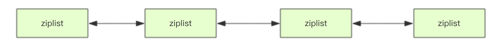
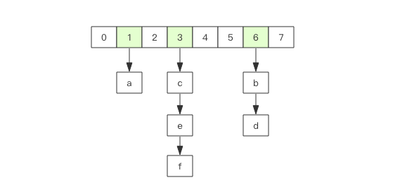
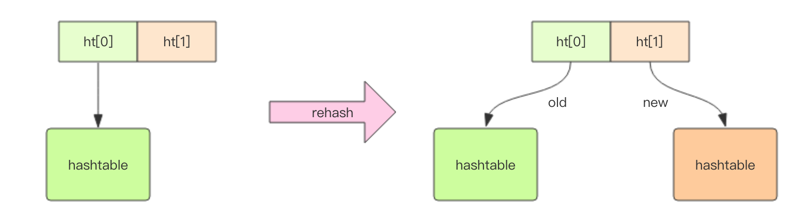

# 简介


# 安装

主要方式有四种：

1. 使用 Docker 安装。
2. 通过 Github 源码编译。
3. 直接安装 apt-get install(Ubuntu)、yum install(RedHat) 或者 brew install(Mac)。
4. 如果读者懒于安装操作，也可以使用网页版的 [Web Redis](https://try.redis.io/) 直接体验。


具体操作如下：

**Docker 方式**

```bash
# 拉取 redis 镜像
> docker pull redis
# 运行 redis 容器
> docker run --name myredis -d -p6379:6379 redis
# 执行容器中的 redis-cli，可以直接使用命令行操作 redis
> docker exec -it myredis redis-cli
```

**Github 源码编译方式**

```bash
# 下载源码
> git clone --branch 2.8 --depth 1 git@github.com:antirez/redis.git
> cd redis
# 编译
> make
> cd src
# 运行服务器，daemonize表示在后台运行
> ./redis-server --daemonize yes
# 运行命令行
> ./redis-cli
```

**直接安装方式**

```bash
# mac
> brew install redis
# ubuntu
> apt-get install redis
# redhat
> yum install redis
# 运行客户端
> redis-cli
```


# 基础数据结构

Redis 有 5 种基础数据结构，分别为：string (字符串)、list (列表)、set (集合)、hash (哈希) 和 zset (有序集合)。

### string（字符串）

字符串 string 是 Redis 最简单的数据结构。Redis 所有的数据结构都是以唯一的 key 字符串作为名称，然后通过这个唯一 key 值来获取相应的 value 数据。不同类型的数据结构的差异就在于 value 的结构不一样。


一个<u>常见的用途就是缓存用户信息</u>。我们将用户信息结构体使用 JSON 序列化成字符串，然后将序列化后的字符串塞进 Redis 来缓存。


Redis 的字符串是动态字符串，是可以修改的字符串，内部结构实现上类似于 Java 的  ArrayList，采用预分配冗余空间的方式来减少内存的频繁分配，如图中所示，内部为当前字符串实际分配的空间 capacity  一般要高于实际字符串长度 len。当字符串长度小于 1M 时，扩容都是加倍现有的空间，如果超过  1M，扩容时一次只会多扩 1M  的空间。需要注意的是字符串最大长度为 512M。

**键值对**

```bash
> set name codehole
OK
> get name
"codehole"
> exists name
(integer) 1
> del name
(integer) 1
> get name
(nil)
```

**批量键值对**

可以批量对多个字符串进行读写，节省网络耗时开销。

```bash
> set name1 codehole
OK
> set name2 holycoder
OK
> mget name1 name2 name3 # 返回一个列表
1) "codehole"
2) "holycoder"
3) (nil)
> mset name1 boy name2 girl name3 unknown
> mget name1 name2 name3
1) "boy"
2) "girl"
3) "unknown"
```

**过期和 set 命令扩展**

可以对 key 设置过期时间，到点自动删除，这个功能常用来控制缓存的失效时间。

```bash
> set name codehole
> get name
"codehole"
> expire name 5  # 5s 后过期
...  # wait for 5s
> get name
(nil)

> setex name 5 codehole  # 5s 后过期，等价于 set+expire
> get name
"codehole"
... # wait for 5s
> get name
(nil)

> setnx name codehole  # 如果 name 不存在就执行 set 创建
(integer) 1
> get name
"codehole"
> setnx name holycoder
(integer) 0  # 因为 name 已经存在，所以 set 创建不成功
> get name
"codehole"  # 没有改变
```

**计数**

如果 value 值是一个整数，还可以对它进行自增操作。自增是有范围的，它的范围是 signed long 的最大最小值，超过了这个值，Redis 会报错。

```bash
> set age 30
OK
> incr age
(integer) 31
> incrby age 5
(integer) 36
> incrby age -5
(integer) 31
> set codehole 9223372036854775807  # Long.Max
OK
> incr codehole
(error) ERR increment or decrement would overflow
```

### list（列表）

相当于 Java 语言里面的 LinkedList，注意它是链表而不是数组。这意味着 list 的插入和删除操作非常快，时间复杂度为 O(1)，但是索引定位很慢，时间复杂度为 O(n)

当列表弹出了最后一个元素之后，该数据结构自动被删除，内存被回收。


Redis 的列表结构常用来做异步队列使用。将需要延后处理的任务结构体序列化成字符串塞进 Redis 的列表，另一个线程从这个列表中轮询数据进行处理。

**右边进左边出：队列**

```bash
> rpush books python java golang
(integer) 3
> llen books
(integer) 3
> lpop books
"python"
> lpop books
"java"
> lpop books
"golang"
> lpop books
(nil)
```

**右边进右边出：栈**

```bash
> rpush books python java golang
(integer) 3
> rpop books
"golang"
> rpop books
"java"
> rpop books
"python"
> rpop books
(nil)
```

**慢操作**

lindex 相当于 Java 链表的`get(int index)`方法，它需要对链表进行遍历，性能随着参数`index`增大而变差。

```bash
> rpush books python java golang
(integer) 3
> lindex books 1  # O(n) 慎用
"java"
> lrange books 0 -1  # 获取所有元素，O(n) 慎用
1) "python"
2) "java"
3) "golang"
> ltrim books 1 -1 # O(n) 慎用 ltrim 和字面上的含义不太一样，个人觉得它叫 lretain(保留) 更合适一些，因为 ltrim 跟的两个参数start_index和end_index定义了一个区间，在这个区间内的值，ltrim 要保留，区间之外统统砍掉。
OK
> lrange books 0 -1
1) "java"
2) "golang"
> ltrim books 1 0 # 这其实是清空了整个列表，因为区间范围长度为负
OK
> llen books
(integer) 0
```

**快速列表**



再深入一点你会发现 Redis 底层存储还不是一个 linkedlist ，而是称之为快速链表的 quicklist 

首先在列表元素较少的情况下会使用一块连续的内存存储，这个结构是 `ziplist`，也即是压缩列表。它将所有的元素紧挨着一起存储，分配的是一块连续的内存。当数据量比较多的时候才会改成 `quicklist`。因为普通的链表需要的附加指针空间太大，会比较浪费空间，而且会加重内存的碎片化。比如这个列表里存的只是 `int` 类型的数据，结构上还需要两个额外的指针 `prev` 和 `next` 。所以 Redis 将链表和 `ziplist` 结合起来组成了 `quicklist`。也就是将多个 `ziplist` 使用双向指针串起来使用。这样既满足了快速的插入删除性能，又不会出现太大的空间冗余。

### hash（字典）

内部实现结构上同 Java 的 HashMap 也是一致的，同样的数组 + 链表二维结构。第一维 hash 的数组位置碰撞时，就会将碰撞的元素使用链表串接起来。



Redis 的字典的值只能是字符串，另外它们 rehash 的方式不一样，因为 Java 的 HashMap 在字典很大时，rehash 是个耗时的操作，需要一次性全部 rehash。Redis 为了高性能，不能堵塞服务，所以采用了渐进式 rehash 策略。



渐进式 rehash 会在 rehash 的同时，保留新旧两个 hash 结构，查询时会同时查询两个 hash 结构，然后在后续的定时任务中以及 hash 操作指令中，循序渐进地将旧 hash 的内容一点点迁移到新的 hash 结构中。当搬迁完成了，就会使用新的hash结构取而代之。（Golang map 也是这种渐进式 rehash）

当 hash 移除了最后一个元素之后，该数据结构自动被删除，内存被回收。

hash 也有缺点，hash 结构的存储消耗要高于单个字符串，到底该使用 hash 还是字符串，需要根据实际情况再三权衡。

```bash
> hset books java "think in java"  # 命令行的字符串如果包含空格，要用引号括起来
(integer) 1
> hset books golang "concurrency in go"
(integer) 1
> hset books python "python cookbook"
(integer) 1
> hgetall books  # entries()，key 和 value 间隔出现
1) "java"
2) "think in java"
3) "golang"
4) "concurrency in go"
5) "python"
6) "python cookbook"
> hlen books
(integer) 3
> hget books java
"think in java"
> hset books golang "learning go programming"  # 因为是更新操作，所以返回 0
(integer) 0
> hget books golang
"learning go programming"
> hmset books java "effective java" python "learning python" golang "modern golang programming"  # 批量 set
OK
```

### set（集合）

相当于 Java 语言里面的 HashSet，它内部的键值对是无序的唯一的。它的内部实现相当于一个特殊的字典，字典中所有的 value 都是一个值`NULL`。

当集合中最后一个元素移除之后，数据结构自动删除，内存被回收。


set 结构可以用来存储活动中奖的用户 ID，因为有去重功能，可以保证同一个用户不会中奖两次。

```bash
> sadd books python
(integer) 1
> sadd books python  #  重复
(integer) 0
> sadd books java golang
(integer) 2
> smembers books  # 注意顺序，和插入的并不一致，因为 set 是无序的
1) "java"
2) "python"
3) "golang"
> sismember books java  # 查询某个 value 是否存在，相当于 contains(o)
(integer) 1
> sismember books rust
(integer) 0
> scard books  # 获取长度相当于 count()
(integer) 3
> spop books  # 弹出一个
"java"
```

### zset（有序集合）

zset 可能是 Redis 提供的最为特色的数据结构，Java 的 SortedSet 和 HashMap 的结合体，一方面它是一个 set，保证了内部 value 的唯一性，另一方面它可以给每个 value 赋予一个 score，代表这个 value 的排序权重。它的内部实现用的是一种叫做「跳跃列表」的数据结构。

zset 中最后一个 value 被移除后，数据结构自动删除，内存被回收。


zset 可以用来存粉丝列表，value 值是粉丝的用户 ID，score 是关注时间。我们可以对粉丝列表按关注时间进行排序。

zset 还可以用来存储学生的成绩，value 值是学生的 ID，score 是他的考试成绩。我们可以对成绩按分数进行排序就可以得到他的名次。

```bash
> zadd books 9.0 "think in java"
(integer) 1
> zadd books 8.9 "java concurrency"
(integer) 1
> zadd books 8.6 "java cookbook"
(integer) 1
> zrange books 0 -1  # 按 score 排序列出，参数区间为排名范围
1) "java cookbook"
2) "java concurrency"
3) "think in java"
> zrevrange books 0 -1  # 按 score 逆序列出，参数区间为排名范围
1) "think in java"
2) "java concurrency"
3) "java cookbook"
> zcard books  # 相当于 count()
(integer) 3
> zscore books "java concurrency"  # 获取指定 value 的 score
"8.9000000000000004"  # 内部 score 使用 double 类型进行存储，所以存在小数点精度问题
> zrank books "java concurrency"  # 排名
(integer) 1
> zrangebyscore books 0 8.91  # 根据分值区间遍历 zset
1) "java cookbook"
2) "java concurrency"
> zrangebyscore books -inf 8.91 withscores # 根据分值区间 (-∞, 8.91] 遍历 zset，同时返回分值。inf 代表 infinite，无穷大的意思。
1) "java cookbook"
2) "8.5999999999999996"
3) "java concurrency"
4) "8.9000000000000004"
> zrem books "java concurrency"  # 删除 value
(integer) 1
> zrange books 0 -1
1) "java cookbook"
2) "think in java"
```

## 容器型数据结构的通用规则

list/set/hash/zset 这四种数据结构是容器型数据结构，它们共享下面两条通用规则：

1. create if not exists

   如果容器不存在，那就创建一个，再进行操作。比如 rpush 操作刚开始是没有列表的，Redis 就会自动创建一个，然后再 rpush 进去新元素。

2. drop if no elements

   如果容器里元素没有了，那么立即删除元素，释放内存。这意味着 lpop 操作到最后一个元素，列表就消失了。

## 过期时间

Redis 所有的数据结构都可以设置过期时间，时间到了，Redis 会自动删除相应的对象。需要注意的是过期是以对象为单位，比如一个 hash 结构的过期是整个 hash 对象的过期，而不是其中的某个子 key。

还有一个需要特别注意的地方是如果一个字符串已经设置了过期时间，然后你调用了 set 方法修改了它，它的过期时间会消失。

```
127.0.0.1:6379> set codehole yoyo
OK
127.0.0.1:6379> expire codehole 600
(integer) 1
127.0.0.1:6379> ttl codehole
(integer) 597
127.0.0.1:6379> set codehole yoyo
OK
127.0.0.1:6379> ttl codehole
(integer) -1
```

## 