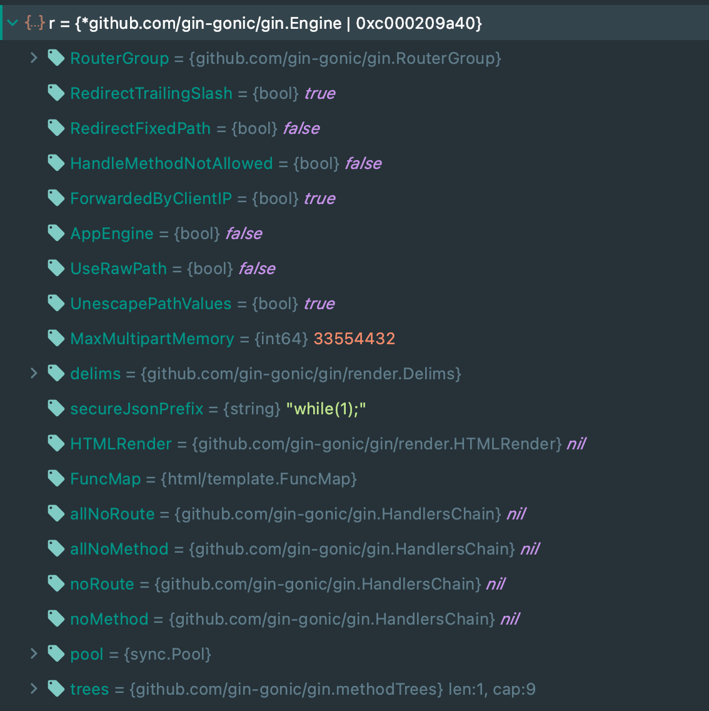
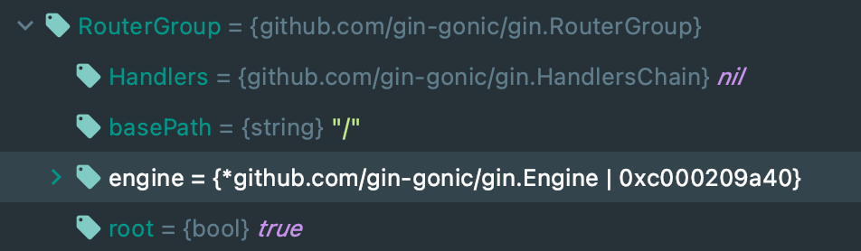
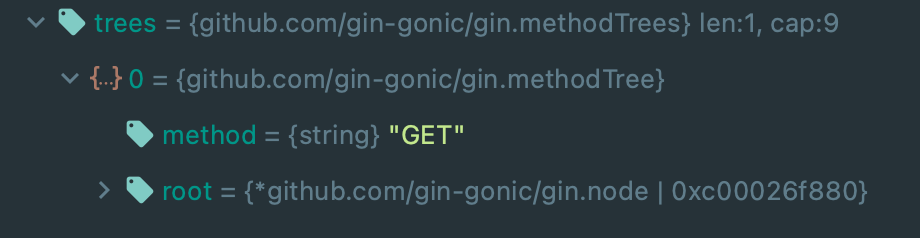
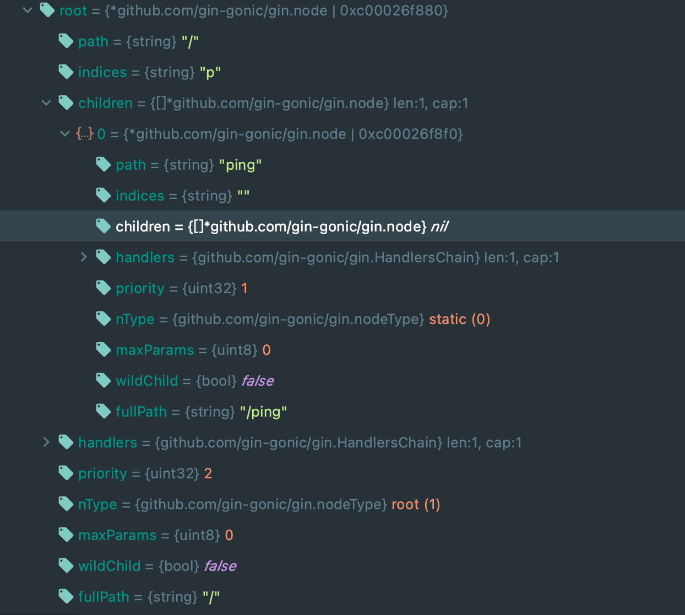
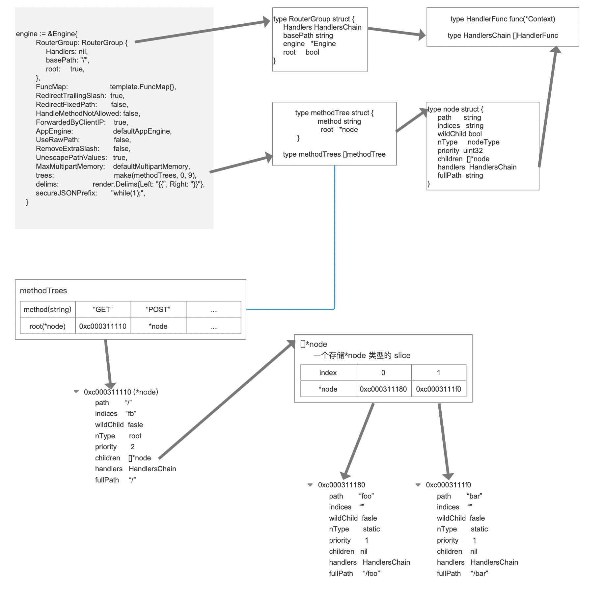

# Gin 源码阅读


以下是一个简单的 Gin 使用样例（官方样例），代码如下

https://github.com/gin-gonic/examples/blob/master/app-engine/gophers/hello.go

```go
package hello

import (
	"net/http"

	"github.com/gin-gonic/gin"
)

// This function's name is a must. App Engine uses it to drive the requests properly.
// 这个函数的名字是必须的。 应用引擎使用这个驱动适当地处理所有的 request
func init() {
  // 开始一个新的没有任何中间件的 Gin 实体
	r := gin.New()

	// 定义你的处理
	r.GET("/", func(c *gin.Context) {
		c.String(http.StatusOK, "Hello World!")
	})
	r.GET("/ping", func(c *gin.Context) {
		c.String(http.StatusOK, "pong")
	})

  // 使用 net/http 处理所有的请求
	http.Handle("/", r)
}
```

好了，大概我们有了方向，知道应该从哪儿开始看起——就从开始一个 Gin 实体开始。`gin.New()` 返回的是一个什么玩意儿呢？

`/gin/gin.go`

```go

// New 返回一个全新的没有任何中间件的空引擎实体
// 使用默认的设置如下：
// - RedirectTrailingSlash:  true
// - RedirectFixedPath:      false
// - HandleMethodNotAllowed: false
// - ForwardedByClientIP:    true
// - UseRawPath:             false
// - UnescapePathValues:     true
func New() *Engine {
  // 判断当前运行环境是否为 Debug 模式然后打印 WARNING 信息
   debugPrintWARNINGNew()
   engine := &Engine{
      RouterGroup: RouterGroup{
         Handlers: nil,
         basePath: "/",
         root:     true,
      },
      FuncMap:                template.FuncMap{},
      RedirectTrailingSlash:  true,
      RedirectFixedPath:      false,
      HandleMethodNotAllowed: false,
      ForwardedByClientIP:    true,
      AppEngine:              defaultAppEngine,
      UseRawPath:             false,
      RemoveExtraSlash:       false,
      UnescapePathValues:     true,
      MaxMultipartMemory:     defaultMultipartMemory,
      trees:                  make(methodTrees, 0, 9),
      delims:                 render.Delims{Left: "{{", Right: "}}"},
      secureJSONPrefix:       "while(1);",
   }
   engine.RouterGroup.engine = engine
   engine.pool.New = func() interface{} {
      return engine.allocateContext()
   }
   return engine
}
```

我们看到该函数返回的是 *Engine ，直接去到 Engine 结构体的定义看看源码是怎么解释的

```go
// Engine 是这个框架的实体， 其中包含有 muxer 中间件和一些配置设置
// 通过使用 New() 或者 Default() 创建一个 Engine 的实体
type Engine struct {
	RouterGroup

  // 如果当前路由不能被匹配，则启用自动重定向
	// 带有(不带)结尾斜杠的路径的处理程序存在。
	// 例如，如果请求的是/foo/，但是只存在/foo的路由，则
	// 客户端被重定向到/foo, GET请求的http状态码为301
	// 和307的所有其他请求方法。
	RedirectTrailingSlash bool

  // 如果启用，路由器尝试修复当前请求路径，如果没有
	// 为它注册处理。
  // 首先，多余的路径元素，如 ../ 或 // 被删除。
	// 其次，路由器对清除的路径进行不区分大小写的查找。
	// 如果可以找到该路由的处理，路由器会进行重定向
	// 指向正确的路径，状态码为 301 的 GET 请求和 307 的
	// 所有其他请求方法。
	// 例如/FOO和 /..//Foo 可以重定向到/Foo。
	// redirecttrailing 斜杠独立于这个选项。
	RedirectFixedPath bool

  // 如果启用，路由器检查是否允许另一个方法
	// 当前路由，如果当前请求不能被路由。
	// 如果是这种情况，请求将被返回'Method Not Allowed'
	// 和 HTTP 状态码 405。
	// 如果没有其他方法被允许，请求被委托给 NotFound
	// 处理程序。
	HandleMethodNotAllowed bool
	ForwardedByClientIP    bool

  // #726 #755 如果启用，它将允许插入一些以
	// 'X-AppEngine…' 为了更好地与PaaS结合。
	AppEngine bool

  // 如果开启， url.RawPath 会被用于查找参数
	UseRawPath bool

  // 如果为 true，路径的值将不转义。
	// 如果 UseRawPath 是 false(默认)，UnescapePathValues 实际上是 true，
	// url.Path 会被使用，它已经没有转义了。
	UnescapePathValues bool

  // 给 http 的 maxMemory 参数的值请求的 ParseMultipartForm
	// 方法调用。
	MaxMultipartMemory int64

  // 即使 URL 中有额外的斜杠，参数也可以被解析。
	// 见第 #1817 PR和 #1644 issue
	RemoveExtraSlash bool

	delims           render.Delims
	secureJSONPrefix string
	HTMLRender       render.HTMLRender
	FuncMap          template.FuncMap
	allNoRoute       HandlersChain
	allNoMethod      HandlersChain
	noRoute          HandlersChain
	noMethod         HandlersChain
	pool             sync.Pool
	trees            methodTrees
	maxParams        uint16
}
```

可以看见其中的很多属性都是用于程序做处理的配置项

接下来我们关注于路由实现

### 路由

可以通过 `gin.New()` 函数看见当中对路有组的一些定义

```go
engine := &Engine{
  // 实例一个 path 为 "/" 的路由组
		RouterGroup: RouterGroup{
			Handlers: nil,
			basePath: "/",
			root:     true,
		},
  ...... 
  // 将 gin Engine 实例本身添加至路由组的 engine 中
  engine.RouterGroup.engine = engine
```

`/gin/routegroup.go`

```go
// RouterGroup 用于内部配置路由器，一个 RouterGroup 与一个前缀和一个处理器数组(中间件)相关联
type RouterGroup struct {
   Handlers HandlersChain
   basePath string
   engine   *Engine
   root     bool
}
```

在示例中是这样注册一个路由的

```go
	r.GET("/", func(c *gin.Context) {
		c.String(http.StatusOK, "Hello World!")
	})
```

顺着源码下去，`r.GET()` 函数是怎么回事呢？翻看源码，`gin.go` 的 `Engine` 的结构体的定义中没有 `GET` 方法啊。他实际上就是调用了 `RouterGroup.GET()` 函数。 为什么呢？还记得在 `Engine` 结构体里怎么定义的吗？（请直接往上去看）,是直接在 `Engine` 结构体中直接嵌入了`RouterGroup`结构体,这就是 Golang 的一个特性了，相当于在 `Engine` 的结构体中直接写有`RouterGroup` 结构体的所有字段，这里不做拓展。给出查阅资料请新建窗口去看看。

[内嵌类型的方法和继承](https://learnku.com/docs/the-way-to-go/105-anonymous-field-and-embedded-structure/3643#8bbaa2)

`/gin/routergroup.go`

```go
// GET is a shortcut for router.Handle("GET", path, handle).
func (group *RouterGroup) GET(relativePath string, handlers ...HandlerFunc) IRoutes {
   return group.handle("GET", relativePath, handlers)
}
........

func (group *RouterGroup) handle(httpMethod, relativePath string, handlers HandlersChain) IRoutes {
  // 计算出完整的路由路径 -> string
  // --- joinPaths(group.basePath, relativePath)
	absolutePath := group.calculateAbsolutePath(relativePath)
  
  // 将定义路径的 handle 函数与 group 中之前定义函数合并（中间件等） -> HandlersChain
	handlers = group.combineHandlers(handlers)
  
  // 从引擎中调用 addRoute() 函数，将 handle 函数绑定路由路径和请求方法
  // 可以通过这个函数知道路由最后绑定在哪儿的，请往下看这个函数的定义
	group.engine.addRoute(httpMethod, absolutePath, handlers)
  
  // 返回了调用的 RouterGroup 实体本体
  // 如果 RouterGroup 是被 Engine 调用的则返回 Engine
	return group.returnObj()
}
```

https://github.com/gin-gonic/examples/blob/master/app-engine/gophers/hello.go

```go
func init() {
	r := gin.New()

	r.GET("/", func(c *gin.Context) {
		c.String(http.StatusOK, "Hello World!")
	})
	r.GET("/ping", func(c *gin.Context) {
		c.String(http.StatusOK, "pong")
	})

	http.Handle("/", r)
}
```

也就是说在样例代码中的定义中会通过 basePath 为 '/' 的 RouterGroup，计算两个 `GET` 方法传递的路径`"/"` 和` "/ping"` 的绝对路径然后，再合并(combine)对应的 handle 函数的，然后调用了 `group` 中绑定的 `engine` 将绝对路径和处理方法添加到 `trees` ，我们先来看看内存中的 `r` Engine 结构体中都存储了哪些内容



`RouterGroup`



好，现在我们来详细看看绑定好的路由是以什么样的形式存在的。

`/gin/gin.go`

```go
func (engine *Engine) addRoute(method, path string, handlers HandlersChain) {
   assert1(path[0] == '/', "path 必须以 '/' 开头")
   assert1(method != "", "HTTP 方法不能为空")
   assert1(len(handlers) > 0, "这里必须至少有一个处理方法")

   // 打印 debug 信息
   debugPrintRoute(method, path, handlers)
  
   // 如调用字面意思，在树中找到传递过来的 method 值的那一个节点
   // 回到 engine 的结构体定义找到 trees 字段，发现 trees 是 methodTrees 类型
   // 请带着疑惑继续将此处的逻辑代码看一遍
   // 因为无论是 tree 还是 root 都是会在在下一个 tree.go 源文件中找到
   root := engine.trees.get(method)
   if root == nil {
      // 可见 root 是一个 node 结构体的东西
      root = new(node)
      root.fullPath = "/"
      engine.trees = append(engine.trees, methodTree{method: method, root: root})
   }
   // 将路径与绑定的 handle 函数添加到 node 上
   root.addRoute(path, handlers)
  
  // 更新 maxParams
	if paramsCount := countParams(path); paramsCount > engine.maxParams  {
		engine.maxParams = paramsCount
	}
}

// gin/utils.go
func assert1(guard bool, text string) {
	if !guard {
		panic(text)
	}
}

// gin/tree.go
type methodTree struct {
	method string
	root   *node
}

// 其实就是一个结构体的 slice
type methodTrees []methodTree

func (trees methodTrees) get(method string) *node {
  // 遍历 slice 找到对应的结构体，返回他的 root
	for _, tree := range trees {
		if tree.method == method {
			return tree.root
		}
	}
	return nil
}

// 回到 engine.go 中可以看见如果没有从 methodTrees 中找到对应的节点会创建一个 node 节点作为 root 
type node struct {
	path      string
	indices   string
	children  []*node
	handlers  HandlersChain
	priority  uint32
	nType     nodeType
	maxParams uint8
	wildChild bool
	fullPath  string
}

```

可见 `addRoute` 是把路由路径和 handle 函数绑定到 `trees` 中的，我们先看看示例程序的 `trees` 是什么样的



`trees` 中生成了 `methodTree` 实体，method 方法为 "GET" 因为两个路由都是 GET 方法的，猜测 root 节点是 "/" 的绑定实体该节点下是 "/ping" 路由的节点，果然实况如图：



接下来我们回到代码的逻辑，他是如何生成 node 并相互挂载的。

简单的说来，流程是这个样子的，添加第一条路由的判断当前节点是否为空，是的话在 root 节点直接添加上路径与 handle 函数。

如果添加第二条路由，会在树中对比最长匹配路径，在树中更具路径遍历，直到遍历出最长匹配路径的节点，然后创建一个节点挂载在找到的节点后。

如果第二条路由路径比已有找到的路径还要短，比如想要绑定 "/test/ping" 现树中只有 "/test/foo/bar" 节点，那首先两个就会找到 "/test/foo/bar" 节点，然后将其拆分成 `path` 为 "/test/foo" 和 "/bar"  两个节点，并且 "/bar"  挂载在 "/test/foo" 节点下，然后对节点再进行最长字符匹配找到 "/test/foo" 的节点然后将函数绑定进去。

现在我们假设再插入一条 "/tset/faa" 的路由，字符最长匹配会找到 "/test/f" 然后将结点分离开，于是就有了 "/test/f", "oo"(该节点下还挂着"/bar") , "aa"（当前路由插入的节点），"oo" 和 "aa" 被挂在 "/test/f" 结点的 `children` 下，node 结构体有个属性叫 `indices` 它记录了当前结点下的孩子结点们的头一个字符，比如说这里的 "/test/f" 结点，他的 `indices` 值为 "oa"。可以发现，`indices[0]` 对应就是 `children[0]` 

因此在寻找匹配路由的时候，会先从该 `indices` 字段搜寻匹配的下标，这样就能知道想要查找的路径是在 `children` 中的哪一个

`/gin/tree.go`

```go
// addRoute 将绑定了 handle 函数和路径的 node 添加到 root
// 不是并发安全的
func (n *node) addRoute(path string, handlers HandlersChain) {
	fullPath := path
	n.priority++

	// Empty tree
	if len(n.path) == 0 && len(n.children) == 0 {
    // 该函数是最主要插入函数
    // 非空树也会找到响应节点添加上相应子节点
    // 然后在子节点上调用该函数绑定路由和 handle 函数
		n.insertChild(path, fullPath, handlers)
		n.nType = root
		return
	}

	parentFullPathIndex := 0

walk:
	for {
    // 找到最长匹配前缀的节点
    // 这也意味着普通前缀不包含 ':' 或 '*'
		// 因为现有的键不能包含这些字符
		i := longestCommonPrefix(path, n.path)

		// 将找到的最长匹配字符与当前字符分裂开来
    // 如果找到的最长匹配字符在当前节点 path 之前，将当前节点分割成两份
		if i < len(n.path) {
			child := node{
				path:      n.path[i:],
				wildChild: n.wildChild,
				indices:   n.indices,
				children:  n.children,
				handlers:  n.handlers,
				priority:  n.priority - 1,
				fullPath:  n.fullPath,
			}

			n.children = []*node{&child}
			// []byte for proper unicode char conversion, see #65
			n.indices = bytesconv.BytesToString([]byte{n.path[i]})
			n.path = path[:i]
			n.handlers = nil
			n.wildChild = false
			n.fullPath = fullPath[:parentFullPathIndex+i]
		}

    // 为当前节点创建一个子节点
		if i < len(path) {
			path = path[i:]

			if n.wildChild {
				parentFullPathIndex += len(n.path)
				n = n.children[0]
				n.priority++

				// Check if the wildcard matches
				if len(path) >= len(n.path) && n.path == path[:len(n.path)] &&
					// Adding a child to a catchAll is not possible
					n.nType != catchAll &&
					// Check for longer wildcard, e.g. :name and :names
					(len(n.path) >= len(path) || path[len(n.path)] == '/') {
					continue walk
				}

				pathSeg := path
				if n.nType != catchAll {
					pathSeg = strings.SplitN(path, "/", 2)[0]
				}
				prefix := fullPath[:strings.Index(fullPath, pathSeg)] + n.path
				panic("'" + pathSeg +
					"' in new path '" + fullPath +
					"' conflicts with existing wildcard '" + n.path +
					"' in existing prefix '" + prefix +
					"'")
			}

			c := path[0]

			// slash after param
			if n.nType == param && c == '/' && len(n.children) == 1 {
				parentFullPathIndex += len(n.path)
				n = n.children[0]
				n.priority++
				continue walk
			}

			// Check if a child with the next path byte exists
			for i, max := 0, len(n.indices); i < max; i++ {
				if c == n.indices[i] {
					parentFullPathIndex += len(n.path)
					i = n.incrementChildPrio(i)
					n = n.children[i]
					continue walk
				}
			}

			// Otherwise insert it
			if c != ':' && c != '*' {
				// []byte for proper unicode char conversion, see #65
				n.indices += bytesconv.BytesToString([]byte{c})
				child := &node{
					fullPath: fullPath,
				}
				n.children = append(n.children, child)
				n.incrementChildPrio(len(n.indices) - 1)
				n = child
			}
			n.insertChild(path, fullPath, handlers)
			return
		}

		// Otherwise and handle to current node
		if n.handlers != nil {
			panic("handlers are already registered for path '" + fullPath + "'")
		}
		n.handlers = handlers
		n.fullPath = fullPath
		return
	}
}

```

好了，一个路由以及他的 handle 函数以及被设置好了。来一张结构脑图总结一下。



有必要看着这个结构图和下面的代码然后回忆一下 `gin` 的实现细节

```go
func init() {
	r := gin.New()

	r.GET("/", func(c *gin.Context) {
		c.String(http.StatusOK, "Hello World!")
	})
	r.GET("/foo", func(c *gin.Context) {
		c.String(http.StatusOK, "pong")
	})
  r.GET("/bar", func(c *gin.Context) {
		c.String(http.StatusOK, "pong")
	})

	http.Handle("/", r)
}
```


既然讲到了路由，我认为很有必要看看当一个 HTTP request 进到程序，他是如何更具请求 URL 找到对应结点的，下面我找出了关键源码呈现给大家。

`gin/gin.go`

```go
	t := engine.trees
	// 找到对应方法树的根(root)结点
	for i, tl := 0, len(t); i < tl; i++ {
		if t[i].method != httpMethod {
			continue
		}
		root := t[i].root
		// 找到对应路由
		value := root.getValue(rPath, c.params, unescape)
		if value.params != nil {
			c.Params = *value.params
		}
    // handle 函数数组不为空
		if value.handlers != nil {
			c.handlers = value.handlers
			c.fullPath = value.fullPath
      // 本质是对 handlers 数组的遍历调用
			c.Next()
			c.writermem.WriteHeaderNow()
			return
		}
	........
	}


// gin/tree.go
func (n *node) getValue(path string, params *Params, unescape bool) (value nodeValue) {
walk: // Outer loop for walking the tree
	for {
		prefix := n.path
		if len(path) > len(prefix) {
			if path[:len(prefix)] == prefix {
				path = path[len(prefix):]
				// 如果这个结点不是一个有通配的节点 (param or catchAll)
				// 那么就可以直接往下遍历
				if !n.wildChild {
					idxc := path[0]
					for i, c := range []byte(n.indices) {
						if c == idxc {
							n = n.children[i]
							continue walk
						}
					}

					// 什么也没找到
					// 我们可以建议重定向到相同的URL，不带尾斜杠，如果叶结点存在的路径。
					value.tsr = (path == "/" && n.handlers != nil)
					return
				}

				// 处理有通配符的孩子结点
				n = n.children[0]
				switch n.nType {
				case param:
					// 找到参数结束 (either '/' or path end)
					end := 0
					for end < len(path) && path[end] != '/' {
						end++
					}

					// 将 params 保存到返回结果
					if params != nil {
						if value.params == nil {
							value.params = params
						}
						// Expand slice within preallocated capacity
						i := len(*value.params)
						*value.params = (*value.params)[:i+1]
						val := path[:end]
						if unescape {
							if v, err := url.QueryUnescape(val); err == nil {
								val = v
							}
						}
						(*value.params)[i] = Param{
							Key:   n.path[1:],
							Value: val,
						}
					}

					// 需要继续下探
					if end < len(path) {
						if len(n.children) > 0 {
							path = path[end:]
							n = n.children[0]
							continue walk
						}

						// 但是没法下探的时候
						value.tsr = (len(path) == end+1)
						return
					}

					if value.handlers = n.handlers; value.handlers != nil {
						value.fullPath = n.fullPath
						return
					}
					if len(n.children) == 1 {
						// 没有任何 handle 函数。检查该 path + a 的 handle 函数存在
						// TSR建议路径最后存有尾斜杠
						n = n.children[0]
						value.tsr = (n.path == "/" && n.handlers != nil)
					}
					return

				case catchAll:
					// 将 params 保存到返回结果
					if params != nil {
						if value.params == nil {
							value.params = params
						}
						// Expand slice within preallocated capacity
						i := len(*value.params)
						*value.params = (*value.params)[:i+1]
						val := path
						if unescape {
							if v, err := url.QueryUnescape(path); err == nil {
								val = v
							}
						}
						(*value.params)[i] = Param{
							Key:   n.path[2:],
							Value: val,
						}
					}

					value.handlers = n.handlers
					value.fullPath = n.fullPath
					return

				default:
					panic("invalid node type")
				}
			}
		}

		if path == prefix {
			// 我们应该已经找到匹配路径的结点
			// 检查这个结点是否注册得有 handle 函数
			if value.handlers = n.handlers; value.handlers != nil {
				value.fullPath = n.fullPath
				return
			}

			// 如果该路由没有注册 handle 函数
			// 但该路由有一个通配符的子结点，则必须有一个该路径的 handle
			// 后跟一个额外的斜杠
			if path == "/" && n.wildChild && n.nType != root {
				value.tsr = true
				return
			}

			// 没有任何 handle 函数。检查该 path + a 的 handle 函数存在
			// TSR建议路径最后存有尾斜杠
			for i, c := range []byte(n.indices) {
				if c == '/' {
					n = n.children[i]
					value.tsr = (len(n.path) == 1 && n.handlers != nil) ||
						(n.nType == catchAll && n.children[0].handlers != nil)
					return
				}
			}

			return
		}

		// 什么也没找到。
    // 可以建议重定向到相同的 URL 与一个额外的 '/' 符号如果叶子存在的路径
		value.tsr = (path == "/") ||
			(len(prefix) == len(path)+1 && prefix[len(path)] == '/' &&
				path == prefix[:len(prefix)-1] && n.handlers != nil)
		return
	}
}

```

可以看见其本质就是一次对树的遍历，直到找到对应路径(path) 所在的结点，然后进行 handle 函数的处理最后返回 HTTP Response