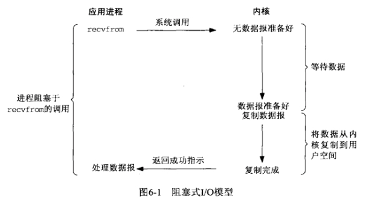

# 操作系统

操作系统的 **五大功能**，分别为：<u>作业管理、文件管理、存储管理、输入输出设备管理、进程及处理机管理</u>

## 进程、线程、协程

### 进程

是应用程序的启动实例，<u>每个进程都有独立的内存空间</u>，不同进程通过 [进程间的通信方式](https://cloud.tencent.com/developer/article/1690556) 来通信。进程是占有资源的最小单位（线程可以访问其所在进程内的所有资源，但线程本身并不占有资源或仅仅占有一点必须资源）

每一个进程来说这个进程看到属于它的一块 **内存资源**，这块资源是它所 **独占** 的，所以进程之间的通信就会比较麻烦，原理就是需要让不同的进程间能够看到一份公共的资源。所以交换数据必须通过内核, **在内核中开辟一块缓冲区**，进程1把数据从用户空间 拷到内核缓冲区，进程2再从内核缓冲区把数据读走，内核提供的这种机制称为进程间通信。

- 进程间的通信方式
  1. 匿名管道通信

     1. 只能单向通信

     2. 只能血缘关系的进程进行通信（父子进程、兄弟进程）

     3. 依赖于文件系统

     4. 生命周期随进程（在内存中，进程结束被释放）

     5. 面向字节流的服务

     6. 管道内部提供了同步机制（锁、等待队列、信号）
     7. 读写端通过打开的文件描述符来传递

  2. 高级管道通信

  3. 有名管道通信

     1. 解决匿名管道的只能有血缘关系的进程通信问题
     2. **提供一个路径名**与之关联，**以FIFO的文件形式存储于文件系统中**
     3. 命名管道是一个设备文件

  4. 消息队列通信

  5. 信号量通信

  6. 信号

  7. 共享内存通信

  8. 套接字通信

### 线程

从属于进程，每个进程至少包含一个线程，线程是 <u>CPU 调度的基本单位</u>，多个线程之间可以共享进程的资源并通过共享内存等线程间的通信方式来通信。

### 协程

协程可以理解为一种轻量级线程，与线程相比，协程不受操作系统调度，协程调度器由用户应用程序提供，协程调度器按照调度策略把<u>协程调度到线程中运行</u>。

### 总结

线程是最小的执行单元，而进程由至少一个线程组成。如何调度进程和线程，完全由操作系统决定，程序自己不能决定什么时候执行，执行多长时间。

###### 参考

https://hit-alibaba.github.io/interview/basic/arch/Concurrency.html

---

## 文件描述符

文件描述符：简称fd，当应用程序请求内核打开/新建一个文件时，内核会返回一个文件描述符用于对应这个打开/新建的文件，其fd本质上就是一个非负整数，读写文件也是需要使用这个文件描述符来指定待读写的文件的。

操作系统为每一个进程维护了一个文件描述符表，该表的索引值都从从0开始的，所以在不同的进程中可以看到相同的文件描述符，这种情况下相同的文件描述符可能指向同一个文件，也可能指向不同的文件，具体情况需要具体分析，下面用一张简图就可以很容易的明白了


---


## IO

IO分两阶段：

```
1.数据准备阶段
2.内核空间复制回用户进程缓冲区阶段
```

### 五种 IO 模型

#### 同步

同步是指用户线程发起IO请求后需要等待或者轮询内核IO操作完成后才能继续执行。

#### 异步

异步是指用户线程发起IO请求后仍继续执行，当内核IO操作完成后会通知用户线程，或者调用用户线程注册的回调函数。

#### 阻塞

阻塞是指IO操作需要彻底完成后才返回到用户空间。

#### 非阻塞

非阻塞是指IO操作被调用后立即返回给用户一个状态值，无需等到IO操作彻底完成。

#### 同步阻塞 IO（Blocking IO）

- 传统 IO 模型
- 用户线程在内核进行 IO 操作时被阻塞




用户线程通过系统调用read发起IO读操作，由用户空间转到内核空间。内核等到数据包到达后，然后将接收的数据拷贝到用户空间，完成read操作。


#### 同步非阻塞 IO（Non-blocking IO）

- 用户线程可以在发起IO请求后可以立即返回


由于socket是非阻塞的方式，因此用户线程发起IO请求时立即返回。但并未读取到任何数据，用户线程需要不断地发起IO请求，直到数据到达后，才真正读取到数据，继续执行。

#### IO 多路复用（IO Multiplexing）

- IO多路复用模型是建立在内核提供的多路分离函数select基础之上的，使用select函数可以避免同步非阻塞IO模型中轮询等待的问题。


用户首先将需要进行IO操作的 socket 添加到 select 中，然后阻塞等待 select 系统调用返回。当数据到达时，socket 被激活，select 函数返回。用户线程正式发起 read 请求，读取数据并继续执行。

从流程上来看，使用 select 函数进行IO请求和同步阻塞模型没有太大的区别，甚至还多了添加监视socket，以及调用select函数的额外操作，效率更差。但是，<u>使用 select 以后最大的优势是用户可以在一个线程内同时处理多个socket 的 IO 请求</u>。用户可以注册多个socket，然后不断地调用 select 读取被激活的 socket，即<u>可达到在同一个线程内同时处理多个 IO 请求的目的</u>。而在同步阻塞模型中，必须通过多线程的方式才能达到这个目的。

#### 异步 IO（Asynchronous IO）

- 让内核等数据准备好，并且复制到用户进程空间后执行事先指定好的函数。
- 只发出IO指令，并不等待IO结果，然后就去执行其他代码，当IO返回结果时，再通知CPU进行处理。


#### 信号驱动 IO（Signal Driven IO）

- 通过调用sigaction注册信号函数，等内核数据准备好的时候系统中断当前程序，执行信号函数(在这里面调用recv)


#### 小结

阻塞IO模型、非阻塞IO模型、IO复用模型(select/poll/epoll)、信号驱动IO模型都属于同步IO，因为阶段2是阻塞的(尽管时间很短)。只有异步IO模型是符合POSIX异步IO操作含义的，不管在阶段1还是阶段2都可以干别的事。


#### 参考

https://www.jianshu.com/p/96f1189b95fe

https://www.cnblogs.com/euphie/p/6376508.html


#### IO 多路复用

IO 多路复用是指内核一旦发现进程指定的一个或者多个 IO 条件准备读取，它就通知该进程。IO 多路复用适用如下场合：

1. 当客户处理多个描述字时（一般时交互式输入和网络套接接口），必须使用 I/O 复用。
2. 当一个客户同时处理多个套接口时，而这种情况时可能的，但很少出现。
3. 如果一个 TCP 服务器既要处理监听套接口，又要处理已连接套接口，一般也要用到 I/O 复用。
4. 如果一个服务器即要处理 TCP，又要处理 UDP，一般要使用 I/O 复用。

与多进程和多线程技术相比，I/O多路复用技术的最大优势是系统开销小，系统不必创建进程/线程，也不必维护这些进程/线程，从而大大减小了系统的开销。


### 堆、栈

#### 栈

栈是用于存放本地变量，内部临时变量以及有关上下文的内存区域。程序在调用函数时，操作系统会自动通过压栈和弹栈完成保存函数现场等操作，不需要程序员手动干预。

栈 <u>是一块连续的内存区域</u>，<u>栈顶的地址和栈的最大容量是系统预先规定好的</u>。能从栈获得的空间较小。如果申请的空间超过栈的剩余空间时，例如递归深度过深，将提示 stackoverflow。

栈是机器系统提供的数据结构，计算机会在底层对栈提供支持：分配专门的寄存器存放栈的地址，压栈出栈都有专门的指令执行，这就决定了栈的效率比较高。

#### 堆

堆是用于存放除了栈里的东西之外所有其他东西的内存区域，当使用`malloc`和`free`时就是在操作堆中的内存。对于堆来说，释放工作由程序员控制，容易产生memory leak。

堆是 <u>向高地址扩展</u> 的数据结构，是 <u>不连续的内存区域</u>。这是由于系统是用链表来存储的空闲内存地址的，自然是不连续的，而链表的遍历方向是由低地址向高地址。堆的大小受限于计算机系统中有效的虚拟内存。由此可见，堆获得的空间比较灵活，也比较大。

对于堆来讲，频繁的 new/delete 势必会造成内存空间的不连续，从而造成大量的碎片，使程序效率降低。对于栈来讲，则不会存在这个问题，因为栈是先进后出的队列，永远都不可能有一个内存块从栈中间弹出。

堆都是动态分配的，没有静态分配的堆。栈有2种分配方式：静态分配和动态分配。静态分配是编译器完成的，比如局部变量的分配。动态分配由 `alloca` 函数进行分配，但是栈的动态分配和堆是不同的，他的动态分配是由编译器进行释放，无需我们手工实现。

计算机底层并没有对堆的支持，堆则是C/C++函数库提供的，同时由于上面提到的碎片问题，都会导致堆的效率比栈要低。

#### 参考

https://hit-alibaba.github.io/interview/basic/arch/Memory-Management.html

---


### 磁盘调度

磁盘访问延迟 = 队列时间 + 控制器时间 + 寻道时间 + 旋转时间 + 传输时间

磁盘调度的目的是减小延迟，其中前两项可以忽略，寻道时间是主要矛盾。

