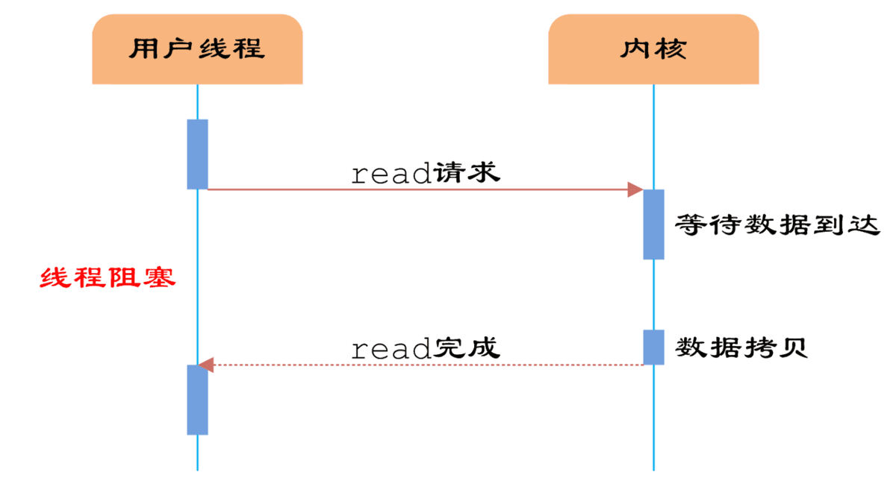
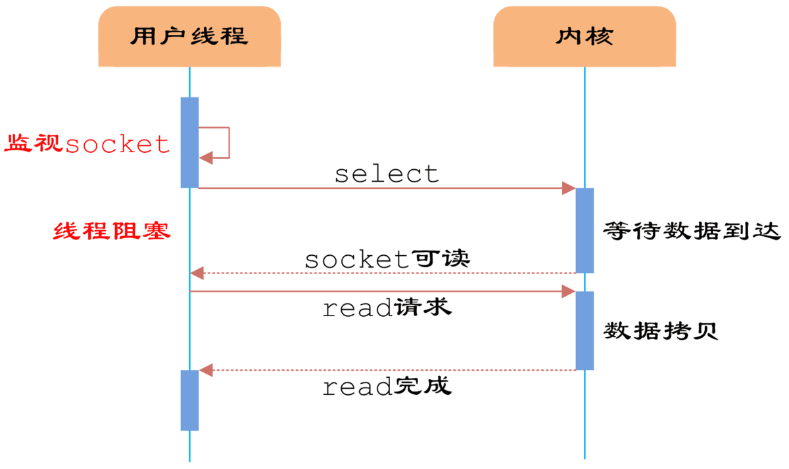
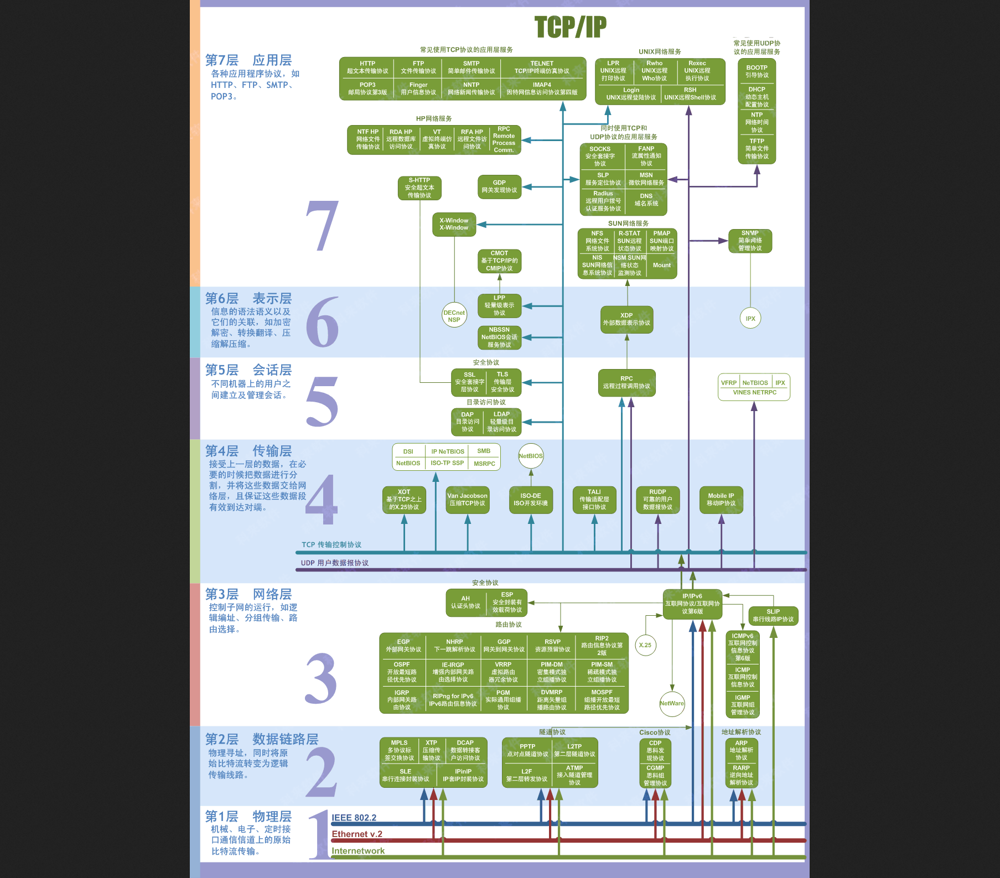
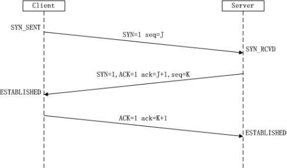
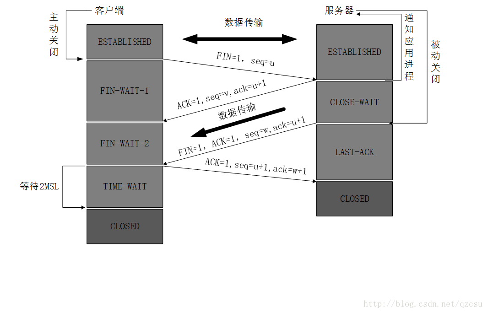
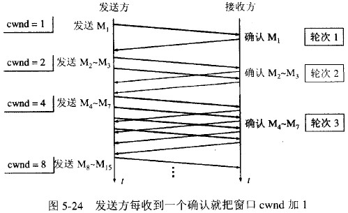
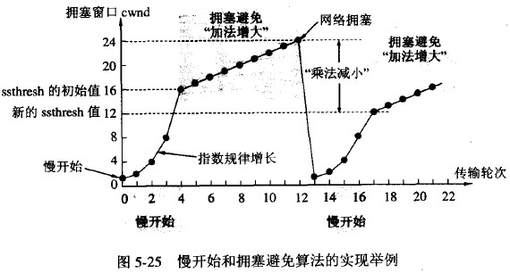
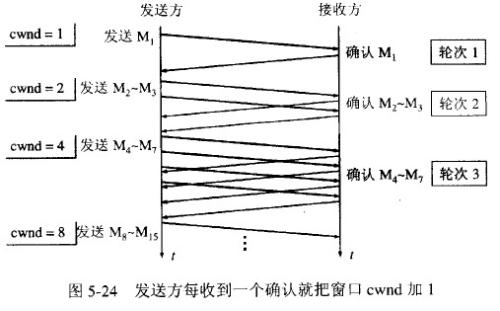
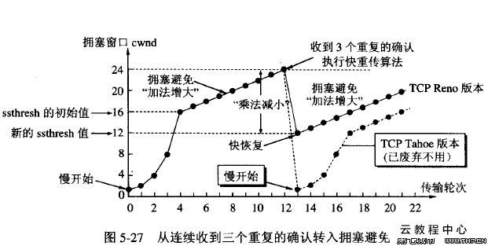

# 我的后端校招准备

## 准备

- 简历
  - 自我介绍
  - 项目
  - 自我优缺点
- 技能

  - 操作系统
  - 网络
  - 数据库
- 算法数据结构

## 脑图


## 技能

#### 操作系统

操作系统的 **五大功能**，分别为：<u>作业管理、文件管理、存储管理、输入输出设备管理、进程及处理机管理</u>

##### 进程、线程、协程

###### 进程

是应用程序的启动实例，<u>每个进程都有独立的内存空间</u>，不同进程通过 [进程间的通信方式](https://cloud.tencent.com/developer/article/1690556) 来通信。进程是占有资源的最小单位（线程可以访问其所在进程内的所有资源，但线程本身并不占有资源或仅仅占有一点必须资源）

- 进程间的通信方式
  1. 匿名管道通信
  2. 高级管道通信
  3. 有名管道通信
  4. 消息队列通信
  5. 信号量通信
  6. 信号
  7. 共享内存通信
  8. 套接字通信

###### 线程

从属于进程，每个进程至少包含一个线程，线程是 <u>CPU 调度的基本单位</u>，多个线程之间可以共享进程的资源并通过共享内存等线程间的通信方式来通信。

###### 协程

协程可以理解为一种轻量级线程，与线程相比，协程不受操作系统调度，协程调度器由用户应用程序提供，协程调度器按照调度策略把<u>协程调度到线程中运行</u>。

###### 总结

线程是最小的执行单元，而进程由至少一个线程组成。如何调度进程和线程，完全由操作系统决定，程序自己不能决定什么时候执行，执行多长时间。

###### 参考

https://hit-alibaba.github.io/interview/basic/arch/Concurrency.html

---


#### IO

IO分两阶段：

```
1.数据准备阶段
2.内核空间复制回用户进程缓冲区阶段
```

##### 五种 IO 模型

###### 同步

同步是指用户线程发起IO请求后需要等待或者轮询内核IO操作完成后才能继续执行。

###### 异步

异步是指用户线程发起IO请求后仍继续执行，当内核IO操作完成后会通知用户线程，或者调用用户线程注册的回调函数。

###### 阻塞

阻塞是指IO操作需要彻底完成后才返回到用户空间。

###### 非阻塞

非阻塞是指IO操作被调用后立即返回给用户一个状态值，无需等到IO操作彻底完成。

###### 同步阻塞 IO（Blocking IO）

- 传统 IO 模型
- 用户线程在内核进行 IO 操作时被阻塞




用户线程通过系统调用read发起IO读操作，由用户空间转到内核空间。内核等到数据包到达后，然后将接收的数据拷贝到用户空间，完成read操作。


###### 同步非阻塞 IO（Non-blocking IO）

- 用户线程可以在发起IO请求后可以立即返回


由于socket是非阻塞的方式，因此用户线程发起IO请求时立即返回。但并未读取到任何数据，用户线程需要不断地发起IO请求，直到数据到达后，才真正读取到数据，继续执行。

###### IO 多路复用（IO Multiplexing）

- IO多路复用模型是建立在内核提供的多路分离函数select基础之上的，使用select函数可以避免同步非阻塞IO模型中轮询等待的问题。




用户首先将需要进行IO操作的 socket 添加到 select 中，然后阻塞等待 select 系统调用返回。当数据到达时，socket 被激活，select 函数返回。用户线程正式发起 read 请求，读取数据并继续执行。

从流程上来看，使用 select 函数进行IO请求和同步阻塞模型没有太大的区别，甚至还多了添加监视socket，以及调用select函数的额外操作，效率更差。但是，<u>使用 select 以后最大的优势是用户可以在一个线程内同时处理多个socket 的 IO 请求</u>。用户可以注册多个socket，然后不断地调用 select 读取被激活的 socket，即<u>可达到在同一个线程内同时处理多个 IO 请求的目的</u>。而在同步阻塞模型中，必须通过多线程的方式才能达到这个目的。

###### 异步 IO（Asynchronous IO）

- 让内核等数据准备好，并且复制到用户进程空间后执行事先指定好的函数。
- 只发出IO指令，并不等待IO结果，然后就去执行其他代码，当IO返回结果时，再通知CPU进行处理。


###### 信号驱动 IO（Signal Driven IO）

- 通过调用sigaction注册信号函数，等内核数据准备好的时候系统中断当前程序，执行信号函数(在这里面调用recv)


###### 小结

阻塞IO模型、非阻塞IO模型、IO复用模型(select/poll/epoll)、信号驱动IO模型都属于同步IO，因为阶段2是阻塞的(尽管时间很短)。只有异步IO模型是符合POSIX异步IO操作含义的，不管在阶段1还是阶段2都可以干别的事。


###### 参考

https://www.jianshu.com/p/96f1189b95fe

https://www.cnblogs.com/euphie/p/6376508.html


##### IO 多路复用

IO 多路复用是指内核一旦发现进程指定的一个或者多个 IO 条件准备读取，它就通知该进程。IO 多路复用适用如下场合：

1. 当客户处理多个描述字时（一般时交互式输入和网络套接接口），必须使用 I/O 复用。
2. 当一个客户同时处理多个套接口时，而这种情况时可能的，但很少出现。
3. 如果一个 TCP 服务器既要处理监听套接口，又要处理已连接套接口，一般也要用到 I/O 复用。
4. 如果一个服务器即要处理 TCP，又要处理 UDP，一般要使用 I/O 复用。

与多进程和多线程技术相比，I/O多路复用技术的最大优势是系统开销小，系统不必创建进程/线程，也不必维护这些进程/线程，从而大大减小了系统的开销。


##### 堆、栈

###### 栈

栈是用于存放本地变量，内部临时变量以及有关上下文的内存区域。程序在调用函数时，操作系统会自动通过压栈和弹栈完成保存函数现场等操作，不需要程序员手动干预。

栈 <u>是一块连续的内存区域</u>，<u>栈顶的地址和栈的最大容量是系统预先规定好的</u>。能从栈获得的空间较小。如果申请的空间超过栈的剩余空间时，例如递归深度过深，将提示 stackoverflow。

栈是机器系统提供的数据结构，计算机会在底层对栈提供支持：分配专门的寄存器存放栈的地址，压栈出栈都有专门的指令执行，这就决定了栈的效率比较高。

###### 堆

堆是用于存放除了栈里的东西之外所有其他东西的内存区域，当使用`malloc`和`free`时就是在操作堆中的内存。对于堆来说，释放工作由程序员控制，容易产生memory leak。

堆是 <u>向高地址扩展</u> 的数据结构，是 <u>不连续的内存区域</u>。这是由于系统是用链表来存储的空闲内存地址的，自然是不连续的，而链表的遍历方向是由低地址向高地址。堆的大小受限于计算机系统中有效的虚拟内存。由此可见，堆获得的空间比较灵活，也比较大。

对于堆来讲，频繁的 new/delete 势必会造成内存空间的不连续，从而造成大量的碎片，使程序效率降低。对于栈来讲，则不会存在这个问题，因为栈是先进后出的队列，永远都不可能有一个内存块从栈中间弹出。

堆都是动态分配的，没有静态分配的堆。栈有2种分配方式：静态分配和动态分配。静态分配是编译器完成的，比如局部变量的分配。动态分配由 `alloca` 函数进行分配，但是栈的动态分配和堆是不同的，他的动态分配是由编译器进行释放，无需我们手工实现。

计算机底层并没有对堆的支持，堆则是C/C++函数库提供的，同时由于上面提到的碎片问题，都会导致堆的效率比栈要低。

###### 参考

https://hit-alibaba.github.io/interview/basic/arch/Memory-Management.html

---


##### 磁盘调度

磁盘访问延迟 = 队列时间 + 控制器时间 + 寻道时间 + 旋转时间 + 传输时间

磁盘调度的目的是减小延迟，其中前两项可以忽略，寻道时间是主要矛盾。

---


#### 网络

##### OSI 7层

见图


OSI 7层记忆口诀：

All People Same To Need Data Process(所有的人都需要对数据处理)

每个单词对应一层,他们开头字母一样，分别是应用层(Application), 表示层(Presentation), 会话层(Session), 网络层(Network), 数据链路层(Data Link), 物理层(Physical)

###### 应用层

应用层为操作系统或网络应用程序提供访问网络服务的接口

应用层协议的代表包括：**Telnet、FTP、HTTP、SNMP**等

###### 表示层

表示层对上层数据或信息进行变换以保证一个主机应用层信息可以被另一个主机的应用程序理解。表示层的数据转换包括数据的加密、压缩、格式转换等。

表示层协议的代表包括：**ASCII、ASN.1、JPEG、MPEG**等。

###### 会话层

会话层管理主机之间的会话进程，即负责建立、管理、终止进程之间的会话。会话层还利用在数据中插入校验点来实现数据的同步。

会话层协议的代表包括：**NetBIOS、ZIP**（**AppleTalk**区域信息协议）等。

###### 传输层

传输层是第一个端到端，即主机到主机的层次。传输层负责将上层数据分段并提供端到端的、可靠的或不可靠的传输。此外，传输层还要处理端到端的差错控制和流量控制问题。

在这一层，**数据的单位**称为**数据段**（segment）。

传输层协议的代表包括：**TCP、UDP、SPX**等。

###### 网络层

网络层负责对子网间的数据包进行路由选择。此外，网络层还可以实现拥塞控制、网际互连等功能。

在这一层，**数据的单位**称为**数据包**（packet）。

网络层协议的代表包括：**IP、IPX、RIP、OSPF**等。

###### 数据链路层

数据链路层在不可靠的物理介质上提供可靠的传输。该层的作用包括：物理地址寻址、数据的成帧、流量控制、数据的检错、重发等。

在这一层，**数据的单位**称为**帧**（frame）。

数据链路层协议的代表包括：**SDLC、HDLC、PPP、STP、帧中继**等。

###### 物理层

物理层规定了激活、维持、关闭通信端点之间的机械特性、电气特性、功能特性以及过程特性。该层为上层协议提供了一个传输数据的物理媒体。

在这一层，**数据的单位**称为**比特**（bit）。

属于物理层定义的典型规范代表包括：EIA/TIA RS-232、EIA/TIA RS-449、V.35、RJ-45等。

###### 附图



###### 参考

https://blog.csdn.net/yaopeng_2005/article/details/7064869

https://www.jianshu.com/p/7bcd3ecf6acd

---


##### IP


###### 参考


---


##### TCP

###### TCP 头部结构和字段

TCP 数据封装在一个IP数据报中：


下图是TCP报文数据格式。TCP首部如果不计选项和填充字段，它通常是20个字节。


- **源端口和目的端口**：各占2个字节(byte)，这两个值与IP报文中的源端IP地址和目的端IP地址唯一确定一个TCP连接。有时一个IP地址和一个端口号也成为 socket(插口)
- **序号**：占4个字节，是本报文段(segment)所发送的数据项目组第一个字节的序号。在TCP传送的数据流中，每一个字节都有一个序号。例如，一报文段的序号为300，而且数据共100字节，则下一个报文段的序号就是400；序号是32bit的无符号数，序号到达2^32-1后从0开始。（注：如何防止从0开始后序号相同的问题）
- **确认序号**：占4个字节，是期望收到对方下次发送的数据的第一个字节的序号，也是期望收到的下一个报文段的首部中的序号；确认序号应该是上次已成功收到数据字节序号+1。<u>只有 ACK 标志为1时，确认序号才有效。</u>
- **数据偏移**：占4比特，表示数据开始的地方离TCP段的起始处有多远。实际上就是TCP 段首部的长度。由于首部长度不固定，因此数据偏移字段时必要的。数据偏移以32位为长度单位也就是4个字节，因此TCP首部的最大长度时60个字节。即便宜最大为12个长度单位=1532位=154字节
- **保留**：6比特，供以后应用，现在置位0.
- **6个标志位比特**：
  - URG：当此标志位值为1时，注解此报文应该尽快发送，而不要按本来的列队次序来传送。与“紧急指针”字段共同应用，紧急指针指出在本报文段中的紧急数据的最后一个字节的序号，使接管方可以知道紧急数据共有多长。
  - ACK：当此标志位值为1时，表示报文中确认序号字段才有效。（报文为确认报文）
  - PSH：当此标志位值为1时，接收方应该尽快将本报文段传送给应用层
  - RST：当此标志位值为1时，表示出现连接错误，必须释放连接，然后再重新传输连接。复位比特还用来拒绝一个不合法的报文段或拒绝打开一个连接。
  - SYN：当此标志位为1，ACK为0 时，表示请求建立一个连接，携带SYN标志的TCP报文段为同步报文段。
  - FIN：发送端完成发送任务
- **窗口**：TCP通过滑动窗口的概念来进行流量控制。设想在发送端发送数据的速度很快而接收端接收速度却很慢的情况下，为了保证数据不丢失，显然需要进行流量控制， 协调好通信双方的工作节奏。<u>所谓滑动窗口，可以理解成接收端所能提供的缓冲区大小</u>。TCP利用一个滑动的窗口来告诉发送端对它所发送的数据能提供多大的缓冲区。窗口大小为字节数，起始于确认序号字段指明的值（这个值是接收端正期望接收的字节）。窗口大小是一个16bit字段，因而窗口大小最大为65535字节。
- **检验和**：检验和覆盖了整个TCP报文段：TCP首部和数据。这是一个强制性的字段，一定时由发端计算和存储，并由收端验证。
- **紧急指针**：只有当URG标志位为1时紧急指针才有效。紧急指针是一个正的偏移量，和序列号字段中的值相加表示紧急数据最后一个字节的序号。

###### TCP 三次握手过程



1. 客户端向服务器发出连接请求报文，这时报文首部中的同部位SYN=1，同时选择一个初始序列号 seq=J ，此时，TCP客户端进程进入了 SYN-SENT（同步已发送状态）状态。TCP规定，SYN报文段（SYN=1的报文段）不能携带数据，但需要消耗掉一个序号。
2. TCP服务器收到请求报文后，如果同意连接，则发出确认报文。确认报文中应该 ACK=1，SYN=1，确认号是ack=J+1，同时也要为自己初始化一个序列号 seq=K，此时，TCP服务器进程进入了SYN-RCVD（同步收到）状态。这个报文也不能携带数据，但是同样要消耗一个序号。
3. TCP客户进程收到确认后，还要向服务器给出确认。确认报文的ACK=1，ack=K+1，**[自己的序列号seq=J+1]**，此时，TCP连接建立，客户端进入ESTABLISHED（已建立连接）状态。TCP规定，ACK报文段可以携带数据，但是如果不携带数据则不消耗序号。
4. 当服务器收到客户端的确认后也进入ESTABLISHED状态，此后双方就可以开始通信了。

###### TCP 三次握手问题补充

- 为什么需要三次握手

   首先我们要知道<u>信道是不可靠的</u>，但是我们<u>要建立可靠的连接发送可靠的数据</u>，也就是<u>数据传输是需要可靠的</u>。在这个时候三次握手是一个理论上的最小值，并不是说是tcp协议要求的，而是为了满足在不可靠的信道上传输可靠的数据所要求的。

  这里举一个我最喜欢的例子，有A，B两个部落要攻打一个很强大的某国，只有当A、B两个部落同时对某国发起进攻才能把某国打下来，于是A派出信使悄悄的走小路去告诉B，我们明天X点一起发起进攻。A部落的信使（带着SYN=1，seq=J）来到了B部落告诉了B部落的人，然后B部落让信使回去告诉A部落他们知道了（ACK=1，SYN=1，ack=J+1，seq=K），信使回到了A部落，但是这样的一次通信是不可靠的，因为B部落的人不知道信使是不是安全到达了A部落把他们确认的信息传达了过去，所以，A部落再派信使跑了一趟告诉B部落没问题了明天见（ACK=1， ack=K+1） 所以三次握手是建立可靠连接理论上的最小值。
      在《计算机网络》一书中其中有提到，三次握手的目的是“为了防止已经失效的连接请求报文段突然又传到服务端，因而产生错误”，这种情况是：一端(client)A发出去的第一个连接请求报文并没有丢失，而是因为某些未知的原因在某个网络节点上发生滞留，导致延迟到连接释放以后的某个时间才到达另一端(server)B。本来这是一个早已失效的报文段，但是B收到此失效的报文之后，会误认为是A再次发出的一个新的连接请求，于是B端就向A又发出确认报文，表示同意建立连接。如果不采用“三次握手”，那么只要B端发出确认报文就会认为新的连接已经建立了，但是A端并没有发出建立连接的请求，因此不会去向B端发送数据，B端没有收到数据就会一直等待，这样B端就会白白浪费掉很多资源。如果采用“三次握手”的话就不会出现这种情况，B端收到一个过时失效的报文段之后，向A端发出确认，此时A并没有要求建立连接，所以就不会向B端发送确认，这个时候B端也能够知道连接没有建立。

###### TCP 四次挥手过程



1. 客户端进程发出连接释放报文，并且停止发送数据。释放数据报文首部，FIN=1，其序列号为seq=u（等于前面已经传送过来的数据的最后一个字节的序号加1），此时，客户端进入FIN-WAIT-1（终止等待1）状态。 TCP规定，FIN报文段即使不携带数据，也要消耗一个序号。

2. 服务器收到连接释放报文，发出确认报文，ACK=1，ack=u+1，并且带上自己的序列号seq=v，此时，服务端就进入了CLOSE-WAIT（关闭等待）状态。TCP服务器通知高层的应用进程，客户端向服务器的方向就释放了，这时候处于半关闭状态，即客户端已经没有数据要发送了，但是服务器若发送数据，客户端依然要接受。这个状态还要持续一段时间，也就是整个CLOSE-WAIT状态持续的时间。

3. 客户端收到服务器的确认请求后，此时，客户端就进入FIN-WAIT-2（终止等待2）状态，等待服务器发送连接释放报文（在这之前还需要接受服务器发送的最后的数据）。

4. 服务器将最后的数据发送完毕后，就向客户端发送连接释放报文，FIN=1，ack=u+1，由于在半关闭状态，服务器很可能又发送了一些数据，假定此时的序列号为seq=w，此时，服务器就进入了LAST-ACK（最后确认）状态，等待客户端的确认。

5. 客户端收到服务器的连接释放报文后，必须发出确认，ACK=1，ack=w+1，而自己的序列号是seq=u+1，此时，客户端就进入了TIME-WAIT（时间等待）状态。注意此时TCP连接还没有释放，必须经过2∗∗MSL（最长报文段寿命）的时间后，当客户端撤销相应的TCB后，才进入CLOSED状态。

6. 服务器只要收到了客户端发出的确认，立即进入CLOSED状态。同样，撤销TCB后，就结束了这次的TCP连接。可以看到，服务器结束TCP连接的时间要比客户端早一些。

###### TCP 四次挥手问题补充

- 为什么需要四次挥手？

  为了确保数据能够完成传输。

  关闭连接时，当收到对方的FIN报文通知时，它仅仅表示对方没有数据发送给你了；但未必你所有的数据都全部发送给对方了，所以你未必会马上关闭Socket，也就是说你可能还需要发送一些数据给对方之后，再发送FIN报文给对方来表示你现在可以关闭连接了，所以它这里的ACK报文和FIN报文多数情况下都是分开发送的。

- 释放连接时为什么TIME-WAIT状态必须等待2MSL时间？

  首先说一下什么时MSL：

  MSL是 Maximum Segment Lifetime（报文最大生存时间），他是任何报文在网络上存在的最长时间，超过自个儿时间报文将会被丢弃。

  1） 为了保证A发送的最后一个ACK报文能够到达B。这个ACK报文段可能丢失，因而让处于LAST-ACK状态的B收不到已发送FIN+ACK报文段的确认。B会超时重传这个FIN+ACK报文段，而A就能在2MSL时间内收到重传的FIN+ACK报文段，重置时间等待计时器（2MSL）。如果A在TIME-WAIT状态不等待一段时间，而是在发送完ACK报文段后就立即释放连接，就无法收到B重传的FIN+ACK报文段，因而不会再发送一次确认报文段，这样B就无法正常进入CLOSED状态

  2） A在发送完ACK报文段后，经过2MSL时间，就可以使本链接持续的时间产生的所有报文段都从网络中小时。这样就可以使下一个生成的新连接中不会出现旧的连接请求的报文段。

- 客户端突然挂掉怎么办？

  正常连接时，客户端突然挂掉，如果灭有措施处理这种情况，那么就会出现客户端和服务器端出现长时间的空闲。解决办法时在服务器设置保活计时器，每当服务器收到客户端的消息，就将计时器复位。超时时长通常设置为2小时。若服务器超过2小时没有收到客户端的消息，他就发送探测报文段。若发送了1个探测报文段，每一个间隔75妙，还没有响应就会认为客户端除了故障，因而终止该连接。

###### TCP 流量控制、滑动窗口

**流量控制**

TCP 流量控制主要时针对接收端的处理速度不如发送端发送速度的快，消除发送方使接收方缓存溢出的可能性。

TCP流量控制主要使用**滑动窗口协议**，滑动窗口是接收数据端使用的窗口大小，用来告诉发送端接收端的缓存大小，以此可以控制发送端发送数据的大小，从而达到流量控制的目的。

接收端通过TCP首部的窗口大小字段反馈当前可接收的字节数。


- 发送方接收到了对方发来的报文 ack = 33, win = 10，知道对方收到了 33 号前的数据，现在期望接收 [33, 43) 号数据。发送方连续发送了 4 个报文段假设为 A, B, C, D, 分别携带 [33, 35), [35, 36), [36, 38), [38, 41) 号数据。
- 接收方接收到了报文段 A, C，但是没收到 B 和 D，也就是只收到了 [33, 35) 和 [36, 38) 号数据。接收方发送回对报文段 A 的确认：ack = 35, win = 10。
- 发送方收到了 ack = 35, win = 10，对方期望接收 [35, 45) 号数据。接着发送了一个报文段 E，它携带了 [41, 44) 号数据。
- 接收方接收到了报文段 B: [35, 36), D:[38, 41)，接收方发送对 D 的确认：ack = 41, win = 10. （这是一个累积确认）
- 发送方收到了 ack = 41, win = 10，对方期望接收 [41, 51) 号数据。
- ......

需要注意的是，接收方接收 tcp 报文的顺序是不确定的，并非是一定先收到 35 再收到 36，也可能是先收到 36，37，再收到 35.

对于发送端的数据缓冲区有这些量：LastByteSent是目前发送的最后1字节的数据编号；LastByteAckd是目前接收到确认的最后1字节的数据编号；Rcvwin是窗口大小。鉴于每次发送方都是收到ACK之后滑动窗口继续发送，发送到LastByteSent这个位置，LastByteSent-LastByteAckd也就是这次发送数据的多少，那么只要满足：LastByteSent–LastByteAckd<=RcvWin(接收端空闲窗口大小) 就会保证不会溢出了。

那么接收端RcvWin怎么算呢？假设接收端缓冲区大小为RcvBuffer。LastByteRead：上层应用程序接收的最后一个字节序号，LastByteRcvd：接收端从网络接收的最后一个字节序号，那么LastByteRcvd–LastByteRead就是已经接受但是还没有传递给上层的数据。所以空闲区域RcvWin= RcvBuffer-(LastByteRcvd–LastByteRead).

###### TCP 拥塞控制、慢启动、拥塞避免、快重传、快恢复

TCP发送方可能因为IP网络的拥塞而被遏制，TCP拥塞控制就是为了解决这个问题（注意和TCP流量控制区别）

TCP拥塞控制的几种方法：**慢启动，拥塞避免，快重传和快恢复**。

这里引入了一个**拥塞窗口**的概念：

拥塞窗口：发送方维持一个叫做拥塞窗口cwnd的状态变量。拥塞窗口的大小取决于网络的拥塞程度，并且动态变化。发送方的让自己的发送窗口=min（cwnd，接收端接收窗口大小）

发送方控制拥塞窗口的原则是：只要网络没有出现拥塞，拥塞窗口旧增大一些，以便把更多的分组发送出去。但只要网络出现拥塞，拥塞窗口旧减小一些，以减少注入到网络中的分组数。

**慢启动**

当主机发送数据时，如果立即所大量数据字节注入到网络，那么就有可能引起网络拥塞，因为现在并不清楚网络的负荷情况。因此，较好的方法是先探测一下，即由小到大逐渐增大发送窗口，也就是说由小到大逐渐增大拥塞窗口数值。通常在刚刚开始发送报文段时，先把拥塞窗口cwnd设置为一个最大报文段MSS的数值。而在每收到一个对新的报文段确认后，把拥塞窗口增加至多一个MSS数值。用这样的方法逐步增大发送方的拥塞窗口cwnd，可以使分组注入到网络的速率更加合理。



每经过一个传输轮次，拥塞窗口 cwnd 就加倍。一个传输轮次所经历的时间其实就是往返时间RTT。不过“传输轮次”更加强调：把拥塞窗口cwnd所允许发送的报文段都连续发送出去，并收到了对已发送的最后一个字节的确认。

另外，慢开始的“慢”并不是指cwnd的增长速率慢，而是指在TCP开始发送报文段时先设置cwnd=1，使得发送方在开始时只发送一个报文段（目的是试探一下网络的拥塞情况），然后再逐渐增大cwnd。

```
为了防止拥塞窗口cwnd增长过大引起网络拥塞，还需要设置一个慢开始门限ssthresh状态变量。慢开始门限ssthresh的用法如下：
当 cwnd < ssthresh 时，使用上述的慢开始算法。
当 cwnd > ssthresh 时，停止使用慢开始算法而改用拥塞避免算法。
当 cwnd = ssthresh 时，既可使用慢开始算法，也可使用拥塞控制避免算法。
```

**拥塞避免**

让拥塞窗口cwnd缓慢地增大，即每经过一个往返时间RTT就把发送方的拥塞窗口cwnd加1，而不是加倍。这样拥塞窗口cwnd按线性规律缓慢增长，比慢开始算法的拥塞窗口增长速率缓慢得多。
 无论在慢开始阶段还是在拥塞避免阶段，只要发送方判断网络出现拥塞（其根据就是没有收到确认），就要把慢开始门限ssthresh设置为出现拥塞时的发送 方窗口值的一半（但不能小于2）。然后把拥塞窗口cwnd重新设置为1，执行慢开始算法。这样做的目的就是要迅速减少主机发送到网络中的分组数，使得发生 拥塞的路由器有足够时间把队列中积压的分组处理完毕。

如下图，用具体数值说明了上述拥塞控制的过程。现在发送窗口的大小和拥塞窗口一样大。



<1>当TCP连接进行初始化时，把拥塞窗口cwnd置为1。前面已说过，为了便于理解，图中的窗口单位不使用字节而使用报文段的个数。慢开始门限的初始值设置为16个报文段，即 cwnd = 16 。

<2>在执行慢开始算法时，拥塞窗口 cwnd 的初始值为1。以后发送方每收到一个对新报文段的确认ACK，就把拥塞窗口值加1，然后开始下一轮的传输（图中横坐标为传输轮次）。因此拥塞窗口cwnd 随着传输轮次按指数规律增长。当拥塞窗口cwnd增长到慢开始门限值ssthresh时（即当cwnd=16时），就改为执行拥塞控制算法，拥塞窗口按线 性规律增长。

<3>假定拥塞窗口的数值增长到24时，网络出现超时（这很可能就是网络发生拥塞了）。更新后的ssthresh值变为12（即变为出现超时时的拥塞窗口数值 24的一半），拥塞窗口再重新设置为1，并执行慢开始算法。当cwnd=ssthresh=12时改为执行拥塞避免算法，拥塞窗口按线性规律增长，每经过 一个往返时间增加一个MSS的大小。

强调：<u>“拥塞避免”并非指完全能够避免了拥塞</u>。利用以上的措施要完全避免网络拥塞还是不可能的。<u>“拥塞避免”是说在拥塞避免阶段将拥塞窗口控制为按线性规律增长，使网络比较不容易出现拥塞。</u>

**快重传**

在超时<u>重传</u>中，重点是<u>定时器溢出超时了才认为发送的数据包丢失</u>，<u>快速重传机制，实现了另外的一种丢包评定标准，即如果我连续收到3次重复ACK，发送方就认为这个seq的包丢失了，立刻进行重传</u>，这样如果接收端回复及时的话，基本就是在重传定时器到期之前，提高了重传的效率。



例如：M1，M2，M3 -----> M1,M3,缺失M2，则向发送方发送M2重复确认，当发送方收到M2的三次重复确认，则认为M2报文丢失，启动快重传机制，重传数据，其他数据发送数据放入队列，待快重传结束后再正常传输。

**快恢复**

与快重传配合使用的还有快恢复算法，其主要有以下两个要点：
 1）当发送方连续收到接收方发来的三个重复确认时，就执行“乘法减小”算法，把慢开始门限ssthresh减半（这个减半指的是变成发生阻塞时的阻塞窗口大小的一半），这是为了预防网络发生拥塞。（注意：接下来不执行慢开始算法）

2）由于发送方现在认为网络很可能没有发生拥塞，因此现在不执行慢开始算法，而是把cwnd(拥塞窗口)值设置为慢开始门限减半后的值（有些版本会让cwnd=ssthresh+3），然后开始执行拥塞避免算法，使拥塞窗口缓慢的线性增大。




###### TCP 超时重传

原理时在发送某一个数据以后旧开启一个计时器，在一定时间内没有收到发送的数据报文的ACK报文，那么旧重新发送数据，直到发送成功为止。

影响超时重传机制协议效率的一个关键参数就是重传超时时间（RTO，Retransmission TImeOut），RTO的值被设置过大过小都会对协议造成不利影响。

1. RTO设长了，重发就很慢，没有效率，性能差
2. RTO设短了，重复很快，但是增加了网络拥塞，导致更多的超时，更多的超时导致更多的重发

连接往返时间（RTT，Round Trip Time），指发送端从发送TCP包开始到接收它的立即响应所消耗的时间。

RTO理论上最好就是网络的RTT时间，但又受制于网络距离与瞬态时延变化，所以实际上使用自适应的动态算法来确定超时时间。

###### TCP 的四种定时器

TCP中有四种计时器（Timer），分别为：
 1.重传计时器：Retransmission Timer
 2.坚持计时器：Persistent Timer
 3.保活计时器：Keeplive Timer
 4.时间等待计时器：Timer_Wait Timer

（1）**重传计时器**
 大家都知道TCP是保证数据可靠传输的。怎么保证呢？带确认的重传机制。在滑动窗口协议中，接受窗口会在连续收到的包序列中的最后一个包向接收端发送一个ACK，当网络拥堵的时候，发送端的数据包和接收端的ACK包都有可能丢失。TCP为了保证数据可靠传输，就规定在重传的“时间片”到了以后，如果还没有收到对方的ACK，就重发此包，以避免陷入无限等待中。
 　当TCP发送报文段时，就创建该特定报文的重传计时器。可能发生两种情况：
 　1.若在计时器截止时间到之前收到了对此特定报文段的确认，则撤销此计时器。
 　2.若在收到了对此特定报文段的确认之前计时器截止时间到，则重传此报文段，并将计时器复位。

（2）**坚持计时器**
   专门对付零窗口通知而设立的，　　
   先来考虑一下情景：发送端向接收端发送数据包知道接受窗口填满了，然后接受窗口告诉发送方接受窗口填满了停止发送数据。此时的状态称为“零窗口”状态，发送端和接收端窗口大小均为0.直到接受TCP发送确认并宣布一个非零的窗口大小。但这个确认会丢失。我们知道TCP中，对确认是不需要发送确认的。若确认丢失了，接受TCP并不知道，而是会认为他已经完成了任务，并等待着发送TCP接着会发送更多的报文段。但发送TCP由于没有收到确认，就等待对方发送确认来通知窗口大小。双方的TCP都在永远的等待着对方。
   要打开这种死锁，TCP为每一个链接使用一个持久计时器。当发送TCP收到窗口大小为0的确认时，就坚持启动计时器。当坚持计时器期限到时，发送TCP就发送一个特殊的报文段，叫做探测报文。这个报文段只有一个字节的数据。他有一个序号，但他的序号永远不需要确认；甚至在计算机对其他部分的数据的确认时该序号也被忽略。探测报文段提醒接受TCP：确认已丢失，必须重传。
   坚持计时器的值设置为重传时间的数值。但是，若没有收到从接收端来的响应，则需发送另一个探测报文段，并将坚持计时器的值加倍和复位。发送端继续发送探测报文段，将坚持计时器设定的值加倍和复位，直到这个值增大到门限值（通常是60秒）为止。在这以后，发送端每个60秒就发送一个探测报文，直到窗口重新打开。
 （3）**保活计时器**
     保活计时器使用在某些实现中，用来防止在两个TCP之间的连接出现长时间的空闲。假定客户打开了到服务器的连接，传送了一些数据，然后就保持静默了。也许这个客户出故障了。在这种情况下，这个连接将永远的处理打开状态。
     要解决这种问题，在大多数的实现中都是使服务器设置保活计时器。每当服务器收到客户的信息，就将计时器复位。通常设置为两小时。若服务器过了两小时还没有收到客户的信息，他就发送探测报文段。若发送了10个探测报文段（每一个像个75秒）还没有响应，就假定客户除了故障，因而就终止了该连接。
 这种连接的断开当然不会使用四次握手，而是直接硬性的中断和客户端的TCP连接。
 （4）**时间等待计时器**
 　时间等待计时器是在四次握手的时候使用的。四次握手的简单过程是这样的：假设客户端准备中断连接，首先向服务器端发送一个FIN的请求关闭包（FIN=final），然后由established过渡到FIN-WAIT1状态。服务器收到FIN包以后会发送一个ACK，然后自己有established进入CLOSE-WAIT.此时通信进入半双工状态，即留给服务器一个机会将剩余数据传递给客户端，传递完后服务器发送一个FIN+ACK的包，表示我已经发送完数据可以断开连接了，就这便进入LAST_ACK阶段。客户端收到以后，发送一个ACK表示收到并同意请求，接着由FIN-WAIT2进入TIME-WAIT阶段。服务器收到ACK，结束连接。此时（即客户端发送完ACK包之后），客户端还要等待2MSL（MSL=maxinum segment lifetime最长报文生存时间，2MSL就是两倍的MSL）才能真正的关闭连接。

###### TCP 粘包/拆包问题

在TCP编程中，我们使用协议(protocol)来解决粘包和拆包问题。

由于TCP传输协议面向流的，没有消息保护边界。一方发送的多个报文可能会被合并成一个大的报文进行传输，这就是粘包；也可能发送的一个报文，可能会被拆分成多个小报文，这就是拆包。

下图演示了粘包、拆包的过程，client分别发送了两个数据包D1和D2给server，server端一次读取到字节数是不确定的，因此可能可能存在以下几种情况：

1. server端分两次读取到了两个独立的数据包，分别是D1和D2，没有粘包和拆包
2. server一次接受到了两个数据包，D1和D2粘合在一起，称之为TCP粘包
3. server分两次读取到了数据包，第一次读取到了完整的D1包和D2包的部分内容，第二次读取到了D2包的剩余内容，这称之为TCP拆包
4. Server分两次读取到了数据包，第一次读取到了D1包的部分内容D1_1，第二次读取到了D1包的剩余部分内容D1_2和完整的D2包。

 **由于发送方发送的数据，可能会发生粘包、拆包的情况。这样，对于接收端就难于分辨出来了，因此必须提供科学的机制来解决粘包、拆包问题，这就是协议的作用**。

**2 粘包、拆包产生的原因**

粘包、拆包问题的产生原因笔者归纳为以下3种：

- socket缓冲区与滑动窗口
- MSS/MTU限制
- Nagle算法

**2.1 socket缓冲区与滑动窗口**

​        每个TCP socket在内核中都有一个发送缓冲区(SO_SNDBUF )和一个接收缓冲区(SO_RCVBUF)，TCP的全双工的工作模式以及TCP的滑动窗口便是依赖于这两个独立的buffer的填充状态。

**SO_SNDBUF：**

进程发送的数据的时候假设调用了一个send方法，最简单情况（也是一般情况），将数据拷贝进入socket的内核发送缓冲区之中，然后send便会在上层返回。换句话说，send返回之时，数据不一定会发送到对端去（和write写文件有点类似），send仅仅是把应用层buffer的数据拷贝进socket的内核发送buffer中。

**SO_RCVBUF：**

把接受到的数据缓存入内核，应用进程一直没有调用read进行读取的话，此数据会一直缓存在相应socket的接收缓冲区内。再啰嗦一点，不管进程是否读取socket，对端发来的数据都会经由内核接收并且缓存到socket的内核接收缓冲区之中。read所做的工作，就是把内核缓冲区中的数据拷贝到应用层用户的buffer里面，仅此而已。

**滑动窗口：**

TCP连接在三次握手的时候，会将自己的窗口大小(window size)发送给对方，其实就是SO_RCVBUF指定的值。之后在发送数据的时，发送方必须要先确认接收方的窗口没有被填充满，如果没有填满，则可以发送。

每次发送数据后，发送方将自己维护的对方的window size减小，表示对方的SO_RCVBUF可用空间变小。

当接收方处理开始处理SO_RCVBUF 中的数据时，会将数据从socket 在内核中的接受缓冲区读出，此时接收方的SO_RCVBUF可用空间变大，即window size变大，接受方会以ack消息的方式将自己最新的window size返回给发送方，此时发送方将自己的维护的接受的方的window size设置为ack消息返回的window size。

此外，发送方可以连续的给接受方发送消息，只要保证对方的SO_RCVBUF空间可以缓存数据即可，即window size>0。当接收方的SO_RCVBUF被填充满时，此时window size=0，发送方不能再继续发送数据，要等待接收方ack消息，以获得最新可用的window size。

**2.2 MSS/MTU分片**

MTU  (Maxitum Transmission Unit,最大传输单元)是**链路层**对一次可以发送的最大数据的限制。MSS（Maxitum Segment Size,最大分段大小)是TCP报文中data部分的最大长度，是**传输层**对一次可以发送的最大数据的限制。

要了解MSS/MTU，首先需要回顾一下TCP/IP五层网络模型模型。

数据在传输过程中，每经过一层，都会加上一些额外的信息：

- **应用层：**只关心发送的数据DATA，将数据写入socket在内核中的缓冲区SO_SNDBUF即返回，操作系统会将SO_SNDBUF中的数据取出来进行发送。
- 传输层：会在DATA前面加上TCP Header(20字节)
- **网络层：**会在TCP报文的基础上再添加一个IP Header，也就是将自己的网络地址加入到报文中。IPv4中IP Header长度是20字节，IPV6中IP Header长度是40字节。
- **链路层：**加上Datalink Header和CRC。会将SMAC(Source Machine，数据发送方的MAC地址)，DMAC(Destination Machine，数据接受方的MAC地址 )和Type域加入。SMAC+DMAC+Type+CRC总长度为18字节。
- **物理层：**进行传输

在回顾这个基本内容之后，再来看MTU和MSS。MTU是以太网传输数据方面的限制，每个以太网帧最大不能超过1518bytes。刨去以太网帧的帧头(DMAC+SMAC+Type域）14Bytes和帧尾(CRC校验)4Bytes，**那么剩下承载上层协议的地方也就是Data域最大就只能有1500Bytes这个值 我们就把它称之为MTU**。

MSS是在MTU的基础上减去网络层的IP Header和传输层的TCP Header的部分，这就是TCP协议一次可以发送的实际应用数据的最大大小。

```javascript
MSS = MTU(1500) -IP Header(20 or 40)-TCP Header(20)
```

由于IPV4和IPV6的长度不同，在IPV4中，以太网MSS可以达到1460byte；在IPV6中，以太网MSS可以达到1440byte。

**发送方发送数据时，当SO_SNDBUF中的数据量大于MSS时，操作系统会将数据进行拆分，使得每一部分都小于MSS，也形成了拆包，**然后每一部分都加上TCP Header，构成多个完整的TCP报文进行发送，当然经过网络层和数据链路层的时候，还会分别加上相应的内容。

另外需要注意的是：对于本地回环地址(lookback)不需要走以太网，所以不受到以太网MTU=1500的限制。linux服务器上输入ifconfig命令，可以查看不同网卡的MTU大小，如下：

上图显示了2个网卡信息：

- eth0需要走以太网，所以MTU是1500；
- lo是本地回环，不需要走以太网，所以不受1500的限制。

**2.3 Nagle算法**

TCP/IP协议中，无论发送多少数据，总是要在数据(DATA)前面加上协议头(TCP Header+IP Header)，同时，对方接收到数据，也需要发送ACK表示确认。

**即使从键盘输入的一个字符，占用一个字节，可能在传输上造成41字节的包，其中包括1字节的有用信息和40字节的首部数据。这种情况转变成了4000%的消耗，这样的情况对于重负载的网络来是无法接受的。称之为"糊涂窗口综合征"**。

为了尽可能的利用网络带宽，TCP总是希望尽可能的发送足够大的数据。（一个连接会设置MSS参数，因此，TCP/IP希望每次都能够以MSS尺寸的数据块来发送数据）。Nagle算法就是为了尽可能发送大块数据，避免网络中充斥着许多小数据块。

Nagle算法的基本定义是任意时刻，最多只能有一个未被确认的小段。 所谓“小段”，指的是小于MSS尺寸的数据块，所谓“未被确认”，是指一个数据块发送出去后，没有收到对方发送的ACK确认该数据已收到。

Nagle算法的规则：

1. 如果SO_SNDBUF中的数据长度达到MSS，则允许发送；
2. 如果该SO_SNDBUF中含有FIN，表示请求关闭连接，则先将SO_SNDBUF中的剩余数据发送，再关闭；
3. 设置了TCP_NODELAY=true选项，则允许发送。TCP_NODELAY是取消TCP的确认延迟机制，相当于禁用了Negale 算法。正常情况下，当Server端收到数据之后，它并不会马上向client端发送ACK，而是会将ACK的发送延迟一段时间（假一般是40ms），它希望在t时间内server端会向client端发送应答数据，这样ACK就能够和应答数据一起发送，就像是应答数据捎带着ACK过去。当然，TCP确认延迟40ms并不是一直不变的，TCP连接的延迟确认时间一般初始化为最小值40ms，随后根据连接的重传超时时间（RTO）、上次收到数据包与本次接收数据包的时间间隔等参数进行不断调整。另外可以通过设置TCP_QUICKACK选项来取消确认延迟。
4. 未设置TCP_CORK选项时，若所有发出去的小数据包（包长度小于MSS）均被确认，则允许发送;
5. 上述条件都未满足，但发生了超时（一般为200ms），则立即发送。

**3 通信协议**

在了解了粘包、拆包产生的原因之后，现在来分析接收方如何对此进行区分。道理很简单，如果存在不完整的数据(拆包)，则需要继续等待数据，直至可以构成一条完整的请求或者响应。

**通过定义通信协议(protocol)，可以解决粘包、拆包问题。协议的作用就定义传输数据的格式。**这样在接受到的数据的时候：

- 如果粘包了，就可以根据这个格式来区分不同的包
- 如果拆包了，就等待数据可以构成一个完整的消息来处理。

**3.1 定长协议**

​        定长协议：顾名思义，就是指定一个报文的必须具有固定的长度。例如，我们规定每3个字节，表示一个有效报文，如果我们分4次总共发送以下9个字节：

```javascript
  +---+----+------+----+  | A | BC | DEFG | HI |  +---+----+------+----+
```

​     那么根据协议，我们可以判断出来，这里包含了3个有效的请求报文，如下：

```javascript
   +-----+-----+-----+   | ABC | DEF | GHI |   +-----+-----+-----+
```

在定长协议中：

- 发送方，必须保证发送报文长度是固定的。如果报文字节长度不能满足条件，如规定长度是1024字节，但是实际需要发送的内容只有900个字节，那么不足的部分可以补充0。因此定长协议可能会浪费带宽。
- 接收方，每读取到固定长度的内容时，则认为读取到了一个完整的报文。

**提示：**Netty中提供了FixedLengthFrameDecoder，支持把固定的长度的字节数当做一个完整的消息进行解码

**3.2 特殊字符分隔符协议**

在包尾部增加回车或者空格符等特殊字符进行分割 。例如，按行解析，遇到字符\n、\r\n的时候，就认为是一个完整的数据包。对于以下二进制字节流：

```javascript
   +--------------+   | ABC\nDEF\r\n |   +--------------+
```

那么根据协议，我们可以判断出来，这里包含了2个有效的请求报文

```javascript
   +-----+-----+   | ABC | DEF |   +-----+-----+
```

​        在特殊字符分隔符协议中：

- 发送方，需要在发送一个报文时，需要在报文尾部添加特殊分割符号；
- 接收方，在接收到报文时，需要对特殊分隔符进行检测，直到检测到一个完整的报文时，才能进行处理。

**在使用特殊字符分隔符协议的时候，需要注意的是，我们选择的特殊字符，一定不能在消息体中出现，否则可能会出现错误的拆包。**例如，发送方希望把”12\r\n34”，当成一个完整的报文，如果是按行拆分，那么就会错误的拆分为2个报文。一种解决策略是，发送方对需要发送的内容预先进行base64编码，由于base64编码只包含64个字符：0-9、a-z、A-Z、+、/，我们可以选择这64个字符之外的特殊字符作为分隔符。

**提示：**netty中提供了DelimiterBasedFrameDecoder根据特殊字符进行解码。事实上，我们熟悉的的缓存服务器redis，也是通过换行符来区分一个完整的报文。

**3.3 变长协议**

将消息区分为消息头和消息体，在消息头中，我们使用一个整形数字，例如一个int，来表示消息体的长度。而消息体实际实际要发送的二进制数据字节。以下是一个基本格式：

```javascript
  header    body+--------+----------+| Length |  Content |+--------+----------+
```

在变长协议中：

- 发送方，发送数据之前，需要先获取需要发送内容的二进制字节大小，然后在需要发送的内容前面添加一个整数，表示消息体二进制字节的长度。
- 接收方，在解析时，先读取内容长度Length，其值为实际消息体内容(Content)占用的字节数，之后必须读取到这么多字节的内容，才认为是一个完整的数据报文。

**提示：**Netty中提供了LengthFieldPrepender给实际内容Content进行编码添加Length字段，接受方使用LengthFieldBasedFrameDecoder解码。

**3.4 序列化**

​        序列化本质上已经不是为了解决粘包和拆包问题，而是为了在网络开发中可以更加的便捷。在变长协议中，我们看到可以在实际要发送的数据之前加上一个length字段，表示实际要发送的数据的长度。**这实际上给我们了一个很好的思路，我们完全可以将一个对象转换成二进制字节，来进行通信，例如使用一个Request对象表示请求，使用一个Response对象表示响应**。

​        序列化框架有很多种，我们在选择时，主要考虑序列化/反序列化的速度，序列化占用的体积，多语言支持等。下面列出了业界流行的序列化框架：

| 框架             | 支持语言                | 官网                                                  |
| :--------------- | :---------------------- | :---------------------------------------------------- |
| jdk序列化        | Java                    |                                                       |
| hessian          | 支持多种，不包含go      | http://hessian.caucho.com/                            |
| fst              | Java                    | https://github.com/RuedigerMoeller/fast-serialization |
| protobuf         | 几乎所有主流语言        | https://developers.google.cn/protocol-buffers/        |
| protostuff       | Java                    | https://protostuff.github.io/                         |
| avro             | Java、c\c++、c#、python | http://avro.apache.org                                |
| kyro             | java                    | https://github.com/EsotericSoftware/kryo              |
| msgback          | 几乎所有主流语言        | https://msgpack.org/                                  |
| thrift           | 几乎所有主流语言        | http://thrift.apache.org/                             |
| JBoss Marshlling | java                    | http://jbossmarshalling.jboss.org/                    |

**提示：**xml、json也属于序列化框架的范畴，上面的表格中并没有列出。

一些网络通信的RPC框架通常会支持多种序列化方式，例如dubbo支持hessian、json、kyro、fst等。在支持多种序列化框架的情况下，在协议中通常需要有一个字段来表示序列化的类型，例如，我们可以将上述变长协议的格式改造为：

```javascript
+--------+-------------+------------+| Length |  serializer |   Content  |+--------+-------------+------------+
```

   这里使用1个字节表示Serializer的值，使用不同的值代表不同的框架。

- 发送方，选择好序列化框架后编码后，需要指定Serializer字段的值。
- 接收方，在解码时，根据Serializer的值选择对应的框架进行反序列化；

**3.5 压缩**

通常，为了节省网络开销，在网络通信时，可以考虑对数据进行压缩。常见的压缩算法有lz4、snappy、gzip等。在选择压缩算法时，我们主要考虑压缩比以及解压缩的效率。

我们可以在网络通信协议中，添加一个compress字段，表示采用的压缩算法：

```javascript
+--------+-----------+------------+------------+| Length | serializer|  compress  |   Content  |+--------+-----------+------------+------------+
```

通常，我们没有必要使用一个字节，来表示采用的压缩算法，1个字节可以标识256种可能情况，而常用压缩算法也就那么几种，因此通常只需要使用2~3个bit来表示采用的压缩算法即可。

另外，由于数据量比较小的时候，压缩比并不会太高，没有必要对所有发送的数据都进行压缩，只有再超过一定大小的情况下，才考虑进行压缩。如rocketmq，producer在发送消息时，默认消息大小超过4k，才会进行压缩。因此，compress字段，应该有一个值，表示没有使用任何压缩算法，例如使用0。

**3.6 查错校验码**

一些通信协议传输的数据中，还包含了查错校验码。典型的算法如CRC32、Adler32等。java对这两种校验方式都提供了支持，java.util.zip.Adler32、java.util.zip.CRC32。

```javascript
+--------+-----------+------------+------------+---------+| Length | serializer|  compress  |   Content  |  CRC32  |+--------+-----------+------------+------------+---------+
```

这里并不对CRC32、Adler32进行详细说明，主要是考虑，为什么需要进行校验？

有人说是因为考虑到安全，这个理由似乎并不充分，因为我们已经有了TLS层的加密，CRC32、Adler32的作用不应该是为了考虑安全。

一位同事的观点，我非常赞同：二进制数据在传输的过程中，可能因为电磁干扰，导致一个高电平变成低电平，或者低电平变成高电平。这种情况下，数据相当于受到了污染，此时通过CRC32等校验值，则可以验证数据的正确性。

另外，通常校验机制在通信协议中，是可选的配置的，并不需要强制开启，其虽然可以保证数据的正确，但是计算校验值也会带来一些额外的性能损失。如Mysql主从同步，虽然高版本默认开启CRC32校验，但是也可以通过配置禁用。

3.7 小结

本节通过一些基本的案例，讲解了在TCP编程中，如何通过协议来解决粘包、拆包问题。在实际开发中，通常我们的协议会更加复杂。例如，一些RPC框架，会在协议中添加唯一标识一个请求的ID，一些支持双向通信的RPC框架，如sofa-bolt，还会添加一个方向信息等。当然，所谓复杂，无非是在协议中添加了某个字段用于某个用途，只要弄清楚这些字段的含义，也就不复杂了。


###### 参考

https://www.jianshu.com/p/8c5ccbe51f5b

https://cloud.tencent.com/developer/article/1430021

---


##### UDP


---


##### HTTP


---


#### 数据库


---


#### 算法数据结构

##### 链表

https://www.jianshu.com/p/7924cf19f128

---


##### 树

###### 二叉树

**二叉树**：二叉树是有限个结点的集合，这个集合或者是空集，或者是由一个根结点和两株互不相交的二叉树组成，其中一株叫根的做左子树，另一棵叫做根的右子树。

**二叉树的性质**：

- 性质1：在二叉树中第 i 层的结点数最多为2^(i-1)（i ≥ 1）
- 性质2：高度为k的二叉树其结点总数最多为2^k－1（ k ≥ 1）
- 性质3：对任意的非空二叉树 T ，如果叶结点的个数为 n0，而其度为 2 的结点数为 n2，则：`n0 = n2 + 1`

**满二叉树**：深度为k且有2^k －1个结点的二叉树称为满二叉树

**完全二叉树**：深度为 k 的，有n个结点的二叉树，当且仅当其每个结点都与深度为 k 的满二叉树中编号从 1 至 n 的结点一一对应，称之为完全二叉树。（除最后一层外，每一层上的节点数均达到最大值；在最后一层上只缺少右边的若干结点）

- 性质4：具有 n 个结点的完全二叉树的深度为 log2n + 1

**注意**：

- 仅有前序和后序遍历，不能确定一个二叉树，必须有中序遍历的结果

###### 堆

如果一棵完全二叉树的任意一个非终端结点的元素都不小于其左儿子结点和右儿子结点（如果有的话） 的元素，则称此完全二叉树为最大堆。

同样，如果一棵完全二叉树的任意一个非终端结点的元素都不大于其左儿子结点和右儿子结点（如果 有的话）的元素，则称此完全二叉树为最小堆。

**最大堆的根结点中的元素在整个堆中是最大的；**

**最小堆的根结点中的元素在整个堆中是最小的。**

###### 哈弗曼树

- 定义：给定n个权值作为n的叶子结点，构造一棵二叉树，若带权路径长度达到最小，称这样的二叉树为最优二叉树，也称为哈夫曼树(Huffman tree)。

- 构造：

    假设有n个权值，则构造出的哈夫曼树有n个叶子结点。 n个权值分别设为 w1、w2、…、wn，则哈夫曼树的构造规则为：

  1. 将w1、w2、…，wn看成是有 n 棵树的森林(每棵树仅有一个结点)；
  2. 在森林中选出两个根结点的权值最小的树合并，作为一棵新树的左、右子树，且新树的根结点权值为其左、右子树根结点权值之和；
  3. 从森林中删除选取的两棵树，并将新树加入森林；
  4. 重复(2)、(3)步，直到森林中只剩一棵树为止，该树即为所求得的哈夫曼树。

###### 二叉排序树

二叉排序树（Binary Sort Tree）又称二叉查找树（Binary Search Tree），亦称二叉搜索树。

二叉排序树或者是一棵空树，或者是具有下列性质的二叉树：

1. 若左子树不空，则左子树上所有结点的值均小于它的根结点的值；
2. 若右子树不空，则右子树上所有结点的值均大于或等于它的根结点的值；
3. 左、右子树也分别为二叉排序树；
4. 没有键值相等的节点

二分查找的时间复杂度是O(log(n))，最坏情况下的时间复杂度是O(n)（相当于顺序查找）

###### 平衡二叉树

平衡二叉树（balanced  binary  tree）,又称 AVL 树。它或者是一棵空树,或者是具有如下性质的二叉树：

1. 它的左子树和右子树都是平衡二叉树，
2. 左子树和右子树的深度之差的绝对值不超过1。

平衡二叉树是对二叉搜索树(又称为二叉排序树)的一种改进。二叉搜索树有一个缺点就是，树的结构是无法预料的，随意性很大，它只与节点的值和插入的顺序有关系，往往得到的是一个不平衡的二叉树。在最坏的情况下，可能得到的是一个单支二叉树，其高度和节点数相同，相当于一个单链表，对其正常的时间复杂度有O(log(n))变成了O(n)，从而丧失了二叉排序树的一些应该有的优点。

###### B-树

**B-树**：B-树是一种非二叉的查找树， 除了要满足查找树的特性，还要满足以下结构特性：

一棵 m 阶的B-树：

1. 树的根或者是一片叶子(一个节点的树),或者其儿子数在 2 和 m 之间。
2. 除根外，所有的非叶子结点的孩子数在 m/2 和 m 之间。
3. 所有的叶子结点都在相同的深度。

B-树的平均深度为logm/2(N)。执行查找的平均时间为O(logm)；

###### Trie 树

Trie 树，又称前缀树，字典树，  是一种有序树，用于保存关联数组，其中的键通常是字符串。与二叉查找树不同，键不是直接保存在节点中，而是由节点在树中的位置决定。一个节点的所有子孙都有相同的前缀，也就是这个节点对应的字符串，而根节点对应空字符串。一般情况下，不是所有的节点都有对应的值，只有叶子节点和部分内部节点所对应的键才有相关的值。

Trie 树查询和插入时间复杂度都是 O(n)，是一种以空间换时间的方法。当节点树较多的时候，Trie 树占用的内存会很大。

Trie 树常用于搜索提示。如当输入一个网址，可以自动搜索出可能的选择。当没有完全匹配的搜索结果，可以返回前缀最相似的可能。

###### 红黑树

红黑树，Red-Black Tree 「RBT」是一个自平衡(不是绝对的平衡)的二叉查找树(BST)，树上的每个节点都遵循下面的规则:

1. 每个节点都有红色或黑色
2. 树的根始终是黑色的 (黑土地孕育黑树根， )
3. 没有两个相邻的红色节点（红色节点不能有红色父节点或红色子节点，**并没有说不能出现连续的黑色节点**）
4. 从节点（包括根）到其任何后代NULL节点(叶子结点下方挂的两个空节点，并且认为他们是黑色的)的每条路径都具有相同数量的黑色节点

红黑树有两大操作:

1. recolor (重新标记黑色或红色)
2. rotation (旋转，这是树达到平衡的关键)

我们会先尝试 recolor，如果 recolor 不能达到红黑树的 4 点要求，然后我们尝试 rotation，其实红黑树的关键玩法就是弄清楚 recolor 和 rotation 的规则。


**参考** ：

 https://hit-alibaba.github.io/interview/basic/algo/Tree.html

https://zhuanlan.zhihu.com/p/79980618、

---


##### 哈希表

哈希表（Hash Table，也叫散列表），是根据关键码值 (Key-Value) 而直接进行访问的数据结构。也就是说，它通过把关键码值映射到表中一个位置来访问记录，以加快查找的速度。哈希表的实现主要需要解决两个问题，哈希函数和冲突解决。

###### 冲突解决

现实中的哈希函数不是完美的，当两个不同的输入值对应一个输出值时，就会产生“碰撞”，这个时候便需要解决冲突。

常见的冲突解决方法有 **开放定址法**，**再哈希法**，**链地址法**，**建立公共溢出区 **等。实际的哈希表实现中，使用最多的是链地址法。

参考：

http://data.biancheng.net/view/63.html

---


##### 排序

###### 常见排序算法

常见的稳定排序算法有：

- 冒泡排序（Bubble Sort） — O(n²)
- 插入排序（Insertion Sort）— O(n²)
- 桶排序（Bucket Sort）— O(n); 需要 O(k) 额外空间
- 计数排序 (Counting Sort) — O(n+k); 需要 O(n+k) 额外空间
- **合并排序**（Merge Sort）— O(nlogn); 需要 O(n) 额外空间
- 二叉排序树排序 （Binary tree sort） — O(n log n) 期望时间; O(n²)最坏时间; 需要 O(n) 额外空间
- 基数排序（Radix sort）— O(n·k); 需要 O(n) 额外空间

常见的不稳定排序算法有：

- 选择排序（Selection Sort）— O(n²)
- 希尔排序（Shell Sort）— O(nlogn)
- 堆排序（Heapsort）— O(nlogn)
- **快速排序**（Quicksort）— O(nlogn) 期望时间, O(n²) 最坏情况; 对于大的、乱数串行一般相信是最快的已知排序


###### 冒泡排序


以顺序为例，从第一个元素开始一个一个的比较相邻的元素，如果第一个比第二个大即a[1]>a[2]，就彼此交换。

###### 选择排序


选择排序是一种简单直观的排序算法，它从待排序的数据元素中选出最小或最大的一个元素，存放在序列的起始位置，然后再从剩余的未排序元素中寻找到最小或最大元素，然后放到已排序的序列的末尾。以此类推，直到全部待排序的数据元素的个数为零。

###### 插入排序


首先将一个记录插入到已经排好序的有序表中，从而一个新的、记录数增1的有序表。每一步将一个待排序的元素，按其排序码的大小，插入到前面已经排好序的一组元素的适当位置上去，直到元素全部插入为止。可以选择不同的方法在已经排好序数据表中寻找插入位置。根据查找方法不同，有多种插入排序方法，下面要介绍的是直接插入排序。 每次从无序表中取出第一个元素，把它插入到有序表的合适位置，使有序表仍然有序。第一趟比较前两个数，然后把第二个数按大小插入到有序表中；第二趟把第三个数据与前两个数从后向前扫描，把第三个数按大小插入到有序表中；依次进行下去，进行了(n-1)趟扫描以后就完成了整个排序过程。

###### 希尔排序


希尔排序是将待排序的数组元素 按下标的一定增量分组 ，分成多个子序列，然后对各个子序列进行直接插入排序算法排序；然后依次缩减增量再进行排序，直到增量为1时，进行最后一次直接插入排序，排序结束。

（**注：**为方便记忆算法，我习惯将其记作**“三层for循环+if”** ------** for（for（for（if）））**）

参考

https://www.jianshu.com/p/d730ae586cf3


###### 堆排序


什么是堆？由于堆排序比较特殊，我们先了解一下堆是什么。堆是一种非线性的数据结构，其实就是利用完全二叉树的结构来维护的一维数组，利用这种结构可以快速访问到需要的值，堆可以分为大顶堆和小顶堆。大顶堆：每个结点的值都大于或等于其左右孩子结点的值小顶堆：每个结点的值都小于或等于其左右孩子结点的值。

首先把待排序的元素按照大小在二叉树位置上排列，且要满足堆的特性，如果根节点存放的是最大的数，则叫做大根堆，反之就叫做小根堆了。根据这个特性就可以把根节点拿出来，然后再堆化下，即用父节点和他的孩子节点进行比较，取最大的孩子节点和其进行交换，再把根节点拿出来，一直循环到最后一个节点，就排序好了。

###### 归并排序

**归并排序**是建立在归并操作上的一种有效，稳定的排序算法，该算法是采用分治法的一个非常典型的应用，其核心思想是将两个有序的数列合并成一个大的有序的序列。


首先将已有序的子序列合并，得到完全有序的序列，即先使每个子序列有序，再使子序列段间有序。过程如下： 申请空间，使其大小为两个已经排序序列之和，该空间用来存放合并后的序列设定两个指针，最初位置分别为两个已经排序序列的起始位置比较两个指针所指向的元素，选择相对小的元素放入到合并空间，并移动指针到下一位置重复步骤c直到某一指针超出序列尾将另一序列剩下的所有元素直接复制到合并序列尾


###### 快速排序

快速排序在1960年提出，是考察次数最多的排序，无论是在大学专业课的期末考试，还是在公司的面试测试题目中，快速排序都极大的被使用，在实际中快速排序也极大的被使用。


通过一趟排序将要排序的数据分割成独立的两部分，其中一部分的所有数据都比另外一部分的所有数据都要小，然后再按此方法对这两部分数据分别进行快速排序，整个排序过程可以递归进行，以此达到整个数据变成有序序列。 在数组中选择一个基准点分别从数组的两端扫描数组，设两个指示标志从后半部分开始，如果发现有元素比该基准点的值小，就交换位置然后从前半部分开始扫描，发现有元素大于基准点的值，继续交换位置如此往复循环，然后把基准点的值放到high这个位置,排序完成 以后采用递归的方式分别对前半部分和后半部分排序，当前半部分和后半部分均有序时该数组就自然有序了。


其实每一次选取标杆遍历后都相当于把这个标杆放在了整个数组中属于它排好序的位置上。

参考

https://www.sohu.com/a/246785807_684445

###### 桶排序

桶排序也称箱排序，原理是将数组分到有限数量的桶子里。每个桶子再个别排序（有可能再使用别的排序算法或是以递归方式继续使用桶排序进行排序）。桶排序是鸽巢排序的一种归纳结果。当要被排序的数组内的数值是均匀分配的时候，桶排序使用线性时间（Θ（n））。但桶排序并不是 比较排序，他不受到 O(n log n) 下限的影响。


根据待排序集合中最大元素和最小元素的差值范围和映射规则，确定申请的桶个数；遍历待排序集合，将每一个元素移动到对应的桶中；对每一个桶中元素进行排序，并移动到已排序集合中。

###### 基数排序

基数排序是透过键值的部份资讯，将要排序的元素分配至某些“桶”中，藉以达到排序的作用，在某些时候，基数排序法的效率高于其它的稳定性排序法。


任何一个阿拉伯数，它的各个位数上的基数都是以0~9来表示的。所以我们不妨把0~9视为10个桶。 我们先根据序列的个位数的数字来进行分类，将其分到指定的桶中。分类后，我们在从各个桶中，将这些数按照从编号0到编号9的顺序依次将所有数取出来。得到的序列就是个位数上呈递增趋势的序列。按照上图个位数排序：{50, 30, 0, 100, 11, 2, 123, 543, 187, 49}。接下来对十位数、百位数也按照这种方法进行排序，最后就能得到排序完成的序列。


###### 参考

https://t.cj.sina.com.cn/articles/view/6080368657/16a6b101101900svla?from=tech&wm=3049_0032


---


##### 搜索


---


##### 字符串


---


##### 动态规划


---


